# NSX-T & K8S - PART 1

This guide outlines the configuration steps needed to implement a basic logical network topology. The assumption is vCenter, ESX Hosts and NSX-T Manager has already been deployed.

# Table Of Contents

[Topology Information](#Topology-Information)       
[Fabric Preperation](#Fabric-Preperation)  
[Host Transport Node](#Host-Transport-Node)   
[Edge Transport Node](#Edge-Transport-Node)   
[Edge Cluster](#Edge-Cluster)  
[Tier 0 Logical Router](#Tier-0-Logical-Router)    
[Tier 1 Logical Router](#Tier-1-Logical-Router)  
[Tier 0 BGP Configuration](#Tier-0-BGP-Configuration)  
[K8S Node Dataplane Connectivity](#K8S-Node-Dataplane-Connectivity)  

# Topology Information
[Back to Table of Contents](#Table-Of-Contents)

* Below logical topology will be implemented in this guide.

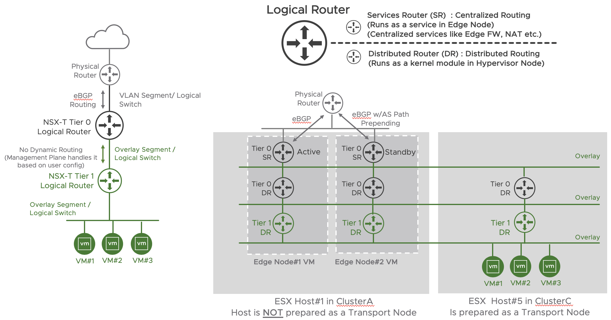

* Three VLANs are configured in the physical underlay. 

VLAN 10 : Management VLAN (vCenter, NSX-T Manager, ESX Management VMkernel and NSX-T Edge Transport Node Management interface are part of this VLAN , 10.190.1.0 /24)  
VLAN 30 : Transport VLAN for Geneve Tunnelling (ESX Host' s and NSX-T Edge Transport Node' s VTEP interfaces are part of this VLAN, 10.190.3.0 /24)  
VLAN 40 : Routing VLAN for External Physical Router peering (Tier 0's Uplink is part of this VLAN, 10.190.4.0 /24)  
All the other subnets are overlay networks  

_**Note: In NSX-T Data Center 2.4.1, K8S integration is supported only when the NSX-T constructs are configured from "Advanced Networking & Security" menu. (NOT from the other menus in the UI, also known as Simplified UI)**_

# Fabric Preperation  
[Back to Table of Contents](#Table-Of-Contents)

## Compute Manager

vCenter is configured as a "Compute Manager" on NSX-T Manager (_**System -> Fabric -> Compute Managers**_)

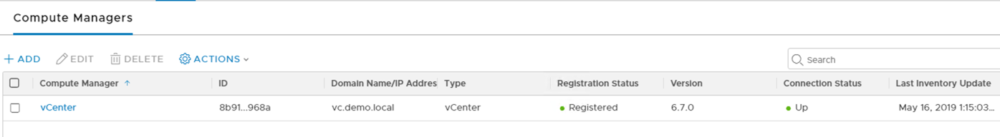

This helps for easier ESX cluster management since NSX-T automatically pulls the cluster information from the vCenter. When a new ESX Host is added to the cluster, it will automatically appear on "Host Transport Nodes" list in NSX GUI.  

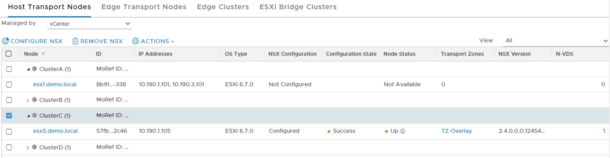

ESX Host preparation process can also be automated for the the ESX Hosts by configuring "Transport Node Profiles" in Fabric -> Profiles menu.

_**Note: Compute manager feature is not for inventory collection (VM, containers etc.) from ESX Hosts. It is for ESX cluster and ESX Host visibility. NSX-T Manager collects the inventory directly from the ESX/KVM Host Transport Nodes.**_

## Transport Zone

Three transport zones are configured. (_**System -> Fabric -> Transport Zones**_)

Edge Transport Nodes are attached to "TZ-VLAN-Edge" and "TZ-Overlay" transport zones. 

Host Transport Node is attached to "TZ-VLAN" and "TZ-Overlay" transport zones. 

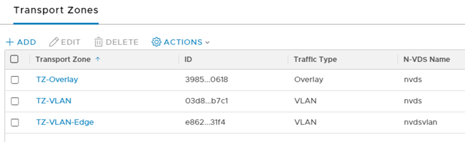

Notice that both "TZ-VLAN" and "TZ-Overlay" transport zones have the exact same _**N-VDS NAME**_ specified. This helps in scenarios which the same ESX Host, having a single virtual switch onit,  has some workloads connected to an overlay and some other workloads connected to VLAN based logical switches/segments. And since each N-VDS is an individual virtual switch, if a different N-VDS name is used for each transport zone then multiple N-VDSs has to be instantiated on the same Host Tranport node which will consume more physical ports on the same ESX Host for resiliency. Because the same vmnic/pnic _**CANNOT**_ be attached to two different virtual switches.

 A seperate VLAN transport zone is used as "TZ-VLAN-Edge" for Edge Transport Node. The reason for this is the uplink segment on Edge Transport Node will be used by T0 only for peering with the physical world. Hence any VLAN Logical Switch/segment configured on the Edge Transport Node does NOT need to extend to the Host Transport Nodes. **For better segregation of traffic this is the way preferred in this environment.** This does NOT mean that this is the only way to configure the Edge Transport Node. You can collapse your Edge Transport Node on a single N-VDS, just like the Host Transport Node. NSX-T platform is extremely flexible in terms of connectivity hence there are many different ways to use Transport zones and N-VDS constructs based on the design requirements.

## VTEP Pool

"VTEP" stands for the "Virtual Tunnel EndPoint" on an Edge Transport Node or Host Transport Node. It is the virtual interface which encapsulates the traffic, from the VMs or K8S Pods, with a GENEVE header and then sends towards the destination through the physical network. Each transport node picks an available IP from the VTEP Pool to be assigned to its VTEP interface. This VTEP pool will be referenced later on in the NSX host/edge preperation steps. (On ESX Host this interface is instantiated as a vmkernel interface.) 

_**Advanced Networking & Security -> Inventory -> Groups -> Ip Pools**_

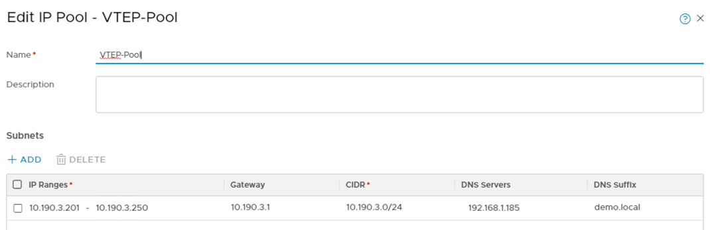

## Uplink Profile

Two uplink profiles are used. (_**System ->  Fabric -> Profiles -> Uplink Profiles**_)

* **"nsx-edge-single-nic-uplink-profile"** for Edge Transport Nodes
* **"esx-uplink-profile"** for Host Transport Node (ESX)

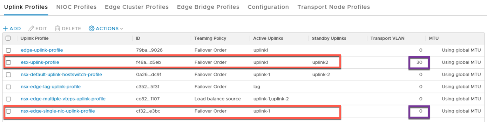

The uplink names "uplink1" and "uplink2" in the "esx-uplink-profile" are just user defined names. They can be "vmware1" , "vmware2" as well.  The same names mst be used when preparing the transport node with the respective uplink profile. This is another abstraction that NSX-T has for easier automation.

Notice that "esx-uplink-profile" has Transport VLAN ID : 30. Because VTEP interface (vmkernel/vmk) on the ESX Host will be tagging all the overlay traffic. The "nsx-edge-single-nic-uplink-profile" on the other hand does _**NOT**_ have a VLAN ID configured. The reason is VTEP interface of the Edge Transport Node will _**NOT**_ be tagging the overlay traffic. It will be sending the overlay traffic untagged to the underlying "vSphere Standard Switch (vSS)" on the ESX Host. The respective port group on "vSS"  will be tagging the overlay traffic with the appropriate VLAN ID onwards to the physical network. 

# Host Transport Node
[Back to Table of Contents](#Table-Of-Contents)

The ESX Host (ESX#5) in ClusterC is prepared for NSX-T. (_**System ->  Fabric -> Nodes -> Host Transport Nodes**_)

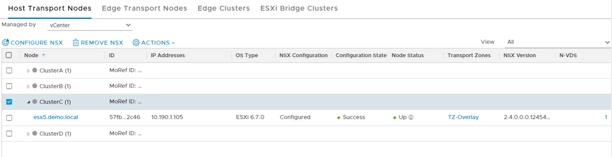

ESX#5 has three vmnics (pnics). 

vmnic0 is used by vSS. Management vmkernel interface of the ESX Host (vmk0) is also attached to vSS. vmnic1 and vmnic2 are attached to N-VDS.

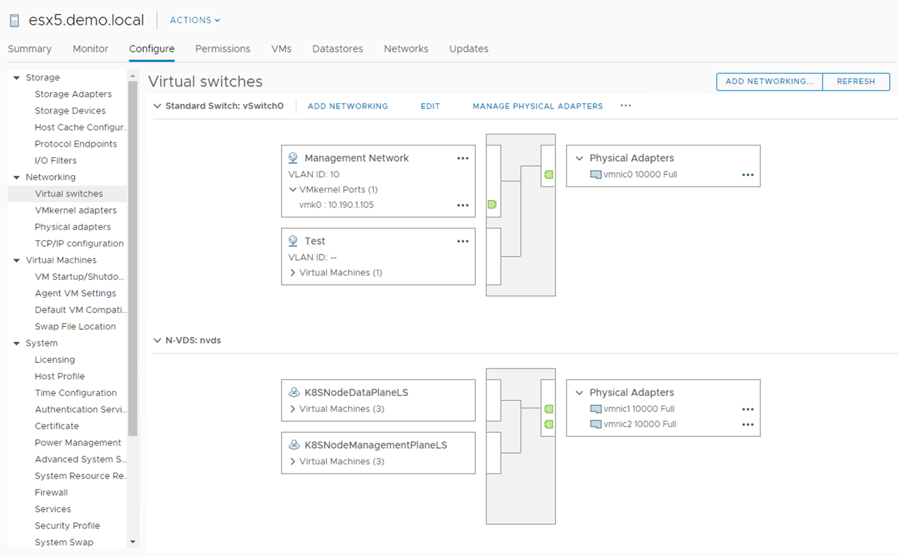

Note : The logical switches/segments on the N-VDS in this screenshot are actually configured in an upcoming step. At this stage there is supposed to be no logical switches on the N-VDS.

The transport zones and uplink associations for this ESX Host is shown below.

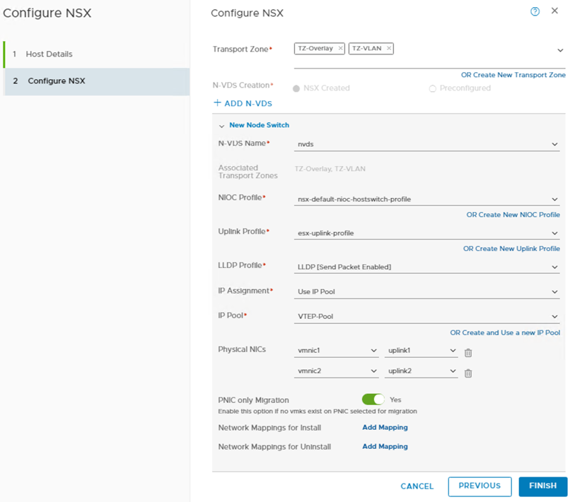

**Note** : If desired, all the connectivity of the ESX Host can be collapsed onto N-VDS (by migrating ESX management/vMotion vmkernels to the N-VDS) , in this environment it is preferred to use a vSS and an N-VDS on the ESX Host.

# Edge Transport Node
[Back to Table of Contents](#Table-Of-Contents)

Two Edge Transport Node VMs are configured in this environment. (_**System -> Fabric -> Nodes- > Edge Transport Nodes**_)

As mentioned earlier Edge Transport Nodes are attached to "TZ-VLAN-Edge" and "TZ-Overlay". Essentially, this means that two different N-VDS will be instantiated on the Edge Transport Node. 

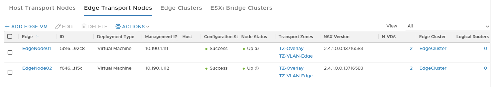

* Below diagram depicts the connectivity of Edge Transport Node(s) on ESX#1 in ClusterA. (Both Edge#1 and Edge#2 are connected to the virtual switch (vSS) the same way)

* The "EdgeManagement", "EdgeTEP" and the "EdgeRouting1" are the port groups on the vSS of the underlying ESX Host (on which the Edge Transport Node(s) are running on) These port groups are tagging the traffic and send it onwards to the physical network.

* The uplink redundancy of the Edge Transport Node is addressed on the underlying vSS. "Edge TEP" and "EdgeRouting1" port groups have teaming policies configured on the vSS level to use vmnic0 as active and vmnic1 as standby on the ESX Host.

* Below diagram shows how the Edge Transport Node is actually provisioned. 

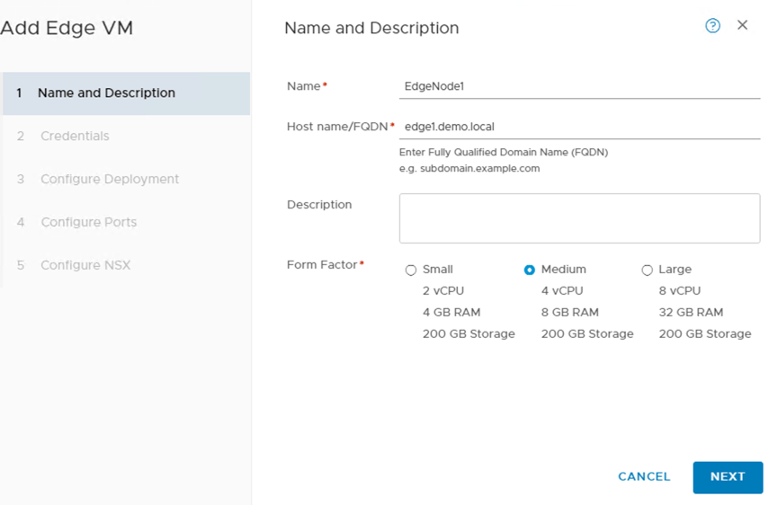

* Edge Transport Node#1 and Edge Transport Node#2 are both deployed on ESX1 in ClusterA. ESX1 is _**NOT**_ prepared for NSX. There is no need to do so as the overlay encapsulation/decapsulation takes place on NSX Edge VM itself **NOT** on the underlying ESX Host.

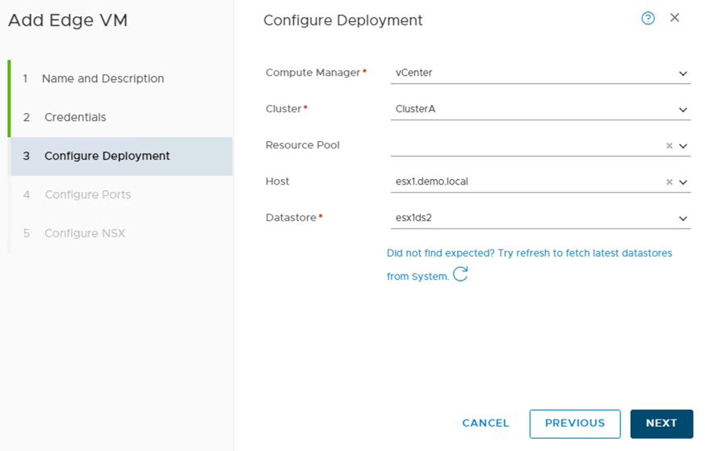

* Management interface is the eth0/vNIC1 of the EdgeNode and it is a dedicated interface with its own routing information base (aka VRF) .  In this environment 10.190.1.111 and .112 /24 is used as EdgeNode management interface IPs.

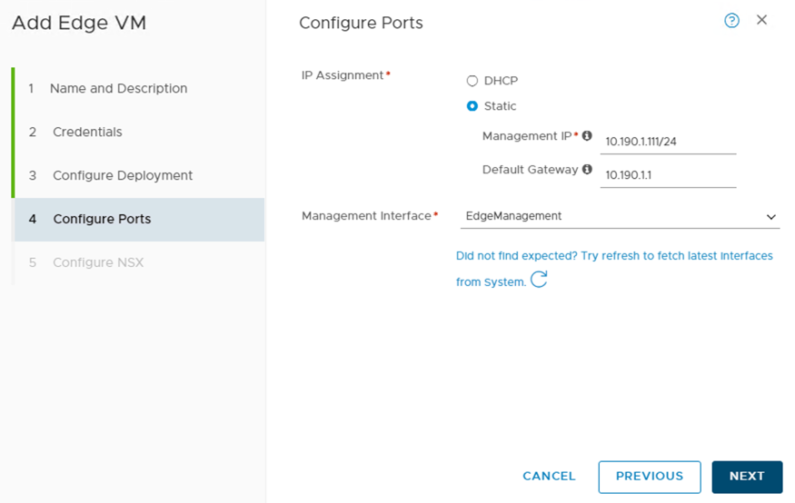

* First NVDS (nvds) : 

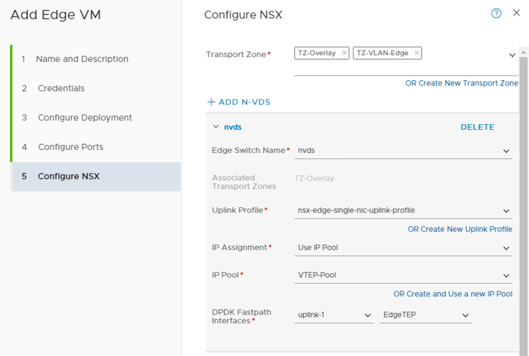

* Second NVDS (nvdsvlan) :

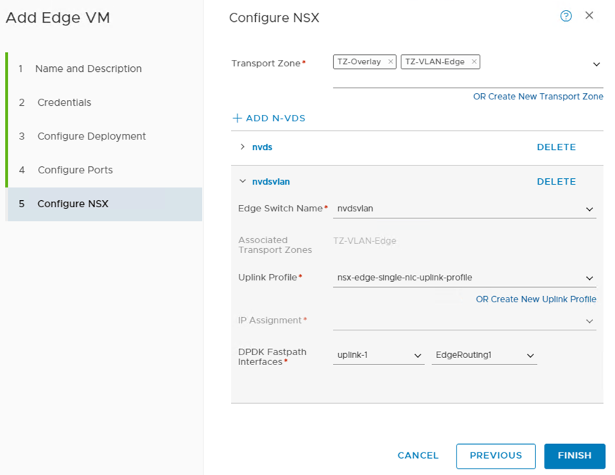

* Repeat above steps for Edge Transport Node#2. Obviously provisioning the Edge Transport Node#2 on another ESX Host would make it more resilient.

* Below screenshot shows how the vNIC of the Edge Node shows up in vCenter GUI.

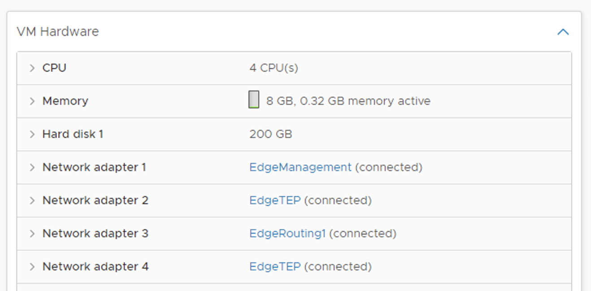

# Edge Cluster
[Back to Table of Contents](#Table-Of-Contents)

To provide resiliency for the centralized services (Tier 0 Services router - SR Component) that will be configured later on, an Edge Cluster is provisioned. (_**System -> Fabric -> Nodes -> Edge Clusters**_)

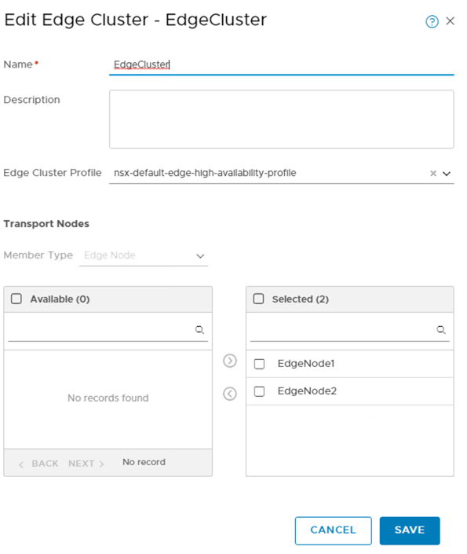

# Tier 0 Logical Router
[Back to Table of Contents](#Table-Of-Contents)

### Create Logical Switch/Segment for Tier 0 Logical Router Uplink Interface 
(_**Advanced Networking & Security -> Networking -> Switching -> Switches**_) 

To attach Tier 0 Logical Router to the physical network, a VLAN logical switch/segment is needed to be provisioned first. Shown below. A logical switch/segment named as "T0UplinkLS" is provisioned. Notice the VLAN ID : 0 . As mentioned earlier, all traffic is being tagged at the underlying vSS on the ESX Host which the Edge Transport Node is running on. 

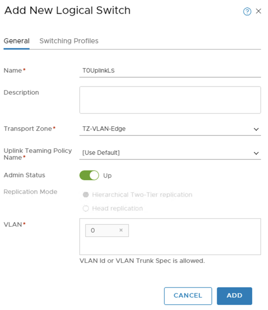

### Create Tier 0 Logical Router 
(_**Advanced Networking & Security -> Networking -> Routers -> Add -> Tier-0 Router**_)

A new Tier 0 Logical Router named as "T0-K8S-Domain" is provisioned. Tier 0 Logical Router always has an SR (Services Router) component. When provisioning Tier 0 Logical Router, an Edge Cluster has to be selected to instantiate the SR component. Failover mode has been selected as the default, which is "Non Preemptive".

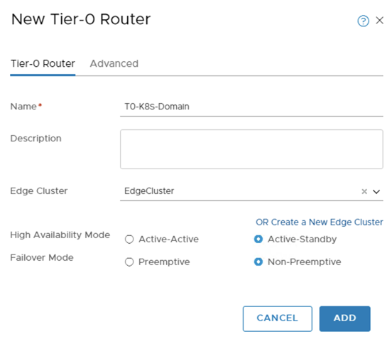

### Tier 0 Logical Router Uplink Interface Configuration 
(_**Advanced Networking & Security -> Networking -> Routers -> "T0-K8S-Domain" -> Configuration -> Router Ports -> Add**_)

A new uplink interface is provisioned on the Tier 0 Logical Router. This interface is connected to the VLAN logical switch/segment provisioned in the earlier step (Logical Switch : T0UplinkLS).  Also notice that this is the step where the Edge Transport Node, that the uplink is connected to, needs to be specified. This way the the management plane knows where to place the SR component of the Tier 0. 

 

Similarly a second uplink interface is provisioned and connected to the same uplink VLAN Logical Switch. (T0UplinkLS) Again, notice that the Edge Transport Node selection is required, this way the management plane knows where to place the _**STANDBY**_ SR component of the Tier 0. Hence this time Edge Transport Node#2 is selected. 

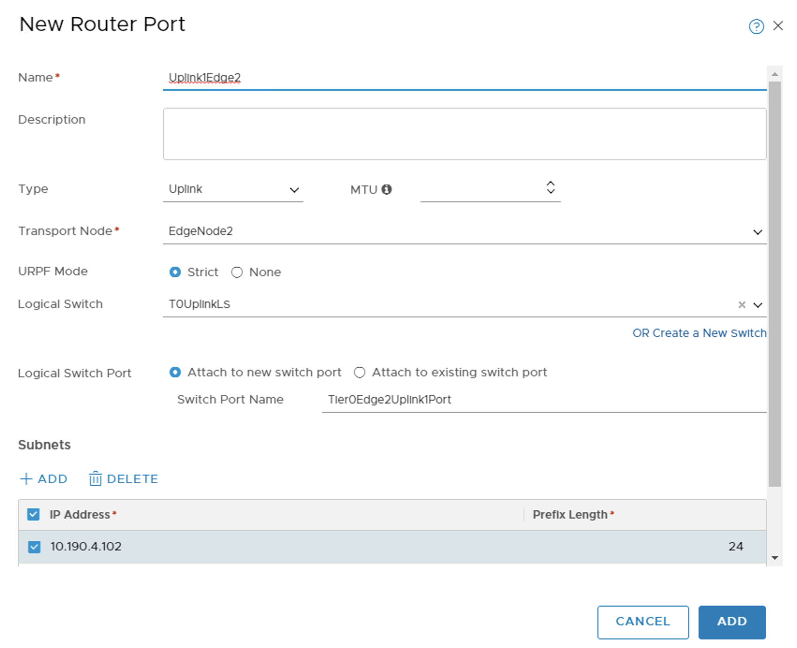

# Tier 1 Logical Router
[Back to Table of Contents](#Table-Of-Contents)

### Creating a Tier 1 Logical Router 
(_**Advanced Networking & Security -> Networking -> Routers -> Add -> Tier-1 Router**_)

A new Tier 1 Logical Router named as "T1-K8S-Node-Management"  is provisioned. For Tier 1, an Edge Cluster is not selected. SR component is not mandatory for Tier 1, it is needed only when running any centralized services (eg FW, NAT, LB) In this environment, only the distributed routing feature will be used with this Tier 1 Logical Router. This logical router, with only DR (Distributed Router) component, is connected to the Tier 0 which is provisioned earlier.

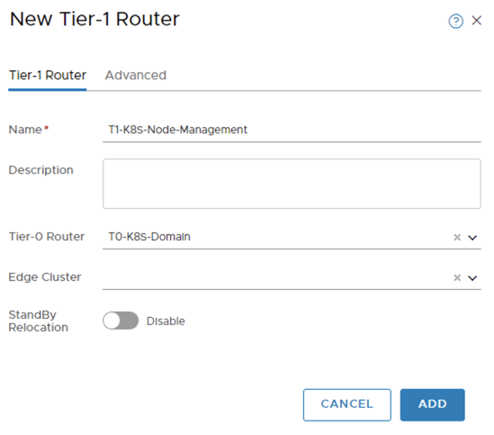

### Create a Logical Switch/Segment for K8S Node VM Management Connectivity 
(_**Advanced Networking & Security -> Networking -> Switching -> Switches**_) 

Each K8S Node is a VM. The VM#1, VM#2 and VM#3 shown in the topology in the beginning of this guide is actually a three node K8S cluster. One master with two worker nodes. Each K8S Node VM will be based on Ubuntu 16.04 OS and have two Ethernet interfaces. First is ens160 (vNIC1) and second is ens192 (vNIC2) .

A new _**overlay**_ logical switch/segment, named as ****"K8SNodeManagementPlaneLS"** is provisioned. Each K8S Node VM' s vNIC1 (ens160) will be connected to this logical switch/segment. K8S Master Node and Worker Nodes will be communicating with each other through this logical switch/segment. K8S Nodes will also check the liveness/readiness of the K8S PODs through this network.

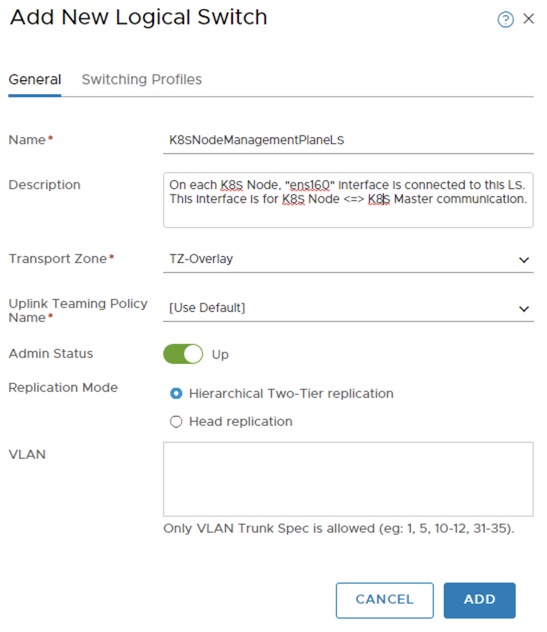

### Tier 1 Logical Router Downlink Interface Configuration 
(_**Advanced Networking & Security -> Networking -> Routers -> ""T1-K8S-Node-Management" -> Configuration -> Router Ports -> Add**_)

A new downlink interface is provisioned on the Tier 1 logical router. This interface is connected to the overlay logical switch/segment provisioned in the previous step. (Logical Switch : K8SNodeManagementPlaneLS)

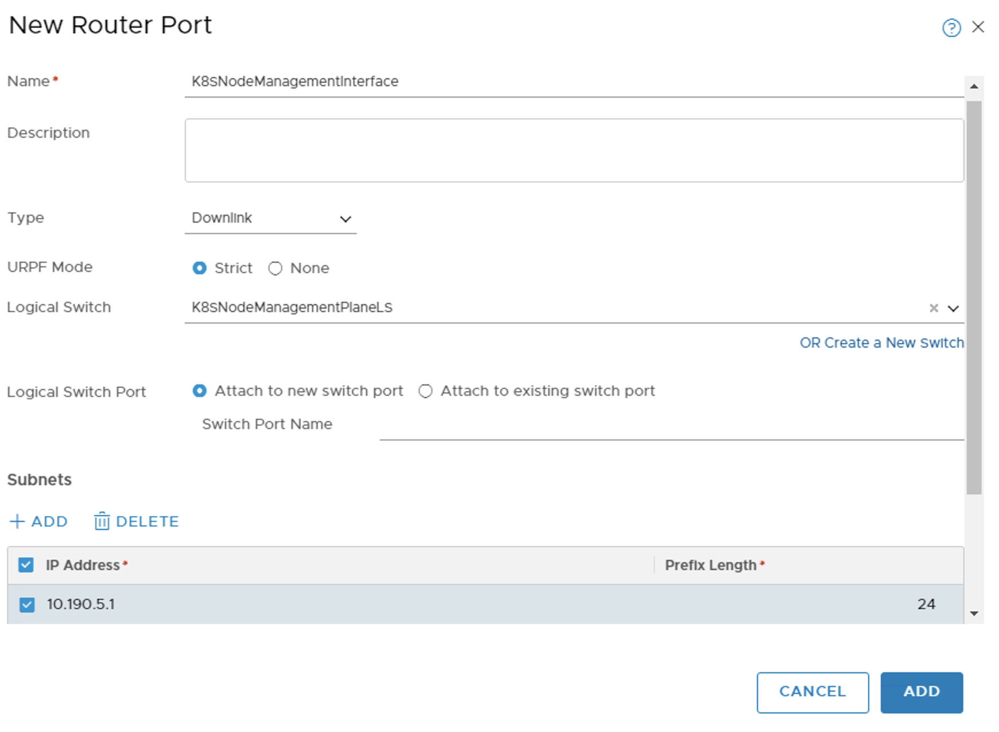

### Route Advertisement on Tier 1 Logical Router 
(_**Advanced Networking & Security -> Networking -> Routers -> "T1-K8S-Node-Management" -> Routing -> Route Advertisement**_) 

Tier 0 logical router does _**NOT**_ magically get the Tier 1 logical rotuer' s southbound subnet information. For this, "Route Advertisement" on Tier 1 should be properly configured. As shown below :

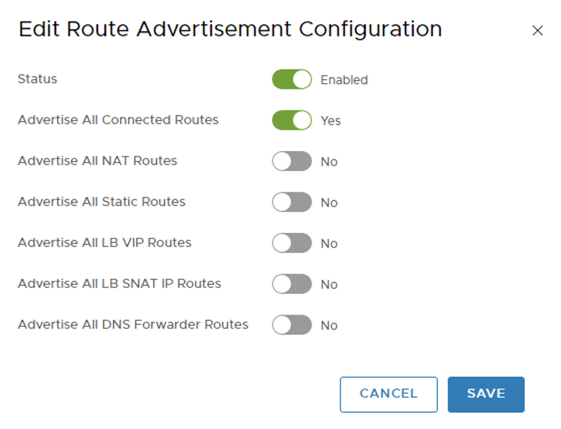

At this point Tier 0' s routing table should see  Tier 1's southbound interface prefix on its routing table. To check that, the user can SSH to the Edge Transport Node' s management IP address (10.190.1.111 in this case, we assume that Edge Transport Node#1 is hosting the Tier 0 Active services router. You can check this by looking at Tier 0' s information tab in NSX GUI.) Once SSHed to Edge Transport Node, then in the CLI, perform "get logical-routers" command, and then perform "vrf <Tier 0 SR' s VRF ID> ", and then perform "get route". The output should have 10.190.5.0/24 as a route with a next hop pointing to Tier 1' s uplink IP.

# Tier 0 BGP Configuration 
[Back to Table of Contents](#Table-Of-Contents)

* BGP neighborship : (_**Advanced Networking & Security -> Networking -> Routers -> "T0-K8S-Domain" -> Routing -> BGP**_)

At this point Tier 0 Active and Tier 0 Standby can be configured with BGP to dynamically announce the prefixes, in the NSX domain, to physical network. Below are the BGP parameters used. Notice that "Local Address" is set to "All Uplinks" . This setting effectively enables BGP neighborship initiation on both Tier 0 Active and Tier 0 Standby uplink interfaces. Tier 0 Standby automatically starts prepending the local AS number three times to make itself less influential for ingress traffic; which actually means that Tier 0 Standby' s control plane is active but data plane is completely  standby.

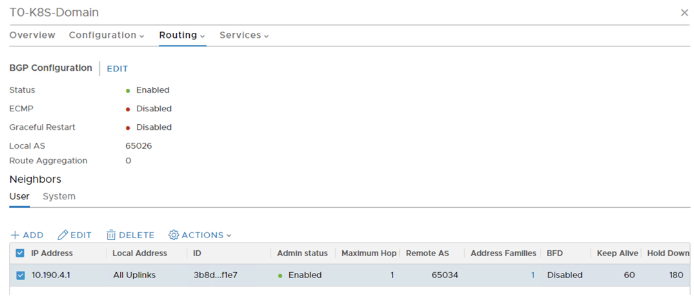

* Route Redistribution to BGP : (_**Advanced Networking & Security -> Networking -> Routers -> "T0-K8S-Domain" ->  Routing -> Route Redistribution**_)
At a minimum Tier 0 NAT, Tier 1 Downlink and Tier 1 LB VIP prefixes should be redistributed to BGP. This will be explained in upcoming chapters but just to quickly touch on it, Tier 0 NAT is needed for K8S Pods -> external access, Tier 1 Downlink is for external -> K8S Node access and Tier 1 LB VIP is needed for external -> K8S Services access. 

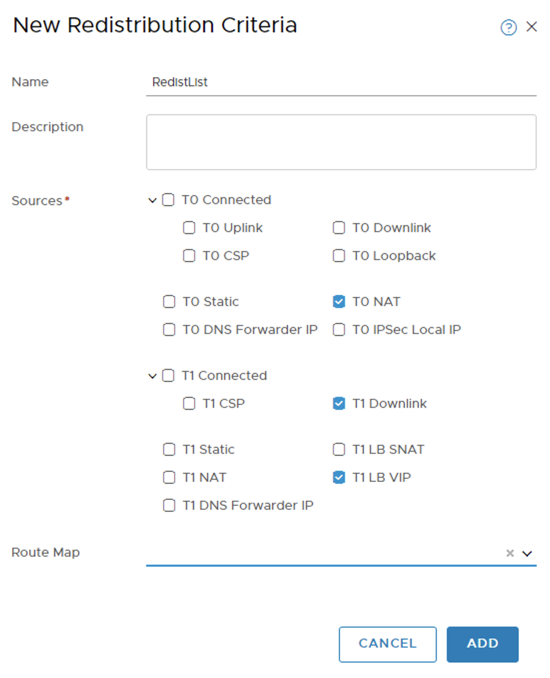

# K8S Node Dataplane Connectivity
[Back to Table of Contents](#Table-Of-Contents)

* Create a Logical Switch/Segment for K8S Node VM Dataplane Connectivity : (_**Advanced Networking & Security -> Networking -> Switching -> Switches**_) 

* A seperate logical switch/segment will be used to connect the second vNIC (ens192) of each K8S Node VM. vNIC2 and this logical switch will be providing the transport medium for the K8S Pods (**NOT** nodes) to communicate with the infrastructure. This logical switch/segment is named as **"K8SNodeDataPlaneLS"** in this environment.

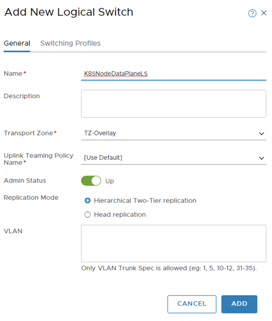

This logical switch/segment will **NOT** be connected to any Tier 0 or Tier 1 logical router. It will solely serve for the purpose of providing the transport for K8S Pods. This will be explained in the upcoming chapters.

[Back to Table of Contents](#Table-Of-Contents)

This concludes Part 1. We will look into the details of which other NSX-T objects will be integrated with K8S and also prepare a K8S cluster in Part 2.

< SHORTCUT to PART 2>

