# NSX-T & K8S - PART 3

# Table Of Contents

[Ubuntu OS Installation](#Ubuntu-OS-Installation)  
[Topology](#Topology)   
[IPAM and IP Pools](#IPAM-and-IP-Pools)   
[Firewall Sections](#Firewall-Sections)  
[Reachability](#Reachability)    
[Tagging NSX-T Objects for K8S](#Tagging-NSX-T-Objects-for-K8S)  
[CNI Plugin Installation](#CNI-Plugin-Installation)   
[Open vSwitch (OVS) Installation](#Open-vSwitch-Installation)  
[Docker Installation](#Docker-Installation)   
[K8S Installation](#K8S-Installation)      

# Ubuntu OS Installation
[Back to Table of Contents](#Table-Of-Contents)

Previously in Part 1, the NSX-T logical networking constructs were prepared to implement a basic topology. In this section three Ubuntu VMs will be provisioned; two of them will be K8S worker nodes and one will be K8S master node. Each VM will be connected to the current topology as shown below. 

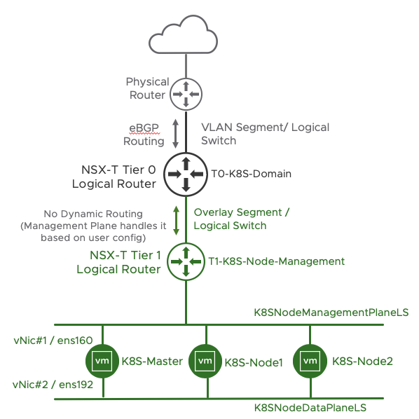

Below steps in this section will be performed for each Ubuntu VM.

* Download Ubuntu 16.04 image (ubuntu-16.04.5-server-amd64.iso) from http://releases.ubuntu.com/16.04/

* Create a new Virtual Machine with the following properties. The virtual machine will be running on ESX5 since that is the ESX Host which is prepared as a Host Transport Node for NSX-T.

*  The first vNIC should be connected to the **"K8SNodeManagementPlaneLS"** and the second vNIC should be connected to the **"K8SNodeDataPlaneLS"** . These logical switches/segments were provisioned in Part 1 of this series. 

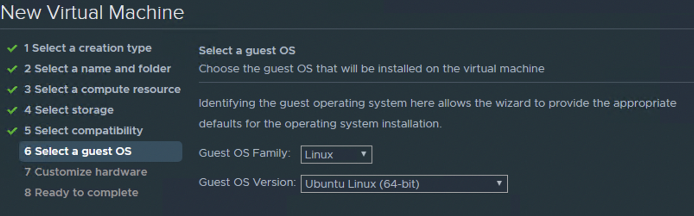

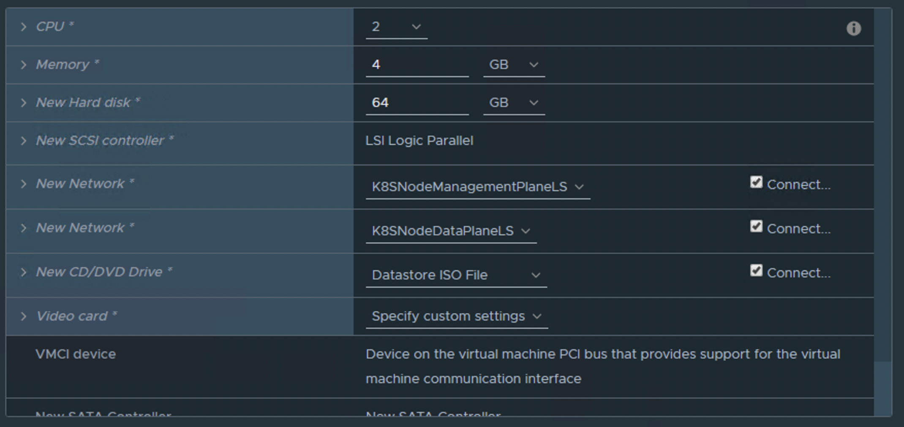

* Get to the console of the VM in vSphere / vCenter GUI and boot it from the ISO image 

* During the operating system installation primary interface should be set to **ens160**.

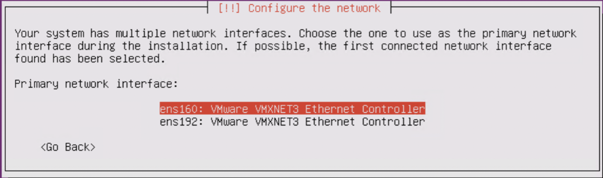

* Since there are no DHCP servers in the respective logical switch/segment ("K8SNodeManagementtPlaneLS"), static IP needs to be configured on ens160.

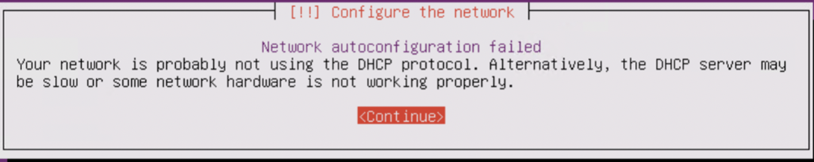

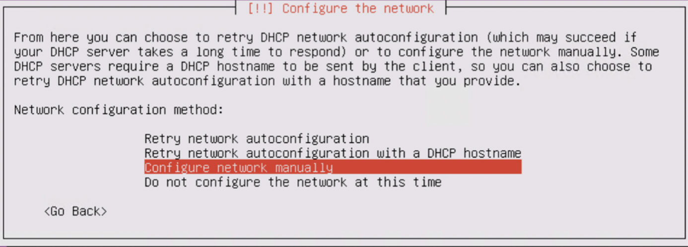

In Part 1 of this series "K8SNodeManagementPlaneLS" was connected to Tier 1 Logical Router ("T1-K8S-Node-Management") and the IP address assigned to the router interface was 10.190.5.1 /24, hence an IP address from the same subnet is picked up, shown below.

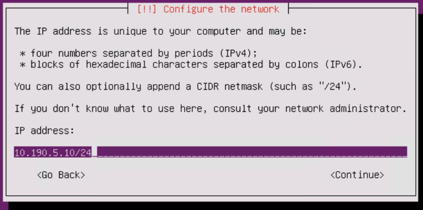

* Configure default gateway as Tier 1 logical router' s ("T1-K8S-Node-Management") interface IP (which is 10.190.5.1).

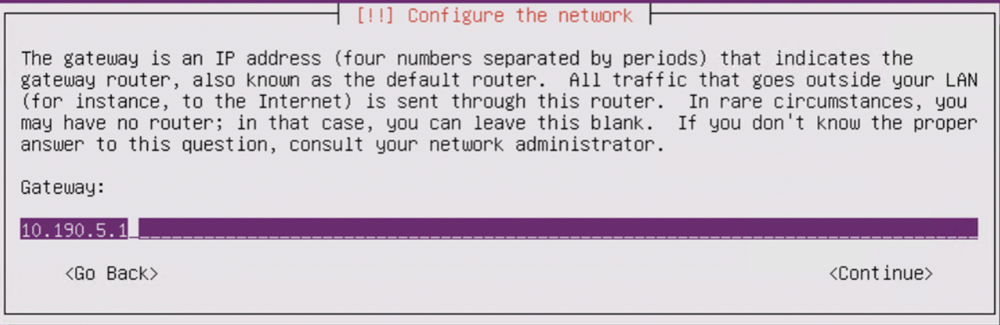

* A DNS server should be present in the environment (either on a seperate overlay segment or external to the NSX topology, does not matter, it just has to be reachable) . In the lab DNS server is attached to a VLAN on the physical router.

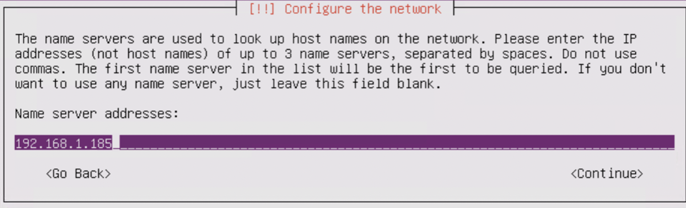

* Assign a hostname to Ubuntu node . In the lab k8s-master, k8s-node1 and k8s-node2 are used as hostnames. (With the IP addresses of 10.190.5.10 for master , 10.190.5.11 for node1 and 10.190.5.12 for node2)

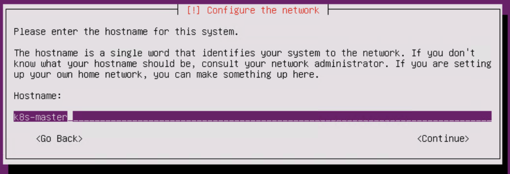

* Configure a domain name

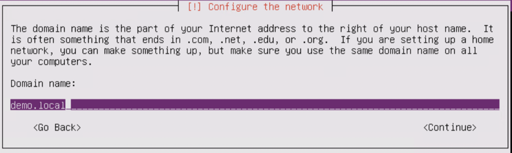

* Type in the a user name and a user for the new account. Instead of root account, Ubuntu would like the admin to use this user name, however we will work around this later on and use root :)

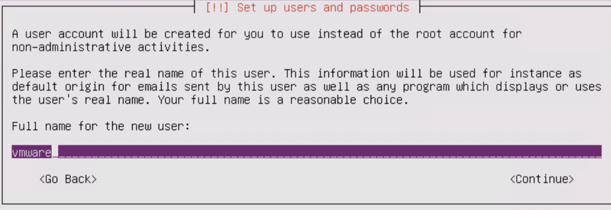

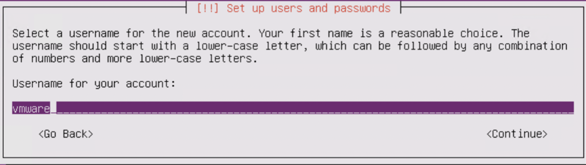

* Assign a password for the recently created user

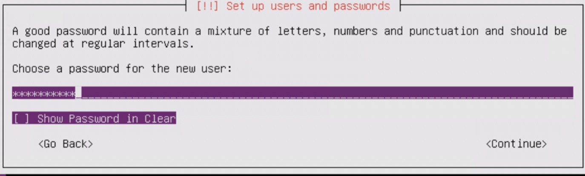

* Enable Open SSH Server 

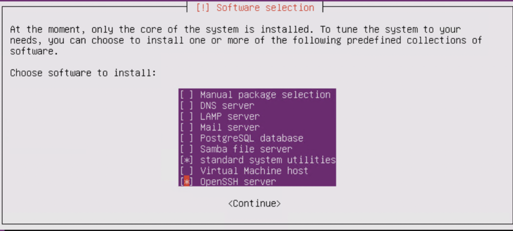

_**Note : If an existing Ubuntu node will be used, take a look at the Appendix to edit and update the hostname and the IP address of the vNIC1.**_

# Topology
[Back to Table of Contents](#Table-Of-Contents)

### ESX and VM level connectivity

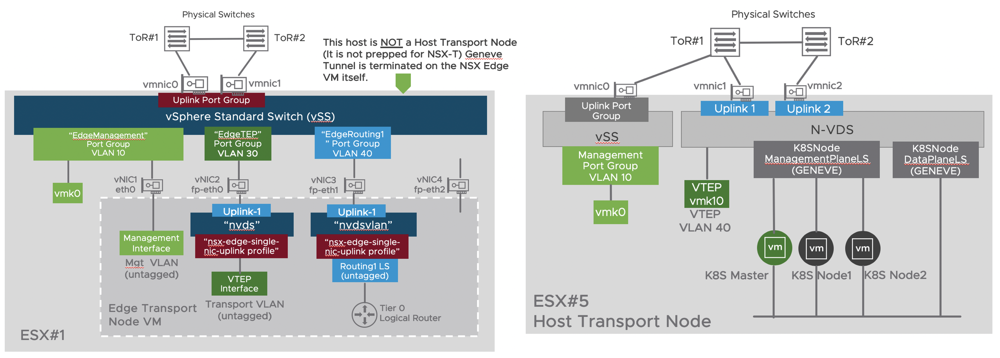

### VM level logical topology 

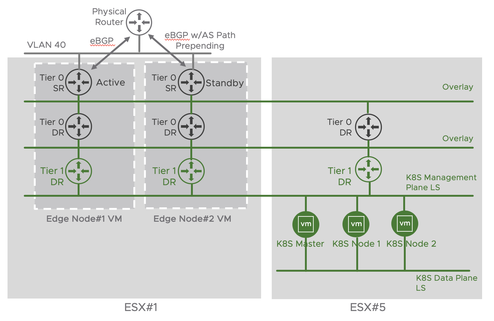

As mentioned in Part 1 of this series, logical switch/segment "K8SDataPlaneLS" is used as a transport medium for the K8S Pods (**NOT** nodes). K8S Pods will be connected to individual logical switches/segments per K8S Namespace. This will be explained in more detail later on.

_**Note : In this environment all K8S Nodes are running on the same ESX Host because of resource constraints. In a real life environment K8S nodes would be spanning across ESX Hosts. A sample topology is shown below.*_

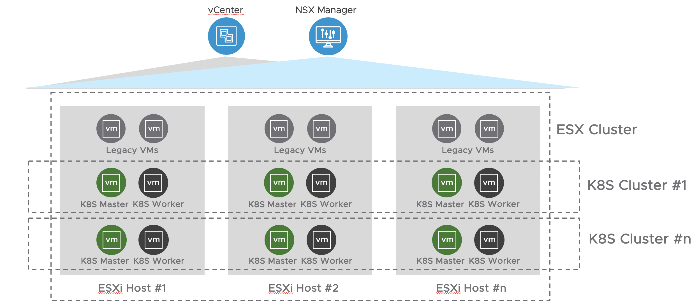

### Container level logical topology

After implementing K8S and integrating it with NSX-T, the topology will look like below. Information shown in this topology will be explained in this article and also in Part 4 of this series. 

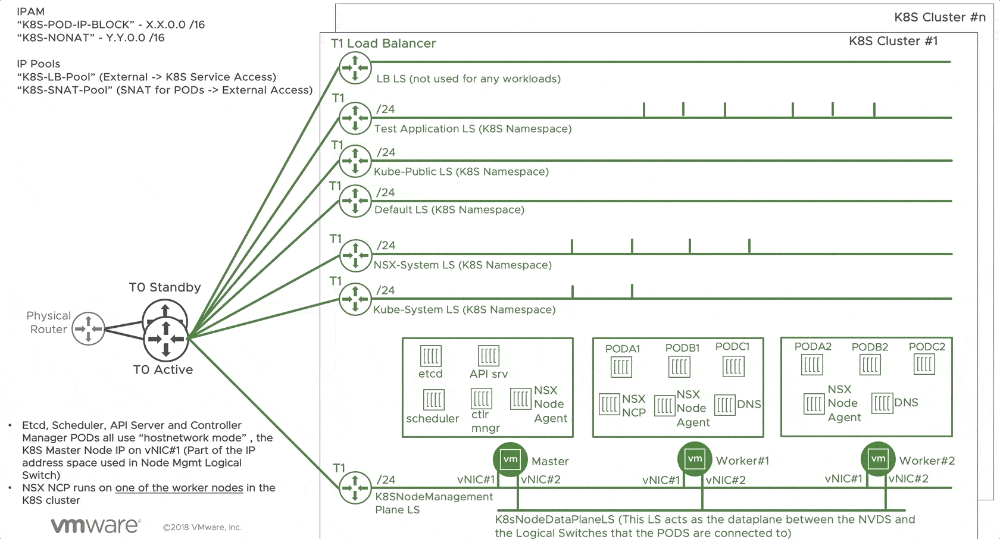 

# IPAM and IP Pools
[Back to Table of Contents](#Table-Of-Contents)

Before moving on further with the Ubuntu node configuration, there are a few additional constructs that need to be configured on NSX-T for K8S integration.

## Configuring IPAM block "K8S-POD-IP-BLOCK" (Advanced Networking & Security -> Networking -> IPAM)

This block is provisioned as a /16 subnet ("K8S-POD-IP-BLOCK" - 172.25.0.0/16)  Whenever a developer creates a new K8S namespace, then this IP Block will be carved out by /24 chunk and a /24 subnet based IP pool will be created in NSX-T atomatically. That /24 subnet based IP pool will be assigned to the respective namespace and whenever Pods are created in that namespace, then each POD will pick an IP address from that /24 subnet.

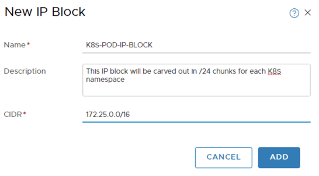

## Configuring IP Pool "K8S-LB-Pool" (Advanced Networking & Security -> Inventory -> Groups -> Ip Pools)

This IP pool will be used by each K8S services exposed. 

When a developer exposes a service with ServiceType=LoadBalancer, a VIP (Virtual IP) address gets picked from this pool automatically. NSX Container Pluging (NCP) will automatically configure that IP as a Layer 4 VIP on the NSX-T Load Balancer, **which is essentially yet another Tier 1 Logical Router but has Load Balancer attached to it**. 

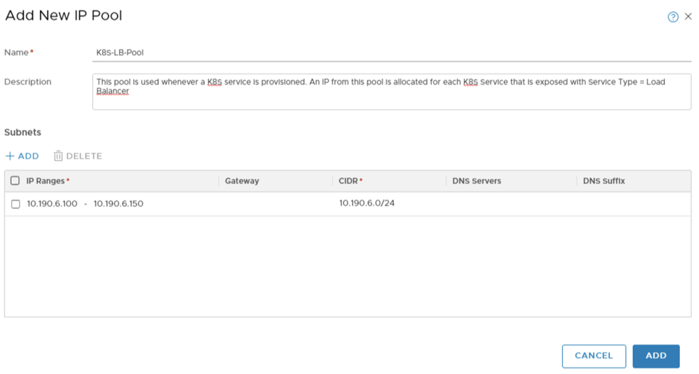

K8S Ingress (Layer 7 LB) also automatically consumes a VIP on NSX-T LB. 

## Configuring IP Pool "K8S-NAT-Pool" (Advanced Networking & Security -> Inventory -> Groups -> Ip Pools)

This IP pool will be used to apply Source NAT (SNAT) for K8S Pods to access external resources (external to NSX domain, eg Container Image Repository, a legacy physical database) . Source NAT is implemented on Tier 0. 

When a developer creates a new K8S namespace, then an IP is picked from this pool as the SNAT IP for all the K8S Pods that will be created in that namespace. And then SNAT rules are automatically provisioned by NSX Container Plugin (NCP) on Tier 0 logical router.

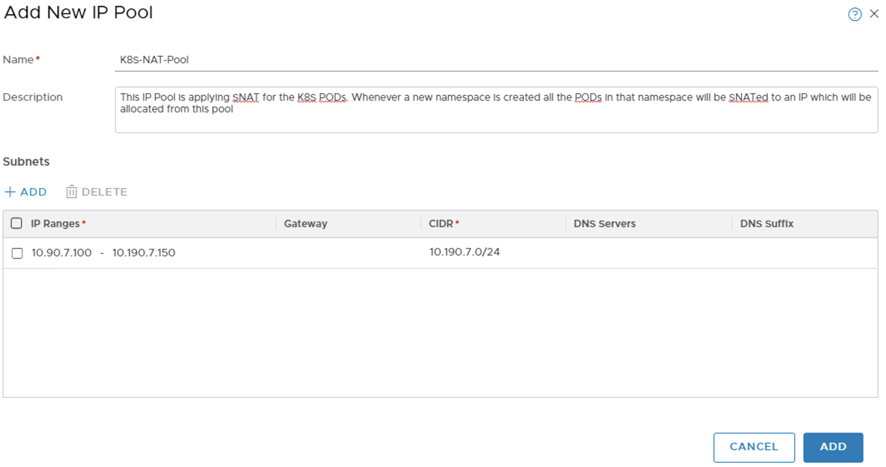

NSX-T supports configuring a persistent SNAT IP per K8S namespace or per K8S service by using native K8S annotations. This provides granular operations for Pods to access a physical database for instance.

NSX-T supports No-NAT for the Pods. Meaning that a routable IP address can also be used for K8S Pods, rather then applying SNAT on Tier0. However the default option is SNAT (hence K8S-NAT-Pool is configured above) . This option can be changed in the NCP configuration, which is explained later on in the next chapter.

# Firewall Sections
[Back to Table of Contents](#Table-Of-Contents)

Two new sections will be configured in the NSX-T distributed firewall rule base. Any K8S related firewall rule will be configured between these sections. Configuration steps shown below. The names used for the sections is important as those will be referenced in Part 4. 

_**Note**_ : Do not forget to check the current section to enable the "Add Section" option. 

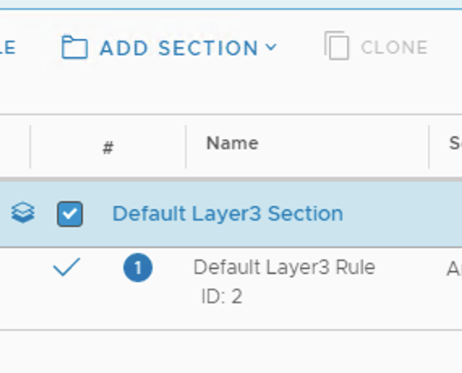
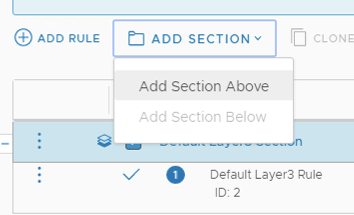
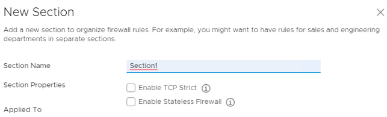
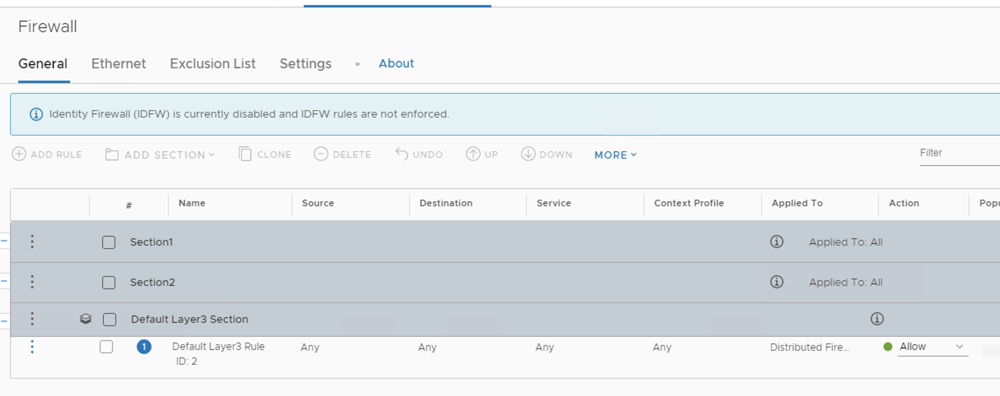


# Reachability
[Back to Table of Contents](#Table-Of-Contents)

* **Subnet#1**: "KS-LB-Pool" subnet should be a routable IP address space, so that when a user tries to access a K8S service hosted as a VIP on NSX-T LB, the physical network should be able to route this traffic all the way to the NSX-T Tier 0 logical router.  
* **Subnet#2**: "K8S-NAT-Pool" subnet should also be a routable IP address space, so that when the Pods try to access an external resource and since their IP addresses get SNATed to an IP from this pool, the return traffic should be able to get successfully routed back to the NSX-T Tier 0 logical router.

Hence it is necessary to make sure that Tier 0 logical router has the proper route redistribution configuration in place. This has been configured in the first chapter ("Initial Configuration of NSX-T") however it is worth mentioning here again.

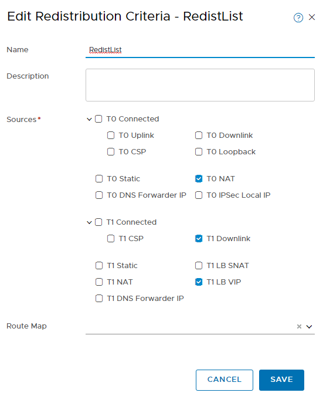

In the above screenshot :
- having "T1 LB VIP" enables Subnet#1 to be announced by Tier 0 logical router to its BGP neighbor (physical router)
- having "**T0** NAT" enables Subnet#2 to be announced by Tier 0 logical router to its BGP neighbor (physical router)

# Tagging NSX-T Objects for K8S
[Back to Table of Contents](#Table-Of-Contents)

A few objects in NSX-T need to be tagged for integration with K8S. The reason for this will be explained in Part 4. 

Following objects will be tagged with "k8s-cluster1" and with scope of "ncp/cluster" and "ncp/node_name".

_**Why "k8s-cluster1" ? Will be explained with detail in Part 4 of this series. In short, the same NSX-T domain can be integrated with multiple K8S clusters. Hence it is important to track each NSX-T object with the respective cluster number or name.**_

## K8S Nodes

In this section the logical ports (in the "K8SNodeDataPlaneLS"), to which the Kubernetes Nodes second vNIC is connected to, will be tagged.

Navigate to "Advanced Networking & Security -> Networking -> Switching" in the NSX-T GUI and then CLICK on "K8SNodeDataPlaneLS". On the top right click on "Related" then select "Ports" on the dropdown menu. (shown below)

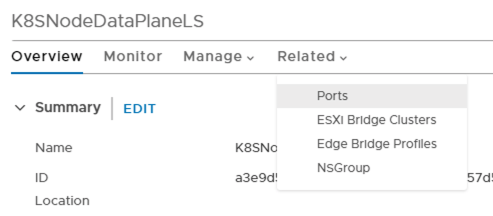

Tick the box next to k8s-master node and then click on "Actions" on the top right (shown below) and select "Manage Tags"


Configure the tag and scope as shown below. 

**Note** : This time the node name is also used in addition to cluster name. 

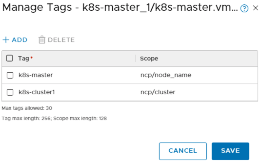

Repeat the steps for the remaining nodes

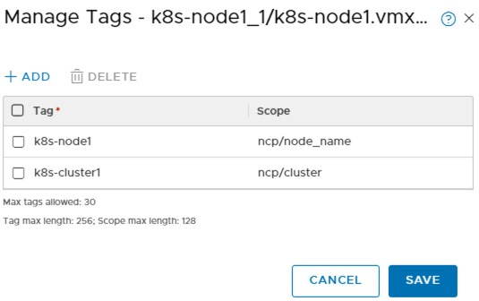

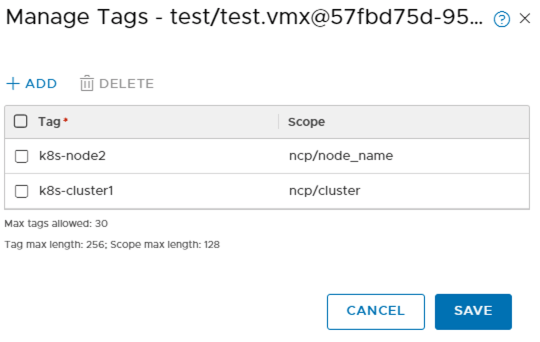

**Note#1** : The tag should match the node name which should match the hostname of the Ubuntu node, since that specific hostname will be used by Kubernetes as the node name.

**Note#2** : If the admin changes the Kubernetes node name, then the tag ncp/node_name should also be updated and NCP needs to be restarted. Once Kubernetes is installed, "kubectl get nodes" can be used to provide the the node names in the output. The tags should be added to the logical switch port before that node gets added to the K8S cluster by using the "kubeadm join" command. Otherwise, the new node will not have network connectivity. In case of tags being incorrect or missing, then to fix the issue, correct tags should be applied and NCP should be restarted.

# CNI Plugin Installation
[Back to Table of Contents](#Table-Of-Contents)

## Make sure Apparmor is loaded  

NSX Container Network Interface (CNI) plugin needs to be installed on the Kubernetes nodes. NSX CNI plugin copies the AppArmor profile file ncp-apparmor to /etc/apparmor.d and load it. Hence prior to the installation the AppArmor service should be up and running. AppArmor is a Mandatory Access Control (MAC) system which is a kernel (LSM) enhancement to confine programs to a limited set of resources.     
More info about Apparmor is here => https://wiki.ubuntu.com/AppArmor   
Useful other commands about AppArmor is here => https://gitlab.com/apparmor/apparmor/wikis/AppArmor_Failures  

To check the status off Apparmor :

<pre><code>

vmware@k8s-master:~$ <b>/etc/init.d/apparmor status</b> 
● apparmor.service - LSB: AppArmor initialization
   Loaded: loaded (/etc/init.d/apparmor; bad; vendor preset: enabled)
   Active: <b>active (exited)</b> since Tue 2019-05-28 13:44:43 EDT; 27min ago
     Docs: man:systemd-sysv-generator(8)
  Process: 1491 ExecReload=/etc/init.d/apparmor reload (code=exited, status=0/SUCCESS)
  Process: 786 ExecStart=/etc/init.d/apparmor start (code=exited, status=0/SUCCESS)

May 28 13:44:42 k8s-master systemd[1]: Starting LSB: AppArmor initialization...
May 28 13:44:42 k8s-master apparmor[786]:  * Starting AppArmor profiles
May 28 13:44:43 k8s-master apparmor[786]: Skipping profile in /etc/apparmor.d/disable: usr.sbin.rsyslogd
May 28 13:44:43 k8s-master apparmor[786]:    ...done.
May 28 13:44:43 k8s-master systemd[1]: Started LSB: AppArmor initialization.
May 28 14:10:35 k8s-master systemd[1]: Reloading LSB: AppArmor initialization.
May 28 14:10:35 k8s-master apparmor[1491]:  * Reloading AppArmor profiles
May 28 14:10:36 k8s-master apparmor[1491]: Skipping profile in /etc/apparmor.d/disable: usr.sbin.rsyslogd
May 28 14:10:36 k8s-master apparmor[1491]:    ...done.
May 28 14:10:36 k8s-master systemd[1]: Reloaded LSB: AppArmor initialization.
vmware@k8s-master:~$

</code></pre>

If the status is NOT loaded then start the service using "sudo /etc/init.d/apparmor start"

## Install CNI 

CNI is a Cloud Native Computing Foundation (CNCF) project. It is a set of specifications and libraries to configure network interfaces in Linux containers. It has a pluggable architecture hence third party plugins are supported.

NSX-T CNI Plugin comes within the "NSX-T Container" package. The package can be downloaded (in _.zip_ format) from Downloads page for NSX-T, shown below.

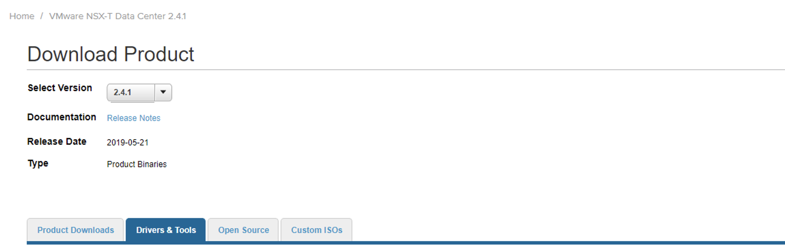

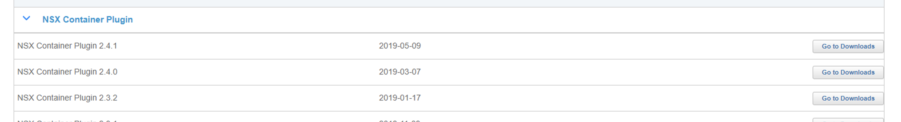

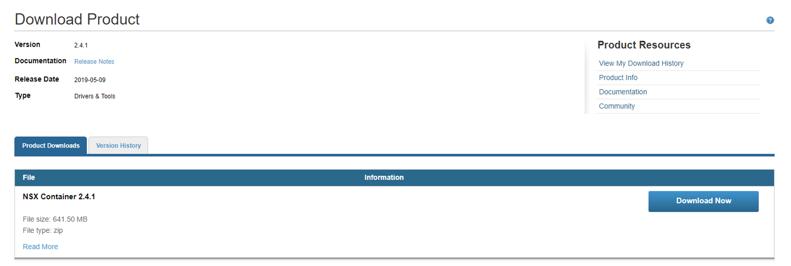

In the current NSX-T version (2.4.1) , the zip file is named as "**nsx-container-2.4.1.13515827.zip**" . 

* Extract the zip file to a folder. 

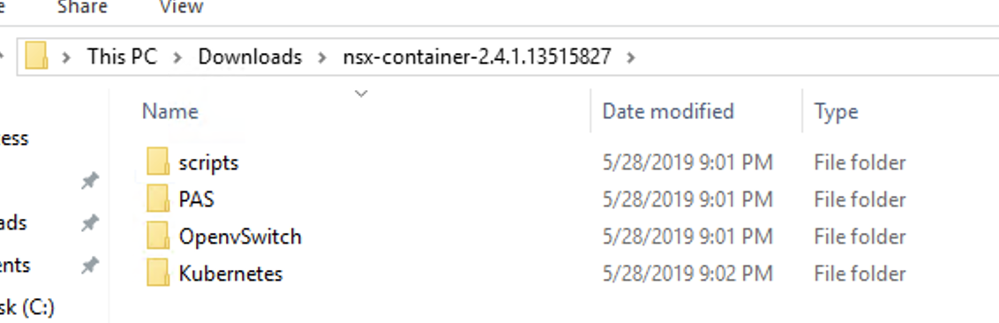

* Use SCP/SSH to copy the folder to the Ubuntu node. Winscp is used as the SCP tool on Windows client and the folder is copied to /home/vmware location on Ubuntu node.

* **For all the installation steps mentioned below and following sections in this guide root level access will be used.**

* Escalate to root in the shell

<pre><code>
vmware@k8s-master:~$ <b>sudo -H bash</b>
[sudo] password for vmware:
root@k8s-master:/home/vmware#
</code></pre>

* On the Ubuntu shell, navigate to "/home/vmware/nsx-container-2.4.1.13515827/Kubernetes/ubuntu_amd64/" folder, and then install CNI as shown below.

<pre><code>
root@k8s-master:/home/vmware/nsx-container-2.4.1.13515827/Kubernetes/ubuntu_amd64# <b>dpkg -i nsx-cni_2.4.1.13515827_amd64.deb</b>
Selecting previously unselected package nsx-cni.
(Reading database ... 59693 files and directories currently installed.)
Preparing to unpack nsx-cni_2.4.1.13515827_amd64.deb ...
Unpacking nsx-cni (2.4.1.13515827) ...
Setting up nsx-cni (2.4.1.13515827) ...
[ ok ] Reloading apparmor configuration (via systemctl): apparmor.service.
root@k8s-master:/home/vmware/nsx-container-2.4.1.13515827/Kubernetes/ubuntu_amd64#
</code></pre>

# Open vSwitch Installation
[Back to Table of Contents](#Table-Of-Contents)

* NSX-T and K8S integration leverages Open vSwitch (OVS) in the data plane. OVS installation files also come as part of the NSX-T Container package which has been extracted and copied to the Ubuntu node in the previous step.

## OVS Dependencies

* Update Ubuntu packages by using : <b>apt-get update</b>

<pre><code>
root@k8s-master:/home/vmware/nsx-container-2.4.1.13515827/Kubernetes/ubuntu_amd64# <b>cd /home/vmware</b>
root@k8s-master:/home/vmware# <b>apt-get update</b>
Get:1 http://security.ubuntu.com/ubuntu xenial-security InRelease [109 kB]
Get:2 http://us.archive.ubuntu.com/ubuntu xenial InRelease [247 kB]
Get:3 http://security.ubuntu.com/ubuntu xenial-security/main amd64 Packages [647 kB]
|
|
OUTPUT OMITTED
|
|
Get:44 http://us.archive.ubuntu.com/ubuntu xenial-backports/universe amd64 Packages [7,804 B]
Get:45 http://us.archive.ubuntu.com/ubuntu xenial-backports/universe i386 Packages [7,488 B]
Get:46 http://us.archive.ubuntu.com/ubuntu xenial-backports/universe Translation-en [4,184 B]
Fetched 29.8 MB in 8s (3,363 kB/s)
Reading package lists... Done
root@k8s-master:/home/vmware#
</code></pre>

* Open vSwitch has dependencies on several Python packages and other components. Because of this, these packages will be installed manually as shown below.

<pre><code>
root@k8s-master:/home/vmware# <b>apt-get install -y python2.7 python-pip python-dev python-six build-essential dkms</b>
Reading package lists... Done
Building dependency tree
Reading state information... Done
The following additional packages will be installed:
  binutils cpp cpp-5 dpkg-dev fakeroot g++ g++-5 gcc gcc-5 gcc-5-base libalgorithm-diff-perl libalgorithm-diff-xs-perl
  libalgorithm-merge-perl libasan2 libatomic1 libc-dev-bin libc6 libc6-dev libcc1-0 libcilkrts5 libdpkg-perl libexpat1-dev libfakeroot
  libfile-fcntllock-perl libgcc-5-dev libgomp1 libisl15 libitm1 liblsan0 libmpc3 libmpx0 libpython-all-dev libpython-dev libpython-stdlib
  libpython2.7 libpython2.7-dev libpython2.7-minimal libpython2.7-stdlib libquadmath0 libstdc++-5-dev libstdc++6 libtsan0 libubsan0
  linux-libc-dev make manpages-dev python python-all python-all-dev python-minimal python-pip-whl python-pkg-resources python-setuptools
  python-wheel python2.7-dev python2.7-minimal
Suggested packages:
  binutils-doc cpp-doc gcc-5-locales debian-keyring g++-multilib g++-5-multilib gcc-5-doc libstdc++6-5-dbg gcc-multilib autoconf automake
  libtool flex bison gdb gcc-doc gcc-5-multilib libgcc1-dbg libgomp1-dbg libitm1-dbg libatomic1-dbg libasan2-dbg liblsan0-dbg libtsan0-dbg
  libubsan0-dbg libcilkrts5-dbg libmpx0-dbg libquadmath0-dbg glibc-doc libstdc++-5-doc make-doc python-doc python-tk python-setuptools-doc
  python2.7-doc binfmt-support
The following NEW packages will be installed:
  binutils build-essential cpp cpp-5 dkms dpkg-dev fakeroot g++ g++-5 gcc gcc-5 libalgorithm-diff-perl libalgorithm-diff-xs-perl
  libalgorithm-merge-perl libasan2 libatomic1 libc-dev-bin libc6-dev libcc1-0 libcilkrts5 libdpkg-perl libexpat1-dev libfakeroot
  libfile-fcntllock-perl libgcc-5-dev libgomp1 libisl15 libitm1 liblsan0 libmpc3 libmpx0 libpython-all-dev libpython-dev libpython-stdlib
  libpython2.7 libpython2.7-dev libpython2.7-minimal libpython2.7-stdlib libquadmath0 libstdc++-5-dev libtsan0 libubsan0 linux-libc-dev
  make manpages-dev python python-all python-all-dev python-dev python-minimal python-pip python-pip-whl python-pkg-resources
  python-setuptools python-six python-wheel python2.7 python2.7-dev python2.7-minimal
The following packages will be upgraded:
  gcc-5-base libc6 libstdc++6
3 upgraded, 59 newly installed, 0 to remove and 147 not upgraded.
Need to get 76.0 MB of archives.
After this operation, 209 MB of additional disk space will be used.
Get:1 http://us.archive.ubuntu.com/ubuntu xenial-updates/main amd64 libpython2.7-minimal amd64 2.7.12-1ubuntu0~16.04.4 [339 kB]
Get:2 http://us.archive.ubuntu.com/ubuntu xenial-updates/main amd64 python2.7-minimal amd64 2.7.12-1ubuntu0~16.04.4 [1,261 kB]
Get:3 http://us.archive.ubuntu.com/ubuntu xenial-updates/main amd64 python-minimal amd64 2.7.12-1~16.04 [28.1 kB]
|
|
|
OUTPUT OMITTED
|
|
|
Setting up python-setuptools (20.7.0-1) ...
Setting up python-six (1.10.0-3) ...
Setting up python-wheel (0.29.0-1) ...
Processing triggers for libc-bin (2.23-0ubuntu10) ...
root@k8s-master:/home/vmware#
</code></pre>

**Note** : Alternatively "apt-get install -f" can be used to install these dependencies (after each Open vSwitch module installation step, shown in the next section). In this guide preferred way has been to manually install all the dependencies in advance.

## Install OVS Modules

* In the Ubuntu node, navigate to "/home/vmware/nsx-container-2.4.1.13515827/OpenvSwitch/xenial_amd64" folder and then follow the steps below.  

### Install libopenvswitch

<pre><code>
root@k8s-master:/home/vmware/nsx-container-2.4.1.13515827/OpenvSwitch/xenial_amd64# <b>dpkg -i libopenvswitch_2.10.2.13185890-1_amd64.deb</b>
Selecting previously unselected package libopenvswitch:amd64.
(Reading database ... 66126 files and directories currently installed.)
Preparing to unpack libopenvswitch_2.10.2.13185890-1_amd64.deb ...
Unpacking libopenvswitch:amd64 (2.10.2.13185890-1) ...
Setting up libopenvswitch:amd64 (2.10.2.13185890-1) ...
Processing triggers for libc-bin (2.23-0ubuntu10) ...
root@k8s-master:/home/vmware/nsx-container-2.4.1.13515827/OpenvSwitch/xenial_amd64#
</code></pre>

### Install Openvswitch Common

<pre><code>
root@k8s-master:/home/vmware/nsx-container-2.4.1.13515827/OpenvSwitch/xenial_amd64# <b>dpkg -i openvswitch-common_2.10.2.13185890-1_amd64.deb</b>
Selecting previously unselected package openvswitch-common.
(Reading database ... 66141 files and directories currently installed.)
Preparing to unpack openvswitch-common_2.10.2.13185890-1_amd64.deb ...
Unpacking openvswitch-common (2.10.2.13185890-1) ...
Setting up openvswitch-common (2.10.2.13185890-1) ...
Processing triggers for man-db (2.7.5-1) ...
root@k8s-master:/home/vmware/nsx-container-2.4.1.13515827/OpenvSwitch/xenial_amd64#
</code></pre>

### Install Openvswitch Datapath

<pre><code>
root@k8s-master:/home/vmware/nsx-container-2.4.1.13515827/OpenvSwitch/xenial_amd64# <b>dpkg -i openvswitch-datapath-dkms_2.10.2.13185890-1_all.deb</b>
Selecting previously unselected package openvswitch-datapath-dkms.
(Reading database ... 66183 files and directories currently installed.)
Preparing to unpack openvswitch-datapath-dkms_2.10.2.13185890-1_all.deb ...
Unpacking openvswitch-datapath-dkms (2.10.2.13185890-1) ...
Setting up openvswitch-datapath-dkms (2.10.2.13185890-1) ...

Creating symlink /var/lib/dkms/openvswitch/2.10.2.13185890/source ->
                 /usr/src/openvswitch-2.10.2.13185890

DKMS: add completed.

Kernel preparation unnecessary for this kernel.  Skipping...

Building module:
cleaning build area....(bad exit status: 2)
./configure --with-linux='/lib/modules/4.4.0-131-generic/build' && make -C datapath/linux.....................
cleaning build area....(bad exit status: 2)

DKMS: build completed.

openvswitch:
Running module version sanity check.
 - Original module
 - Installation
   - Installing to /lib/modules/4.4.0-131-generic/updates/dkms/

vport-geneve.ko:
Running module version sanity check.
 - Original module
 - Installation
   - Installing to /lib/modules/4.4.0-131-generic/updates/dkms/

vport-gre.ko:
Running module version sanity check.
 - Original module
 - Installation
   - Installing to /lib/modules/4.4.0-131-generic/updates/dkms/

vport-lisp.ko:
Running module version sanity check.
 - Original module
 - Installation
   - Installing to /lib/modules/4.4.0-131-generic/updates/dkms/

vport-stt.ko:
Running module version sanity check.
 - Original module
 - Installation
   - Installing to /lib/modules/4.4.0-131-generic/updates/dkms/

vport-vxlan.ko:
Running module version sanity check.
 - Original module
 - Installation
   - Installing to /lib/modules/4.4.0-131-generic/updates/dkms/

depmod..........

DKMS: install completed.
root@k8s-master:/home/vmware/nsx-container-2.4.1.13515827/OpenvSwitch/xenial_amd64#
</code></pre>

### Install Openvswitch Switch

<pre><code>
root@k8s-master:/home/vmware/nsx-container-2.4.1.13515827/OpenvSwitch/xenial_amd64# <b>dpkg -i openvswitch-switch_2.10.2.13185890-1_amd64.deb</b>
Selecting previously unselected package openvswitch-switch.
(Reading database ... 67824 files and directories currently installed.)
Preparing to unpack openvswitch-switch_2.10.2.13185890-1_amd64.deb ...
Unpacking openvswitch-switch (2.10.2.13185890-1) ...
Setting up openvswitch-switch (2.10.2.13185890-1) ...
Processing triggers for systemd (229-4ubuntu21.4) ...
Processing triggers for ureadahead (0.100.0-19) ...
Processing triggers for man-db (2.7.5-1) ...
root@k8s-master:/home/vmware/nsx-container-2.4.1.13515827/OpenvSwitch/xenial_amd64#
</code></pre>

### Reload the Open vSwitch Module

<pre><code>
root@k8s-master:/home/vmware/nsx-container-2.4.1.13515827/OpenvSwitch/xenial_amd64# <b>systemctl force-reload openvswitch-switch</b>
root@k8s-master:/home/vmware/nsx-container-2.4.1.13515827/OpenvSwitch/xenial_amd64#
</code></pre>


### Make sure that Open vSwitch is running

<pre><code>
root@k8s-master:/home/vmware/nsx-container-2.4.1.13515827/OpenvSwitch/xenial_amd64# <b>systemctl status openvswitch-switch.service</b>
● openvswitch-switch.service - LSB: Open vSwitch switch
   Loaded: loaded (/etc/init.d/openvswitch-switch; bad; vendor preset: enabled)
   Active: <b>active (running)</b> since Tue 2019-05-28 14:35:03 EDT; 24s ago
     Docs: man:systemd-sysv-generator(8)
  Process: 17574 ExecStop=/etc/init.d/openvswitch-switch stop (code=exited, status=0/SUCCESS)
  Process: 17611 ExecStart=/etc/init.d/openvswitch-switch start (code=exited, status=0/SUCCESS)
    Tasks: 4
   Memory: 2.6M
      CPU: 112ms
   CGroup: /system.slice/openvswitch-switch.service
           ├─17656 ovsdb-server: monitoring pid 17657 (healthy)
           ├─17657 ovsdb-server /etc/openvswitch/conf.db -vconsole:emer -vsyslog:err -vfile:info --remote=punix:/var/run/openvswitch/db.sock
           ├─17670 ovs-vswitchd: monitoring pid 17671 (healthy)
           └─17671 ovs-vswitchd unix:/var/run/openvswitch/db.sock -vconsole:emer -vsyslog:err -vfile:info --mlockall --no-chdir --log-file=/v

May 28 14:35:02 k8s-master systemd[1]: Starting LSB: Open vSwitch switch...
May 28 14:35:03 k8s-master openvswitch-switch[17611]:  * Starting ovsdb-server
May 28 14:35:03 k8s-master ovs-vsctl[17658]: ovs|00001|vsctl|INFO|Called as ovs-vsctl --no-wait -- init -- set Open_vSwitch . db-version=7.16
May 28 14:35:03 k8s-master ovs-vsctl[17663]: ovs|00001|vsctl|INFO|Called as ovs-vsctl --no-wait set Open_vSwitch . ovs-version=2.10.2.1318589
May 28 14:35:03 k8s-master openvswitch-switch[17611]:  * Configuring Open vSwitch system IDs
May 28 14:35:03 k8s-master openvswitch-switch[17611]:  * Starting ovs-vswitchd
May 28 14:35:03 k8s-master ovs-vsctl[17693]: ovs|00001|vsctl|INFO|Called as ovs-vsctl --no-wait set Open_vSwitch . external-ids:hostname=k8s-
May 28 14:35:03 k8s-master openvswitch-switch[17611]:  * Enabling remote OVSDB managers
May 28 14:35:03 k8s-master systemd[1]: Started LSB: Open vSwitch switch.
root@k8s-master:/home/vmware/nsx-container-2.4.1.13515827/OpenvSwitch/xenial_amd64#

</code></pre>

## Open vSwitch Configuration

* Navigate to home folder

<pre><code>
root@k8s-master:/home/vmware/nsx-container-2.4.1.13515827/OpenvSwitch/xenial_amd64# <b>cd /home/vmware</b>
root@k8s-master:/home/vmware#
</code></pre>

* Creating OVS Internal Bridge

<pre><code>
root@k8s-master:/home/vmware# <b>ovs-vsctl add-br br-int</b>
</code></pre>

* Adding Second Network Interface of the Node to OVS Bridge

In the lab, the second vNIC of each Ubuntu node will be used as transport for K8S Pod -> external communication. Hence ens192 will be attached to OVS Bridge. 
Below command attaches ens 192 to OVS internal bridge and the specified paremeter assigns athe OpenFlow port number 1 to this interface on the bridge.

<pre><code>
root@k8s-master:/home/vmware# <b>ovs-vsctl add-port br-int ens192 -- set Interface ens192 ofport_request=1</b>
</code></pre>

* Configure the ens192 interface on Ubuntu

Two lines about ens192 interface need to be added to the end of the Interfaces configuration file in Ubuntu node. (shown in bold characters below)

<pre><code>
root@k8s-master:/home/vmware#<b>vi /etc/network/interfaces</b>

# This file describes the network interfaces available on your system
# and how to activate them. For more information, see interfaces(5).

source /etc/network/interfaces.d/*

# The loopback network interface
auto lo
iface lo inet loopback

# The primary network interface
auto ens160
iface ens160 inet static
        address 10.190.5.10
        netmask 255.255.255.0
        network 10.190.5.0
        broadcast 10.190.5.255
        gateway 10.190.5.1
        # dns-* options are implemented by the resolvconf package, if installed
        dns-nameservers 192.168.1.185
        dns-search demo.local
<b># The secondary network interface</b>
<b>auto ens192</b>
<b>iface ens192 inet manual</b>
</code></pre>

* Bring up the ens192 interface

<pre><code>
root@k8s-master:/home/vmware#<b>ifup ens192</b>
</code></pre>

### OVS Interface Validation

* Interface binding can be validated by checking the Open vSwitch configuration state, shown below.

<pre><code>
root@k8s-master:/home/vmware# <b>ovs-vsctl show</b>
72d456b9-bde5-44bb-9f1d-480e82dab97e
    Bridge br-int
        Port "ens192"
            Interface <b>"ens192"</b>
        Port br-int
            Interface br-int
                type: internal
    ovs_version: "2.10.2.13185890"
root@k8s-master:~#
</code></pre>

* At this stage a sample output of the "ip addr" command is shown below. For the curious ones out there it is normal to see "br-int" interface in "Down" state since an IP stack is not attached to OVS in this scenario. More info can be found in this Youtube Video https://www.youtube.com/watch?v=rYW7kQRyUvA (Special thanks to @Yuki Tsuboi - Solution Architect at VMware) for pointing out the difference)

<pre><code>
root@k8s-master:~# ip addr
1: lo: <LOOPBACK,UP,LOWER_UP> mtu 65536 qdisc noqueue state UNKNOWN group default qlen 1
    link/loopback 00:00:00:00:00:00 brd 00:00:00:00:00:00
    inet 127.0.0.1/8 scope host lo
       valid_lft forever preferred_lft forever
    inet6 ::1/128 scope host
       valid_lft forever preferred_lft forever
2: ens160: <BROADCAST,MULTICAST,UP,LOWER_UP> mtu 1500 qdisc mq state UP group default qlen 1000
    link/ether 00:50:56:b4:2e:41 brd ff:ff:ff:ff:ff:ff
    inet 10.190.5.10/24 brd 10.190.5.255 scope global ens160
       valid_lft forever preferred_lft forever
    inet6 fe80::250:56ff:feb4:2e41/64 scope link
       valid_lft forever preferred_lft forever
3: ens192: <BROADCAST,MULTICAST,UP,LOWER_UP> mtu 1500 qdisc mq master ovs-system state UP group default qlen 1000
    link/ether 00:50:56:b4:41:a5 brd ff:ff:ff:ff:ff:ff
    inet6 fe80::250:56ff:feb4:41a5/64 scope link
       valid_lft forever preferred_lft forever
4: ovs-gretap0@NONE: <BROADCAST,MULTICAST> mtu 1462 qdisc noop state DOWN group default qlen 1000
    link/ether 00:00:00:00:00:00 brd ff:ff:ff:ff:ff:ff
5: erspan0@NONE: <BROADCAST,MULTICAST> mtu 1450 qdisc noop state DOWN group default qlen 1000
    link/ether fe:57:43:b8:5c:ca brd ff:ff:ff:ff:ff:ff
6: gre0@NONE: <NOARP> mtu 1476 qdisc noop state DOWN group default qlen 1
    link/gre 0.0.0.0 brd 0.0.0.0
7: ovs-ip6gre0@NONE: <NOARP> mtu 1448 qdisc noop state DOWN group default qlen 1
    link/gre6 00:00:00:00:00:00:00:00:00:00:00:00:00:00:00:00 brd 00:00:00:00:00:00:00:00:00:00:00:00:00:00:00:00
8: ovs-ip6tnl0@NONE: <NOARP> mtu 1452 qdisc noop state DOWN group default qlen 1
    link/tunnel6 :: brd ::
11: ovs-system: <BROADCAST,MULTICAST> mtu 1500 qdisc noop state DOWN group default qlen 1000
    link/ether b6:cf:41:f2:67:b7 brd ff:ff:ff:ff:ff:ff
12: br-int: <BROADCAST,MULTICAST> mtu 1500 qdisc noop state DOWN group default qlen 1000
    link/ether 00:50:56:b4:41:a5 brd ff:ff:ff:ff:ff:ff
13: docker0: <NO-CARRIER,BROADCAST,MULTICAST,UP> mtu 1500 qdisc noqueue state DOWN group default
    link/ether 02:42:56:53:15:68 brd ff:ff:ff:ff:ff:ff
    inet 172.17.0.1/16 brd 172.17.255.255 scope global docker0
       valid_lft forever preferred_lft forever
root@k8s-master:~#
</code></pre>


# Docker Installation
[Back to Table of Contents](#Table-Of-Contents)

* Escalate to root in the shell (if not already)

<pre><code>
vmware@k8s-master:~$ <b>sudo -H bash</b>
[sudo] password for vmware:
root@k8s-master:/home/vmware#
</code></pre>

### Install GPG for Docker Repository

Ensure the integrity and authenticity of the images that are downloaded from Docker Hub. GPG is based on Public Key Cryptogragphy (more info here : https://www.gnupg.org/)

<pre><code>
root@k8s-master:/home/vmware# <b>curl -fsSL https://download.docker.com/linux/ubuntu/gpg | sudo apt-key add -</b>   
<b>OK</b>
</code></pre>

### Add Docker Repository to APT Source

Configure Docker Hub as the APT source rather than the Ubuntu 16.04 repository

<pre><code>
root@k8s-master:/home/vmware# <b>add-apt-repository "deb [arch=amd64] https://download.docker.com/linux/ubuntu $(lsb_release -cs) stable"</b>
root@k8s-master:/home/vmware#
</code></pre>

### Update Docker Packages

<pre><code>
root@k8s-master:/home/vmware# <b>apt-get update</b>
apt-get update
Hit:1 http://us.archive.ubuntu.com/ubuntu xenial InRelease
Hit:2 http://security.ubuntu.com/ubuntu xenial-security InRelease
Hit:3 http://us.archive.ubuntu.com/ubuntu xenial-updates InRelease
Get:4 https://download.docker.com/linux/ubuntu xenial InRelease [66.2 kB]
Hit:5 http://us.archive.ubuntu.com/ubuntu xenial-backports InRelease
Get:6 https://download.docker.com/linux/ubuntu xenial/stable amd64 Packages [8,482 B]
Fetched 74.7 kB in 0s (97.9 kB/s)
Reading package lists... Done
root@k8s-master:/home/vmware#
</code></pre>

### Install Docker

<pre><code>
root@k8s-master:/home/vmware# <b>apt-get install -y docker-ce</b>
Reading package lists... Done
Building dependency tree
Reading state information... Done
The following additional packages will be installed:
  aufs-tools cgroupfs-mount containerd.io docker-ce-cli libltdl7 pigz
Suggested packages:
  mountall
The following NEW packages will be installed:
  aufs-tools cgroupfs-mount containerd.io docker-ce docker-ce-cli libltdl7 pigz
0 upgraded, 7 newly installed, 0 to remove and 147 not upgraded.
Need to get 50.5 MB of archives.
After this operation, 243 MB of additional disk space will be used.
Get:1 http://us.archive.ubuntu.com/ubuntu xenial/universe amd64 pigz amd64 2.3.1-2 [61.1 kB]
Get:2 https://download.docker.com/linux/ubuntu xenial/stable amd64 containerd.io amd64 1.2.5-1 [19.9 MB]
|
|
OUTPUT OMITTED
|
|
Processing triggers for libc-bin (2.23-0ubuntu10) ...
Processing triggers for systemd (229-4ubuntu21.4) ...
Processing triggers for ureadahead (0.100.0-19) ...

root@k8s-master:/home/vmware#
</code></pre>

### Validate Docker Installation
 
<pre><code>
root@k8s-master:/home/vmware# <b>systemctl status docker</b>
● docker.service - Docker Application Container Engine
   Loaded: loaded (/lib/systemd/system/docker.service; enabled; vendor preset: enabled)
   Active: active (running) since Tue 2019-05-28 14:48:10 EDT; 58s ago
     Docs: https://docs.docker.com
 Main PID: 19853 (dockerd)
   CGroup: /system.slice/docker.service
           └─19853 /usr/bin/dockerd -H fd:// --containerd=/run/containerd/containerd.sock
|
|
OUTPUT OMITTED
|
|
May 28 14:48:10 k8s-master systemd[1]: Started Docker Application Container Engine.
May 28 14:48:10 k8s-master dockerd[19853]: time="2019-05-28T14:48:10.460886419-04:00" level=info msg="API listen on /var/run/docker.sock"

root@k8s-master:/home/vmware#
</code></pre>


* The version can also be validated with following :

<pre><code>
root@k8s-master:/home/vmware# <b>docker version</b>
Client:
 Version:           18.09.6
 API version:       1.39
 Go version:        go1.10.8
 Git commit:        481bc77
 Built:             Sat May  4 02:35:27 2019
 OS/Arch:           linux/amd64
 Experimental:      false

Server: Docker Engine - Community
 Engine:
  Version:          18.09.6
  API version:      1.39 (minimum version 1.12)
  Go version:       go1.10.8
  Git commit:       481bc77
  Built:            Sat May  4 01:59:36 2019
  OS/Arch:          linux/amd64
  Experimental:     false
</code></pre>

# K8S Installation
[Back to Table of Contents](#Table-Of-Contents)

## Install kubelet, kubeadm, kubectl

### Enable https transport method for apt

<pre><code>
root@k8s-master:/home/vmware# <b>apt-get update && apt-get install -y apt-transport-https curl</b>
Hit:1 http://security.ubuntu.com/ubuntu xenial-security InRelease
Hit:2 http://us.archive.ubuntu.com/ubuntu xenial InRelease
Hit:3 http://us.archive.ubuntu.com/ubuntu xenial-updates InRelease
Hit:4 https://download.docker.com/linux/ubuntu xenial InRelease
Hit:5 http://us.archive.ubuntu.com/ubuntu xenial-backports InRelease
Reading package lists... Done
Reading package lists... Done
Building dependency tree
|
|
OUTPUT OMITTED
|
|
Setting up curl (7.47.0-1ubuntu2.13) ...
Setting up apt-transport-https (1.2.31) ...
Processing triggers for libc-bin (2.23-0ubuntu10) ...
</code></pre>

### Install GPG for Google Downloads

Ensure the integrity and authenticity of the images that are downloaded from Google. GPG is based on Public Key Cryptogragphy (more info here : https://www.gnupg.org/)

<pre><code>
root@k8s-master:/home/vmware# <b>curl -s https://packages.cloud.google.com/apt/doc/apt-key.gpg | apt-key add -</b>
<b>OK</b>
root@k8s-master:/home/vmware#
</code></pre>

* Add Google Repository to APT Source

```
root@k8s-master:/home/vmware# a
root@k8s-master:/home/vmware#
```

### Download the packages related to Google repo

<pre><code>
root@k8s-master:/home/vmware# <b>apt-get update</b>
Hit:1 http://security.ubuntu.com/ubuntu xenial-security InRelease
Hit:3 http://us.archive.ubuntu.com/ubuntu xenial InRelease
Hit:4 http://us.archive.ubuntu.com/ubuntu xenial-updates InRelease
Hit:5 https://download.docker.com/linux/ubuntu xenial InRelease
Hit:6 http://us.archive.ubuntu.com/ubuntu xenial-backports InRelease
Get:2 https://packages.cloud.google.com/apt kubernetes-xenial InRelease [8,993 B]
Get:7 https://packages.cloud.google.com/apt kubernetes-xenial/main amd64 Packages [26.1 kB]
Fetched 35.1 kB in 1s (26.4 kB/s)
Reading package lists... Done
</code></pre>

<pre><code>
root@k8s-master:/home/vmware# <b>apt-get install -y kubelet kubeadm kubectl</b>
Reading package lists... Done
Building dependency tree
Reading state information... Done
The following additional packages will be installed:
  conntrack cri-tools ebtables kubernetes-cni socat
The following NEW packages will be installed:
  conntrack cri-tools ebtables kubeadm kubectl kubelet kubernetes-cni socat
0 upgraded, 8 newly installed, 0 to remove and 144 not upgraded.
Need to get 50.8 MB of archives.
After this operation, 291 MB of additional disk space will be used.
Get:2 http://us.archive.ubuntu.com/ubuntu xenial/main amd64 conntrack amd64 1:1.4.3-3 [27.3 kB]
Get:1 https://packages.cloud.google.com/apt kubernetes-xenial/main amd64 cri-tools amd64 1.12.0-00 [5,343 kB]
Get:6 http://us.archive.ubuntu.com/ubuntu xenial-updates/main amd64 ebtables amd64 2.0.10.4-3.4ubuntu2.16.04.2 [79.9 kB]
|
|
OUTPUT OMITTED
|
|
Processing triggers for ureadahead (0.100.0-19) ...
Setting up conntrack (1:1.4.3-3) ...
Setting up cri-tools (1.12.0-00) ...
Setting up ebtables (2.0.10.4-3.4ubuntu2.16.04.2) ...
update-rc.d: warning: start and stop actions are no longer supported; falling back to defaults
Setting up kubernetes-cni (0.7.5-00) ...
Setting up socat (1.7.3.1-1) ...
Setting up kubelet (1.14.2-00) ...
Setting up kubectl (1.14.2-00) ...
Setting up kubeadm (1.14.2-00) ...
Processing triggers for systemd (229-4ubuntu21.4) ...
Processing triggers for ureadahead (0.100.0-19) ...
root@k8s-master:/home/vmware#
</code></pre>

**Note** : Specific versions can be called out if desired, for instance "**apt-get install -y kubelet=1.13.3-00 kubeadm=1.13.3-00 kubectl=1.13.3-00**"

## Initiate K8S Cluster

### Disable SWAP  

K8S requires the SWAP to be disabled => https://github.com/kubernetes/kubernetes/blob/master/CHANGELOG-1.8.md#before-upgrading  
There is a great blog article about why this step is needed => https://frankdenneman.nl/2018/11/15/kubernetes-swap-and-the-vmware-balloon-driver/
How to do it on Ubuntu => https://www.tecmint.com/disable-swap-partition-in-centos-ubuntu/ 

The commands used are shown below.

<pre><code>
root@k8s-master:~# <b>swapoff -a</b>
</code></pre>


<pre><code>
root@k8s-master:~#<b>vi /etc/fstab</b> 
</code></pre>

Comment out the line where it says "_/dev/mapper/ubuntu--vg-swap_1_" by typing # at the beginning of that line and save the file. 

### Use "kubeadm init" command on the _"k8s-master"_ to initiate the K8s cluster 

<pre><code>
root@k8s-master:/home/vmware# <b>kubeadm init</b>
[
[init] Using Kubernetes version: v1.14.2
[preflight] Running pre-flight checks
        [WARNING IsDockerSystemdCheck]: detected "cgroupfs" as the Docker cgroup driver. The recommended driver is "systemd". Please follow the guide at https://kubernetes.io/docs/setup/cri/
[preflight] Pulling images required for setting up a Kubernetes cluster
[preflight] This might take a minute or two, depending on the speed of your internet connection
[preflight] You can also perform this action in beforehand using 'kubeadm config images pull'
[kubelet-start] Writing kubelet environment file with flags to file "/var/lib/kubelet/kubeadm-flags.env"
[kubelet-start] Writing kubelet configuration to file "/var/lib/kubelet/config.yaml"
[kubelet-start] Activating the kubelet service
[certs] Using certificateDir folder "/etc/kubernetes/pki"
[certs] Generating "ca" certificate and key
[certs] Generating "apiserver" certificate and key|
|
|
OUTPUT OMITTED
|
|
|
rol-plane by adding the label "node-role.kubernetes.io/master=''"
<b>[mark-control-plane] Marking the node k8s-master as control-plane by adding the taints [node-role.kubernetes.io/master:NoSchedule]</b>
[bootstrap-token] Using token: uvty9c.o9lpnuxin9vavyfa
[bootstrap-token] Configuring bootstrap tokens, cluster-info ConfigMap, RBAC Roles
[bootstrap-token] configured RBAC rules to allow Node Bootstrap tokens to post CSRs in order for nodes to get long term certificate credentials
[bootstrap-token] configured RBAC rules to allow the csrapprover controller automatically approve CSRs from a Node Bootstrap Token
[bootstrap-token] configured RBAC rules to allow certificate rotation for all node client certificates in the cluster
[bootstrap-token] creating the "cluster-info" ConfigMap in the "kube-public" namespace
[addons] Applied essential addon: CoreDNS
[addons] Applied essential addon: kube-proxy

Your Kubernetes control-plane has initialized successfully!

To start using your cluster, you need to run the following as a regular user:

  mkdir -p $HOME/.kube
  sudo cp -i /etc/kubernetes/admin.conf $HOME/.kube/config
  sudo chown $(id -u):$(id -g) $HOME/.kube/config

You should now deploy a pod network to the cluster.
Run "kubectl apply -f [podnetwork].yaml" with one of the options listed at:
  https://kubernetes.io/docs/concepts/cluster-administration/addons/

Then you can join any number of worker nodes by running the following on each as root:

kubeadm join 10.190.5.10:6443 --token uvty9c.o9lpnuxin9vavyfa \
    --discovery-token-ca-cert-hash sha256:2866b49e691b3ea0dcdeb97b26a57bbb7abf619393a664620a336f2ff5b406e0
</code></pre>

* Preflight check error about cgroup driver can be ignored in the test environment however in real life scenarios its impact is well explained in this thread : https://github.com/kubernetes/kubeadm/issues/1394

* By default K8S do not schedule any workload/application Pods on the master node. You can see that in the logs in the above output. (...by adding the taints [node-role.kubernetes.io/master:NoSchedule])

### Configure the Environment variables for Kubeconfig

<pre><code>
root@k8s-master:/home/vmware#   <b>mkdir -p $HOME/.kube</b>
root@k8s-master:/home/vmware#   <b>sudo cp -i /etc/kubernetes/admin.conf $HOME/.kube/config</b>
root@k8s-master:/home/vmware#   <b>sudo chown $(id -u):$(id -g) $HOME/.kube/config</b>
root@k8s-master:/home/vmware#
</code></pre>

### Join the other Ubuntu nodes to the K8S Cluster

To join other nodes to clusuter simply copy & paste the "kubeadm join..." command that was presented when K8S cluster was initiated on K8S Master.      
On "k8s-node1" and "k8s-node2" : 

<pre><code>
root@k8s-node1:~#<b>kubeadm join 10.190.5.10:6443 --token 3l6vkk.yge3ejvgypen7lm9 \
    --discovery-token-ca-cert-hash sha256:debd5e0940c7eb34b6c4a43609d5c1a70449cb91b7e586410167c694c4a65710)</b>
</code></pre>

### On the "k8s-master" node verify K8S cluster nodes status is "Ready"

<pre><code>
root@k8s-master:/home/vmware# <b>kubectl get nodes</b>
NAME         STATUS   ROLES    AGE   VERSION
k8s-master   <b>Ready</b>    master   15m   v1.14.1
k8s-node1    <b>Ready</b>    <none>   50s   v1.14.1
k8s-node2    <b>Ready</b>    <none>   14s   v1.14.1
</code></pre>

**Note** : Whenever a new Kubernetes worker needs to be added to the cluster a new token can be generated on K8S master by using "_kubeadm token create --print-join-command_" and then the output will provide the command that needs to be used to join the new worker node.

This concludes Part 3. We will take a deeper look into the PODs running in this initial state of the K8S cluster.

### [Part 4](https://github.com/dumlutimuralp/nsx-t-k8s/blob/master/Part%204/README.md)

# Appendix
[Back to Table of Contents](#Table-Of-Contents)

If an existing Ubuntu node will be used as a K8S node, then following steps can be followed :

### Add Hostname and Edit the Hosts file of the node

* Hostname of the node can be identified by the prompt. (ie vmware@**k8s-master**:~#) If it is not configured properly during the Ubuntu OS installation, then it can be edited by **"sudo vi /etc/hostname"**. 

* In addition to the hostname, the hosts file should be configured with the local IP and the hostname of the node. The entry with 127.0.1.1 in the hosts file needs to be replaced with the local IP and the hostname of the node, shown below.

<pre><code>
vmware@k8s-master:~#<b>sudo vi /etc/hosts</b>
</code></pre>

Sample output : 

<pre><code>
127.0.0.1       localhost
<b>10.190.5.10     k8s-master</b>
# The following lines are desirable for IPv6 capable hosts
::1     localhost ip6-localhost ip6-loopback
ff02::1 ip6-allnodes
ff02::2 ip6-allrouters
~
~
</code></pre>

### Configuring a static IP on the primary interface of the node

* Edit the interfaces config

</code><pre>
vmware@k8s-master:~$<b>sudo vi /etc/network/interfaces</b>
</code></pre>

* Add the following lines for vNIC1 :

</code><pre>
auto ens160
iface ens160 inet static
address 10.190.5.10
netmask 255.255.255.0
network 10.190.5.0
broadcast 10.190.5.255
gateway 10.190.5.1
dns-nameservers 192.168.1.185
</code></pre>

* Bring up the interface :

</code><pre>
vmware@k8s-master:~$<b>sudo ifup ens160</b>
</code></pre>

Note : It may generate an error about resolving hostname but it can be ignored.

* Check if the interface is up and running : 

<pre><code>
vmware@k8s-master:~$<b>ip addr</b>
1: lo: <LOOPBACK,UP,LOWER_UP> mtu 65536 qdisc noqueue state UNKNOWN group default qlen 1
    link/loopback 00:00:00:00:00:00 brd 00:00:00:00:00:00
    inet 127.0.0.1/8 scope host lo
       valid_lft forever preferred_lft forever
    inet6 ::1/128 scope host
       valid_lft forever preferred_lft forever
2: ens160: <BROADCAST,MULTICAST,UP,LOWER_UP> mtu 1500 qdisc mq state <b>UP</b> group default qlen 1000
    link/ether 00:50:56:b4:64:43 brd ff:ff:ff:ff:ff:ff
    inet <b>10.190.5.10/24</b> brd 10.190.5.255 scope global ens160
       valid_lft forever preferred_lft forever
    inet6 fe80::250:56ff:feb4:6443/64 scope link
       valid_lft forever preferred_lft forever
3: ens192: <BROADCAST,MULTICAST> mtu 1500 qdisc noop state DOWN group default qlen 1000
    link/ether 00:50:56:b4:bd:d7 brd ff:ff:ff:ff:ff:ff
vmware@ubuntu:~$
</code></pre>

### Reboot the node

* Reboot the node with "sudo reboot"

[Back to Table of Contents](#Table-Of-Contents)

### [Part 4](https://github.com/dumlutimuralp/nsx-t-k8s/blob/master/Part%204/README.md)


