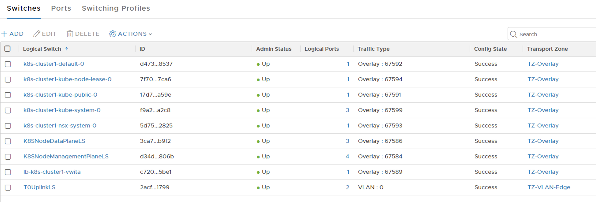
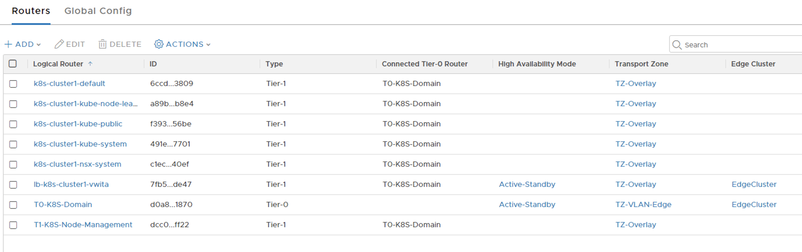
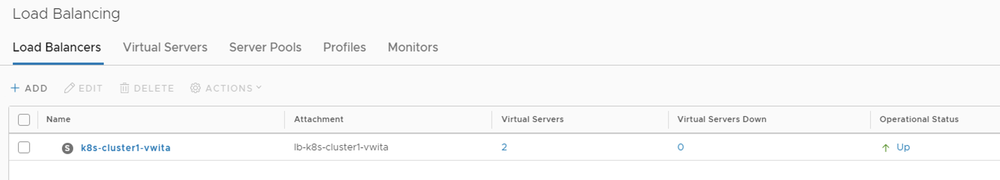
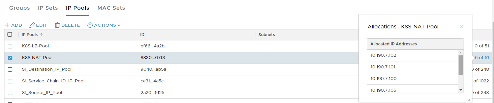
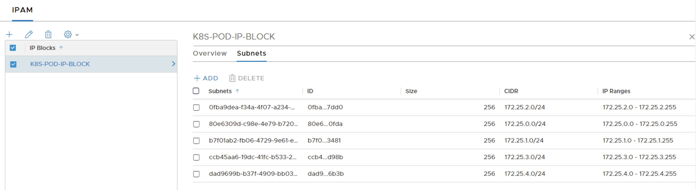
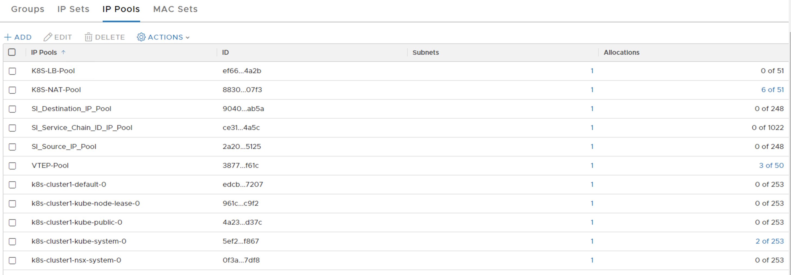

# NSX-T & K8S - PART 4

# Table Of Contents

[Current State](#Current-State)   
[NSX Container Plugin (NCP) and NSX Node Agent Installation](#NSX-Container-Plugin-and-NSX-Node-Agent-Installation)

# Current State
[Back to Table of Contents](#Table-Of-Contents)

## K8S Cluster

Previously in Part 3, K8S cluster has successfully been formed using kubeadm. 

<pre><code>
root@k8s-master:/home/vmware# <b>kubectl get nodes</b>
NAME         STATUS   ROLES    AGE   VERSION
k8s-master   <b>Ready</b>    master   15m   v1.14.1
k8s-node1    <b>Ready</b>    <none>   50s   v1.14.1
k8s-node2    <b>Ready</b>    <none>   14s   v1.14.1
</code></pre>

The namespaces that are provisioned by default can be seen using the following kubectl command.

<pre><code>
root@k8s-master:~# <b>kubectl get namespaces</b>
NAME              STATUS   AGE
default           Active   4h36m
kube-node-lease   Active   4h36m
kube-public       Active   4h36m
kube-system       Active   4h36m
root@k8s-master:~#
</code></pre>

To see which infrastructure Pods are automatically provisioned during the initialization of K8S cluster, following command can be used.

<pre><code>
root@k8s-master:~# <b>kubectl get pods --all-namespaces</b>
NAMESPACE     NAME                                 READY   STATUS              RESTARTS   AGE
<b>kube-system</b>   coredns-fb8b8dccf-b592z              0/1     <b>ContainerCreating</b>   0          4h27m
<b>kube-system</b>   coredns-fb8b8dccf-j66fg              0/1     <b>ContainerCreating</b>   0          4h27m
<b>kube-system</b>   etcd-k8s-master                      1/1     Running             0          4h26m
<b>kube-system</b>   kube-apiserver-k8s-master            1/1     Running             0          4h26m
<b>kube-system</b>   kube-controller-manager-k8s-master   1/1     Running             0          4h26m
<b>kube-system</b>   kube-proxy-bk7rs                     1/1     Running             0          19m
<b>kube-system</b>   kube-proxy-j4p5f                     1/1     Running             0          4h27m
<b>kube-system</b>   kube-proxy-mkm4w                     1/1     Running             0          44m
<b>kube-system</b>   kube-scheduler-k8s-master            1/1     Running             0          4h26m
root@k8s-master:~#
</code></pre>

_**Notice "coredns-xxx" Pods are stuck in "ContainerCreating" phase, the reason is although kubelet agent on K8S worker Node sent a request to NSX-T CNI Plugin module to start provisioning the individual network interface for these Pods, since the NSX Node Agent is not installed on the K8S worker nodes yet (Nor the NSX Container Plugin for attaching NSX-T management plane to K8S API) , kubelet can not move forward with the Pod creation.**_

Below is a revisit of the NSX-T and K8S integration architecture (which was mentioned in Part 2 of this series)

## NSX-T Topology

Current state of the topology is still as the same that we created in Part 1. Shown below. The only difference now is K8S cluster is deployed hence the infrastructure Pods are scheduled on K8S nodes. 

Below screenshots from the NSX-T GUI show the current configuration of the dataplane with NSX-T.

LOGICAL SWITCHES

LOGICAL ROUTERS

IP Pools

Load Balancer

No load balancers exist yet.

FIREWALL

Only the two empty firewall sections and the default section exist in the rule base.

# NSX Container Plugin and NSX Node Agent Installation
[Back to Table of Contents](#Table-Of-Contents)

Once again, the content and files in the NSX container folder that was copied to each K8S node will be used in this section. 

## Load The Docker Image for NSX NCP and Node Agent on K8S Nodes

For the commands below, "sudo" can be used with each command or privilege can be escalated to root by using "sudo -H bash" in advance.

On each K8S node, navigate to "/home/vmware/nsx-container-2.4.1.13515827/Kubernetes" folder then execute the following command to load respective image to the local Docker repository of each K8S Node. _**NSX Container Plugin (NCP) and Node Agent Pods use the same container image.**_

<pre><code>
root@k8s-master:/home/vmware/nsx-container-2.4.1.13515827/Kubernetes# <b>docker load -i nsx-ncp-ubuntu-2.4.1.13515827.tar</b>
c854e44a1a5a: Loading layer [==================================================>]  132.8MB/132.8MB
8ba4b4ea187c: Loading layer [==================================================>]  15.87kB/15.87kB
46c98490f575: Loading layer [==================================================>]  9.728kB/9.728kB
1633f88f8c9f: Loading layer [==================================================>]  4.608kB/4.608kB
0e20f4f8a593: Loading layer [==================================================>]  3.072kB/3.072kB
29ee2462776b: Loading layer [==================================================>]  3.072kB/3.072kB
09df119f61a0: Loading layer [==================================================>]  10.84MB/10.84MB
d2445ae12a7e: Loading layer [==================================================>]  28.16kB/28.16kB
c02b8962769c: Loading layer [==================================================>]  284.7kB/284.7kB
3465892d0467: Loading layer [==================================================>]  11.26kB/11.26kB
9a6fc128cdcf: Loading layer [==================================================>]  1.625MB/1.625MB
0ed84005a093: Loading layer [==================================================>]  7.168kB/7.168kB
502420413898: Loading layer [==================================================>]   1.23MB/1.23MB
c30860d2ecd5: Loading layer [==================================================>]    171kB/171kB
8d69b3ad3ee8: Loading layer [==================================================>]  392.4MB/392.4MB
Loaded image: registry.local/2.4.1.13515827/nsx-ncp-ubuntu:latest
root@k8s-master:/home/vmware/nsx-container-2.4.1.13515827/Kubernetes#
</code></pre>

Make sure the image is now in the local Docker repository :

<pre><code>
root@k8s-master:/home/vmware/nsx-container-2.4.1.13515827/Kubernetes# <b>docker images</b>
REPOSITORY                                     TAG                 IMAGE ID            CREATED             SIZE
k8s.gcr.io/kube-proxy                          v1.14.2             5c24210246bb        12 days ago         82.1MB
k8s.gcr.io/kube-apiserver                      v1.14.2             5eeff402b659        12 days ago         210MB
k8s.gcr.io/kube-controller-manager             v1.14.2             8be94bdae139        12 days ago         158MB
k8s.gcr.io/kube-scheduler                      v1.14.2             ee18f350636d        12 days ago         81.6MB
<b>registry.local/2.4.1.13515827/nsx-ncp-ubuntu</b>   latest              5714a979b290        4 weeks ago         518MB
k8s.gcr.io/coredns                             1.3.1               eb516548c180        4 months ago        40.3MB
k8s.gcr.io/etcd                                3.3.10              2c4adeb21b4f        5 months ago        258MB
k8s.gcr.io/pause                               3.1                 da86e6ba6ca1        17 months ago       742kB
root@k8s-master:/home/vmware/nsx-container-2.4.1.13515827/Kubernetes#
</code></pre>

Make sure to update the image name from "nsx-ncp-ubuntu" => "nsx-ncp" , since the yml files, for both NCP and NSX Node Agent , are referring to image name as "nsx-ncp"

<pre><code>
root@k8s-master:/home/vmware/nsx-container-2.4.1.13515827/Kubernetes# <b> docker tag registry.local/2.4.1.13515827/nsx-ncp-ubuntu:latest nsx-ncp:latest</b>
root@k8s-master:/home/vmware/nsx-container-2.4.1.13515827/Kubernetes#
</code></pre>

Verify the image name has changed. 

<pre><code>
root@k8s-master:/home/vmware# <b>docker images</b>
REPOSITORY                                     TAG                 IMAGE ID            CREATED             SIZE
k8s.gcr.io/kube-proxy                          v1.14.2             5c24210246bb        2 weeks ago         82.1MB
k8s.gcr.io/kube-apiserver                      v1.14.2             5eeff402b659        2 weeks ago         210MB
k8s.gcr.io/kube-controller-manager             v1.14.2             8be94bdae139        2 weeks ago         158MB
k8s.gcr.io/kube-scheduler                      v1.14.2             ee18f350636d        2 weeks ago         81.6MB
<b>nsx-ncp</b>                                        latest              5714a979b290        5 weeks ago         518MB
<b>registry.local/2.4.1.13515827/nsx-ncp-ubuntu</b>   latest              5714a979b290        5 weeks ago         518MB
k8s.gcr.io/coredns                             1.3.1               eb516548c180        4 months ago        40.3MB
k8s.gcr.io/etcd                                3.3.10              2c4adeb21b4f        6 months ago        258MB
k8s.gcr.io/pause                               3.1                 da86e6ba6ca1        17 months ago       742kB
</code></pre>

## Create "nsx-system" for NSX NCP, Node Agent Pods and Apply K8S RBAC for those Pods 

* A single yaml file will be used to create a new dedicated namespace for NCP and Node Agent Pods , the yaml is put together by @Yasen Simeonov (Technical Product Manager at VMware) which is public here => https://raw.githubusercontent.com/yasensim/k8s-lab/master/nsx-ncp-rbac.yaml

<pre><code>
root@k8s-master:~# <b>kubectl create -f https://raw.githubusercontent.com/yasensim/k8s-lab/master/nsx-ncp-rbac.yaml</b>
namespace/nsx-system created
serviceaccount/ncp-svc-account created
clusterrole.rbac.authorization.k8s.io/ncp-cluster-role created
clusterrole.rbac.authorization.k8s.io/ncp-patch-role created
clusterrolebinding.rbac.authorization.k8s.io/ncp-cluster-role-binding created
clusterrolebinding.rbac.authorization.k8s.io/ncp-patch-role-binding created
serviceaccount/nsx-node-agent-svc-account created
clusterrole.rbac.authorization.k8s.io/nsx-node-agent-cluster-role created
clusterrolebinding.rbac.authorization.k8s.io/nsx-node-agent-cluster-role-binding created
root@k8s-master:~#
root@k8s-master:~#
root@k8s-master:~# <b>kubectl get namespaces</b>
NAME              STATUS   AGE
default           Active   5h22m
kube-node-lease   Active   5h22m
kube-public       Active   5h22m
kube-system       Active   5h22m
<b>nsx-system</b>        Active   5m47s
root@k8s-master:~#
</code></pre>

The yaml is also published (WITHOUT the nsx-system namespace creation piece) in VMware NSX-T 2.4 Installation Guide here => https://docs.vmware.com/en/VMware-NSX-T-Data-Center/2.4/com.vmware.nsxt.ncp_kubernetes.doc/GUID-AC96C51A-052B-403F-9670-67E55C4C9170.html

## The yaml is also published here : dumlu github

## NCP.ini Parameters
NCP.ini file is the single source of truth that holds all the parameters related to how NCP will consume NSX-T.  
## Dont forghet to specify the service account

## Deploy NSX NCP 
## Note how you commented in the ncp-svc-account line in ncp-deployment.yml file !!!
## Copy the edited NCP-Deployment file to a central location or to K8S Master Node local folder and then deploy the NSX NCP Pod in the "nsx-system" namespace by using the following command

<pre><code>
root@k8s-master:/home/vmware# <b>kubectl create -f ncp-deployment.yml --namespace=nsx-system</b>
configmap/nsx-ncp-config created
deployment.extensions/nsx-ncp created
root@k8s-master:/home/vmware#
root@k8s-master:/home/vmware# <b>kubectl get pods --all-namespaces</b>
NAMESPACE     NAME                                 READY   STATUS              RESTARTS   AGE
kube-system   coredns-fb8b8dccf-b592z              0/1     ContainerCreating   0          5h45m
kube-system   coredns-fb8b8dccf-j66fg              0/1     ContainerCreating   0          5h45m
kube-system   etcd-k8s-master                      1/1     Running             0          5h44m
kube-system   kube-apiserver-k8s-master            1/1     Running             0          5h44m
kube-system   kube-controller-manager-k8s-master   1/1     Running             0          5h44m
kube-system   kube-proxy-bk7rs                     1/1     Running             0          97m
kube-system   kube-proxy-j4p5f                     1/1     Running             0          5h45m
kube-system   kube-proxy-mkm4w                     1/1     Running             0          122m
kube-system   kube-scheduler-k8s-master            1/1     Running             0          5h44m
<b>nsx-system</b>    <b>nsx-ncp-7f65bbf6f6-mr29b </b>            1/1     <b>Running</b>             0          18s
root@k8s-master:/home/vmware#
</code></pre>

* Notice the changes to the existing logical switches/segments, Tier 1 Routers, Load Balancer below . All these newly created objects have been provisioned by NCP ( as soon as NCP Pod has been successfully deployed) by identifying the state of the K8S state and mapping the K8S objects to the NSX-T Logical Networking constructs.

* Notice that CoreDNS pods are still in ContainerCreating phase, the reason for that is NSX Node Agent (which is responsible for connecting the pods to a logical switch) is still not installed on K8S Worker Nodes yet (next step)

## Deploy NSX Node Agent
## 
## Note how you commented in the ncp-svc-account line in ncp-deployment.yml file !!!
## Copy the edited NCP-Deployment file to a central location or to K8S Master Node local folder and then deploy the NSX NCP Pod in the "nsx-system" namespace by using the following command

<pre><code>
root@k8s-master:/home/vmware# kubectl get pods --all-namespaces -o wide
NAMESPACE     NAME                                 READY   STATUS              RESTARTS   AGE     IP            NODE         NOMINATED NODE   READINESS GATES
kube-system   coredns-fb8b8dccf-b592z              0/1     ContainerCreating   0          6h      <none>        k8s-master   <none>           <none>
kube-system   coredns-fb8b8dccf-j66fg              0/1     ContainerCreating   0          6h      <none>        k8s-master   <none>           <none>
kube-system   etcd-k8s-master                      1/1     Running             0          5h59m   10.190.5.10   k8s-master   <none>           <none>
kube-system   kube-apiserver-k8s-master            1/1     Running             0          5h59m   10.190.5.10   k8s-master   <none>           <none>
kube-system   kube-controller-manager-k8s-master   1/1     Running             0          5h59m   10.190.5.10   k8s-master   <none>           <none>
kube-system   kube-proxy-bk7rs                     1/1     Running             0          112m    10.190.5.12   k8s-node2    <none>           <none>
kube-system   kube-proxy-j4p5f                     1/1     Running             0          6h      10.190.5.10   k8s-master   <none>           <none>
kube-system   kube-proxy-mkm4w                     1/1     Running             0          137m    10.190.5.11   k8s-node1    <none>           <none>
kube-system   kube-scheduler-k8s-master            1/1     Running             0          5h59m   10.190.5.10   k8s-master   <none>           <none>
nsx-system    nsx-ncp-7f65bbf6f6-mr29b             1/1     Running             0          14m     10.190.5.12   <b>k8s-node2</b>    <none>           <none>
nsx-system    nsx-node-agent-2tjb7                 2/2     Running             0          24s     10.190.5.12   <b>k8s-node2</b>    <none>           <none>
nsx-system    nsx-node-agent-nqwgx                 2/2     Running             0          24s     10.190.5.11   <b>k8s-node1</b>    <none>           <none>
root@k8s-master:/home/vmware#
</code></pre>

Note : "-o wide" provides which Pod <=> Node mapping in the output

* Notice yet again the coredns pods are still in ContainerCreating state. 

<pre><code>
root@k8s-master:/home/vmware# kubectl get pods --all-namespaces <b>-o wide</b>
NAMESPACE     NAME                                 READY   STATUS              RESTARTS   AGE     IP            NODE         NOMINATED NODE   READINESS GATES
kube-system   coredns-fb8b8dccf-b592z              0/1     ContainerCreating   0          6h      <none>        k8s-master   <none>           <none>
kube-system   coredns-fb8b8dccf-j66fg              0/1     ContainerCreating   0          6h      <none>        k8s-master   <none>           <none>
kube-system   etcd-k8s-master                      1/1     Running             0          5h59m   10.190.5.10   k8s-master   <none>           <none>
kube-system   kube-apiserver-k8s-master            1/1     Running             0          5h59m   10.190.5.10   k8s-master   <none>           <none>
kube-system   kube-controller-manager-k8s-master   1/1     Running             0          5h59m   10.190.5.10   k8s-master   <none>           <none>
kube-system   kube-proxy-bk7rs                     1/1     Running             0          112m    10.190.5.12   k8s-node2    <none>           <none>
kube-system   kube-proxy-j4p5f                     1/1     Running             0          6h      10.190.5.10   k8s-master   <none>           <none>
kube-system   kube-proxy-mkm4w                     1/1     Running             0          137m    10.190.5.11   k8s-node1    <none>           <none>
kube-system   kube-scheduler-k8s-master            1/1     Running             0          5h59m   10.190.5.10   k8s-master   <none>           <none>
nsx-system    nsx-ncp-7f65bbf6f6-mr29b             1/1     Running             0          14m     10.190.5.12   k8s-node2    <none>           <none>
nsx-system    nsx-node-agent-2tjb7                 2/2     Running             0          24s     10.190.5.12   k8s-node2    <none>           <none>
nsx-system    nsx-node-agent-nqwgx                 2/2     Running             0          24s     10.190.5.11   k8s-node1    <none>           <none>
root@k8s-master:/home/vmware# 
</code></pre>

* At this stage simply delete those two coredns pods and K8S scheduler will recreate those two pods and both of them will be successfully get attached to the respective overlay network on NSX-T side.

<pre><code>
root@k8s-master:/home/vmware# <b>kubectl delete pod/coredns-fb8b8dccf-b592z --namespace=kube-system</b>
pod "coredns-fb8b8dccf-b592z" deleted
root@k8s-master:/home/vmware# <b>kubectl delete pod/coredns-fb8b8dccf-j66fg --namespace=kube-system</b>
pod "coredns-fb8b8dccf-j66fg" deleted
root@k8s-master:/home/vmware# kubectl get pods --all-namespaces <b>-o wide</b>
NAMESPACE     NAME                                 READY   STATUS    RESTARTS   AGE     IP            NODE         NOMINATED NODE   READINESS GATES
kube-system   coredns-fb8b8dccf-fhn6q              1/1     Running   0          3m40s   172.25.4.4    k8s-node1    <none>           <none>
kube-system   coredns-fb8b8dccf-wqndw              1/1     Running   0          88s     172.25.4.3    k8s-node2    <none>           <none>
kube-system   etcd-k8s-master                      1/1     Running   0          6h4m    10.190.5.10   k8s-master   <none>           <none>
kube-system   kube-apiserver-k8s-master            1/1     Running   0          6h4m    10.190.5.10   k8s-master   <none>           <none>
kube-system   kube-controller-manager-k8s-master   1/1     Running   0          6h4m    10.190.5.10   k8s-master   <none>           <none>
kube-system   kube-proxy-bk7rs                     1/1     Running   0          117m    10.190.5.12   k8s-node2    <none>           <none>
kube-system   kube-proxy-j4p5f                     1/1     Running   0          6h5m    10.190.5.10   k8s-master   <none>           <none>
kube-system   kube-proxy-mkm4w                     1/1     Running   0          142m    10.190.5.11   k8s-node1    <none>           <none>
kube-system   kube-scheduler-k8s-master            1/1     Running   0          6h4m    10.190.5.10   k8s-master   <none>           <none>
nsx-system    nsx-ncp-7f65bbf6f6-mr29b             1/1     Running   0          20m     10.190.5.12   k8s-node2    <none>           <none>
nsx-system    nsx-node-agent-2tjb7                 2/2     Running   0          5m35s   10.190.5.12   k8s-node2    <none>           <none>
nsx-system    nsx-node-agent-nqwgx                 2/2     Running   0          5m35s   10.190.5.11   k8s-node1    <none>           <none>
root@k8s-master:/home/vmware#
</code></pre>

## Test Pod 

* Let' s create a test pod in it (in imperative way)

<pre><code>
root@k8s-master:/home/vmware# <b>kubectl run testdeployment --image=praqma/network-multitool --replicas=2</b>
kubectl run --generator=deployment/apps.v1 is DEPRECATED and will be removed in a future version. Use kubectl run --generator=run-pod/v1 or kubectl create instead.
deployment.apps/testdeployment created
root@k8s-master:/home/vmware#
</code></pre>

Note : Notice the message in the output. K8S is recommending declerative way of implementing pods. (kubectl create -f <aaa.yml>)

* Below command is basic, it is used to list the pods running in the default namespace. As shown below, the deployment that has just been created has provisioned
two pods (since replicas has been set to 2).

<pre><code>
root@k8s-master:/home/vmware# kubectl get pods -o wide
NAME                             READY   STATUS    RESTARTS   AGE   IP           NODE        NOMINATED NODE   READINESS GATES
testdeployment-884f76955-7xvwf   1/1     Running   0          30s   172.25.1.2   k8s-node1   <none>           <none>
testdeployment-884f76955-rxvb9   1/1     Running   0          30s   172.25.1.3   k8s-node2   <none>           <none>
root@k8s-master:/home/vmware#
</code></pre>

* Below is a "Traceroute" output from one of the pods that has just been created. 

<pre><code>
root@k8s-master:/home/vmware# <b>kubectl exec -it testdeployment-884f76955-7xvwf /bin/bash</b>
bash-4.4# traceroute 8.8.8.8
traceroute to 8.8.8.8 (8.8.8.8), 30 hops max, 46 byte packets
 1  172.25.1.1 (172.25.1.1)  1.257 ms  0.280 ms  0.149 ms 
 2  100.64.208.4 (100.64.208.4)  0.170 ms  0.285 ms  0.134 ms 
 3  10.190.4.1 (10.190.4.1)  1.478 ms  1.252 ms  1.111 ms 
 4  192.168.1.254 (192.168.1.254)  3.647 ms  3.714 ms  4.866 ms 
|
|
OUTPUT OMITTED
|
|
13  72.14.208.150 (72.14.208.150)  40.458 ms  *  *
14  108.170.251.193 (108.170.251.193)  39.072 ms  *  *
15  209.85.251.239 (209.85.251.239)  40.088 ms  72.14.234.227 (72.14.234.227)  39.396 ms  216.239.54.61 (216.239.54.61)  39.398 ms
16  google-public-dns-a.google.com (8.8.8.8)  40.616 ms  *  *
bash-4.4#
</code></pre>

In the traceroute output : 
First Router : Tier 1 Default Namespace Downlink IP
Second Router : Tier 0 Router Link , facing Tier 1
Third Router : Physical Router that Tier 0 is peering with
and onwards...

