# NSX-T & K8S - PART 4

# Table Of Contents

[Current State](#Current-State)   
[NSX Container Plugin (NCP) Installation](#NSX-Container-Plugin-Installation)  
[NSX Node Agent Installation](#NSX-Node-Agent-Installation)

# Current State
[Back to Table of Contents](#Table-Of-Contents)

## K8S Cluster

Previously in Part 3, K8S cluster has successfully been formed using kubeadm. 

<pre><code>
root@k8s-master:/home/vmware# <b>kubectl get nodes</b>
NAME         STATUS   ROLES    AGE   VERSION
k8s-master   <b>Ready</b>    master   15m   v1.14.1
k8s-node1    <b>Ready</b>    <none>   50s   v1.14.1
k8s-node2    <b>Ready</b>    <none>   14s   v1.14.1
</code></pre>

The namespaces that are provisioned by default can be seen using the following kubectl command.

<pre><code>
root@k8s-master:~# <b>kubectl get namespaces</b>
NAME              STATUS   AGE
default           Active   4h36m
kube-node-lease   Active   4h36m
kube-public       Active   4h36m
kube-system       Active   4h36m
root@k8s-master:~#
</code></pre>

To see which infrastructure Pods are automatically provisioned during the initialization of K8S cluster, following command can be used.

<pre><code>
root@k8s-master:~# <b>kubectl get pods --all-namespaces</b>
NAMESPACE     NAME                                 READY   STATUS              RESTARTS   AGE
<b>kube-system</b>   coredns-fb8b8dccf-b592z              0/1     <b>ContainerCreating</b>   0          4h27m
<b>kube-system</b>   coredns-fb8b8dccf-j66fg              0/1     <b>ContainerCreating</b>   0          4h27m
<b>kube-system</b>   etcd-k8s-master                      1/1     Running             0          4h26m
<b>kube-system</b>   kube-apiserver-k8s-master            1/1     Running             0          4h26m
<b>kube-system</b>   kube-controller-manager-k8s-master   1/1     Running             0          4h26m
<b>kube-system</b>   kube-proxy-bk7rs                     1/1     Running             0          19m
<b>kube-system</b>   kube-proxy-j4p5f                     1/1     Running             0          4h27m
<b>kube-system</b>   kube-proxy-mkm4w                     1/1     Running             0          44m
<b>kube-system</b>   kube-scheduler-k8s-master            1/1     Running             0          4h26m
root@k8s-master:~#
</code></pre>

_**Notice "coredns-xxx" Pods are stuck in "ContainerCreating" phase, the reason is although kubelet agent on K8S worker Node sent a request to NSX-T CNI Plugin module to start provisioning the individual network interface for these Pods, since the NSX Node Agent is not installed on the K8S worker nodes yet (Nor the NSX Container Plugin for attaching NSX-T management plane to K8S API) , kubelet can not move forward with the Pod creation.**_

In the previous output, kube-proxy Pods can be ignored as their functionality will be replaced by NSX Kube Proxy container (in the NSX Node Agent Pod)

Below is a revisit of the NSX-T and K8S integration architecture (which was mentioned in Part 2 of this series)

## NSX-T Topology

Current state of the topology is still as the same that we created in Part 1. Shown below. The only difference now is K8S cluster is deployed hence the infrastructure Pods are scheduled on K8S nodes. 

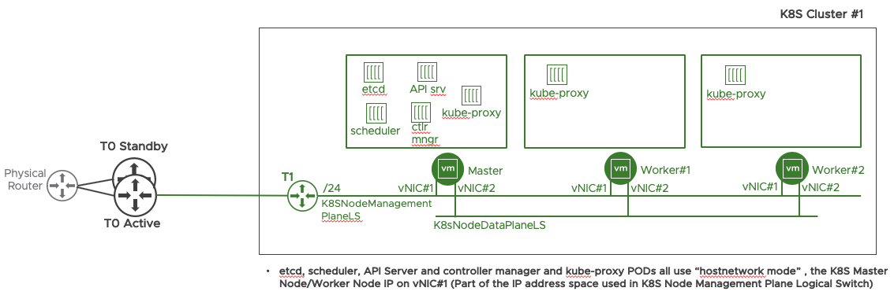

Below screenshots from the NSX-T GUI show the current configuration of the dataplane with NSX-T.

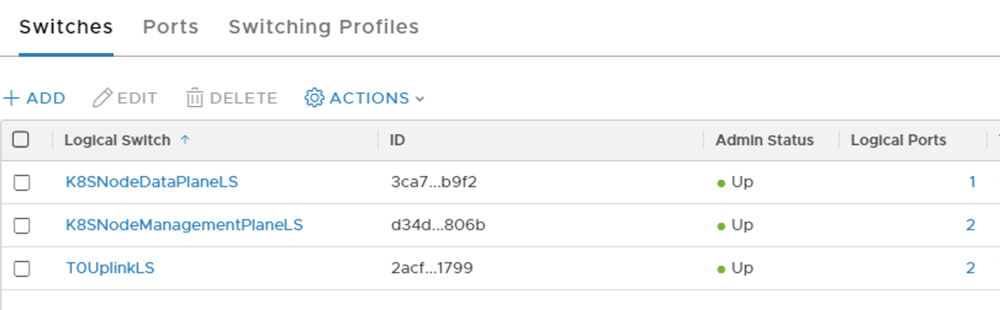

LOGICAL SWITCHES

LOGICAL ROUTERS

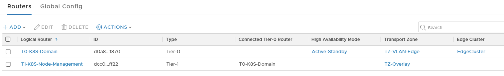

IP POOLS

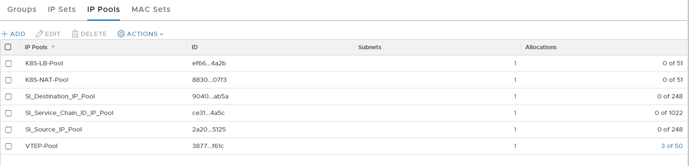

LOAD BALANCER

No load balancers exist yet.

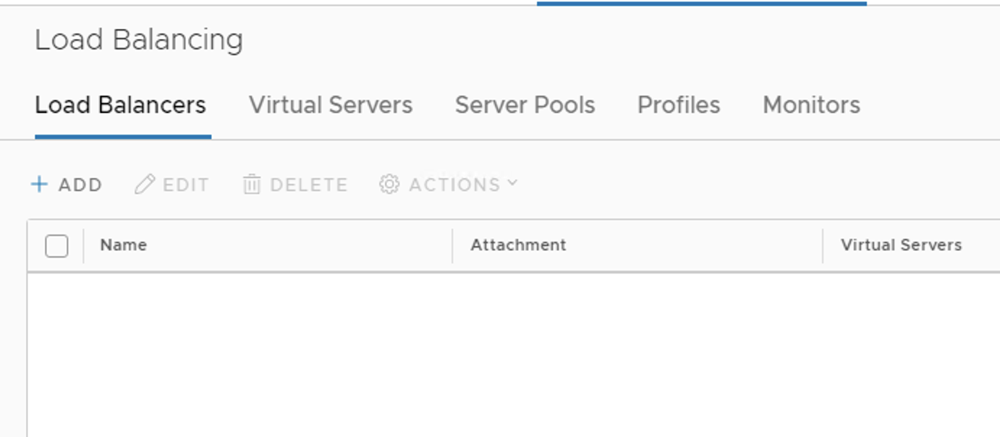

FIREWALL

Only the two empty firewall sections and the default section exist in the rule base.

# NSX Container Plugin Installation
[Back to Table of Contents](#Table-Of-Contents)

Once again, NSX Container Plugin (NCP) image file is in the NSX container folder that was copied to each K8S node will be used in this section. 

## Load The Docker Image for NSX NCP (and NSX Node Agent) on K8S Nodes

For the commands below, "sudo" can be used with each command or privilege can be escalated to root by using "sudo -H bash" in advance.

On each K8S node, navigate to "/home/vmware/nsx-container-2.4.1.13515827/Kubernetes" folder then execute the following command to load respective image to the local Docker repository of each K8S Node. 

_**NSX Container Plugin (NCP) and NSX Node Agent Pods use the same container image.**_

<pre><code>
root@k8s-master:/home/vmware/nsx-container-2.4.1.13515827/Kubernetes# <b>docker load -i nsx-ncp-ubuntu-2.4.1.13515827.tar</b>
c854e44a1a5a: Loading layer [==================================================>]  132.8MB/132.8MB
8ba4b4ea187c: Loading layer [==================================================>]  15.87kB/15.87kB
46c98490f575: Loading layer [==================================================>]  9.728kB/9.728kB
1633f88f8c9f: Loading layer [==================================================>]  4.608kB/4.608kB
0e20f4f8a593: Loading layer [==================================================>]  3.072kB/3.072kB
29ee2462776b: Loading layer [==================================================>]  3.072kB/3.072kB
09df119f61a0: Loading layer [==================================================>]  10.84MB/10.84MB
d2445ae12a7e: Loading layer [==================================================>]  28.16kB/28.16kB
c02b8962769c: Loading layer [==================================================>]  284.7kB/284.7kB
3465892d0467: Loading layer [==================================================>]  11.26kB/11.26kB
9a6fc128cdcf: Loading layer [==================================================>]  1.625MB/1.625MB
0ed84005a093: Loading layer [==================================================>]  7.168kB/7.168kB
502420413898: Loading layer [==================================================>]   1.23MB/1.23MB
c30860d2ecd5: Loading layer [==================================================>]    171kB/171kB
8d69b3ad3ee8: Loading layer [==================================================>]  392.4MB/392.4MB
Loaded image: registry.local/2.4.1.13515827/nsx-ncp-ubuntu:latest
root@k8s-master:/home/vmware/nsx-container-2.4.1.13515827/Kubernetes#
</code></pre>

Make sure the image is now in the local Docker repository :

<pre><code>
root@k8s-master:/home/vmware/nsx-container-2.4.1.13515827/Kubernetes# <b>docker images</b>
REPOSITORY                                     TAG                 IMAGE ID            CREATED             SIZE
k8s.gcr.io/kube-proxy                          v1.14.2             5c24210246bb        12 days ago         82.1MB
k8s.gcr.io/kube-apiserver                      v1.14.2             5eeff402b659        12 days ago         210MB
k8s.gcr.io/kube-controller-manager             v1.14.2             8be94bdae139        12 days ago         158MB
k8s.gcr.io/kube-scheduler                      v1.14.2             ee18f350636d        12 days ago         81.6MB
<b>registry.local/2.4.1.13515827/nsx-ncp-ubuntu</b>   latest              5714a979b290        4 weeks ago         518MB
k8s.gcr.io/coredns                             1.3.1               eb516548c180        4 months ago        40.3MB
k8s.gcr.io/etcd                                3.3.10              2c4adeb21b4f        5 months ago        258MB
k8s.gcr.io/pause                               3.1                 da86e6ba6ca1        17 months ago       742kB
root@k8s-master:/home/vmware/nsx-container-2.4.1.13515827/Kubernetes#
</code></pre>

Make sure to update the image name from "nsx-ncp-ubuntu" => "nsx-ncp" , since the yaml files, for both NCP and NSX Node Agent, are referring to image name as "nsx-ncp"

<pre><code>
root@k8s-master:/home/vmware/nsx-container-2.4.1.13515827/Kubernetes# <b> docker tag registry.local/2.4.1.13515827/nsx-ncp-ubuntu:latest nsx-ncp:latest</b>
root@k8s-master:/home/vmware/nsx-container-2.4.1.13515827/Kubernetes#
</code></pre>

Verify the image name has changed. 

<pre><code>
root@k8s-master:/home/vmware# <b>docker images</b>
REPOSITORY                                     TAG                 IMAGE ID            CREATED             SIZE
k8s.gcr.io/kube-proxy                          v1.14.2             5c24210246bb        2 weeks ago         82.1MB
k8s.gcr.io/kube-apiserver                      v1.14.2             5eeff402b659        2 weeks ago         210MB
k8s.gcr.io/kube-controller-manager             v1.14.2             8be94bdae139        2 weeks ago         158MB
k8s.gcr.io/kube-scheduler                      v1.14.2             ee18f350636d        2 weeks ago         81.6MB
<b>nsx-ncp</b>                                        <b>latest</b>              <b>5714a979b290</b>        5 weeks ago         518MB
<b>registry.local/2.4.1.13515827/nsx-ncp-ubuntu</b>   <b>latest</b>              <b>5714a979b290</b>        5 weeks ago         518MB
k8s.gcr.io/coredns                             1.3.1               eb516548c180        4 months ago        40.3MB
k8s.gcr.io/etcd                                3.3.10              2c4adeb21b4f        6 months ago        258MB
k8s.gcr.io/pause                               3.1                 da86e6ba6ca1        17 months ago       742kB
</code></pre>

## Creating NSX Specific K8S Resources 

For better isolation and security, NSX infrastructure Pods (NSX Container Plugin (NCP) and NSX Node Agent) will be running in their dedicated K8S namespace and a K8S Role Based Access Control (RBAC) policy will be applied for that namespace.

A single yml file, which is included [here](https://raw.githubusercontent.com/dumlutimuralp/nsx-t-k8s/master/Yaml/nsx-ncp-rbac.yml), will be used to implement the following steps :  

create a dedicated K8S namespace, as "nsx-system", for NCP and Node Agent Pods    
create a service account, as "ncp-svc-account", for NCP  
create a service account, as "nsx-node-agent-svc-account", for Node agent  
create a cluster role, as "ncp-cluster-role" , for NCP (having specific API access)   
create a cluster role "ncp-patch-role" , for NCP (having specific API access)  
bind "ncp-svc-account" to "ncp-cluster-role"  
bind "ncp-svc-account" to "ncp-patch-role"  
create a cluster role "nsx-node-agent-cluster-role"  
bind "nsx-node-agent-svc-account" to "nsx-node-agent-cluster-role"  

<pre><code>
root@k8s-master:~# <b>kubectl create -f https://raw.githubusercontent.com/dumlutimuralp/nsx-t-k8s/master/Yaml/nsx-ncp-rbac.yml</b>
namespace/nsx-system created
serviceaccount/ncp-svc-account created
clusterrole.rbac.authorization.k8s.io/ncp-cluster-role created
clusterrole.rbac.authorization.k8s.io/ncp-patch-role created
clusterrolebinding.rbac.authorization.k8s.io/ncp-cluster-role-binding created
clusterrolebinding.rbac.authorization.k8s.io/ncp-patch-role-binding created
serviceaccount/nsx-node-agent-svc-account created
clusterrole.rbac.authorization.k8s.io/nsx-node-agent-cluster-role created
clusterrolebinding.rbac.authorization.k8s.io/nsx-node-agent-cluster-role-binding created
root@k8s-master:~#
root@k8s-master:~#
</code></pre>

Verify that the new namespace is created. 

<pre><code>
root@k8s-master:~# <b>kubectl get namespaces</b>
NAME              STATUS   AGE
default           Active   5h22m
kube-node-lease   Active   5h22m
kube-public       Active   5h22m
kube-system       Active   5h22m
<b>nsx-system</b>        Active   5m47s
root@k8s-master:~#
</code></pre> 

Verify that the service account and role bindings are successfully configured. 

<pre><code>
root@k8s-master:/home/vmware# <b>kubectl get sa -n nsx-system</b>
NAME                         SECRETS   AGE
default                      1         5d19h
<b>ncp-svc-account</b>              1         5d19h
<b>nsx-node-agent-svc-account</b>   1         5d19h
root@k8s-master:/home/vmware#
</code></pre> 

<pre><code>
root@k8s-master:/home/vmware# <b>kubectl describe sa ncp-svc-account -n nsx-system</b>
Name:                <b>ncp-svc-account</b>
Namespace:           <b>nsx-system</b>
Labels:              <none>
Annotations:         <none>
Image pull secrets:  <none>
Mountable secrets:   ncp-svc-account-token-czzwc
Tokens:              ncp-svc-account-token-czzwc
Events:              <none>
root@k8s-master:/home/vmware#
</code></pre> 

<pre><code>
root@k8s-master:/home/vmware# <b>kubectl get clusterrolebinding -n nsx-system</b>
NAME                                                   AGE
cluster-admin                                          6d
kubeadm:kubelet-bootstrap                              6d
kubeadm:node-autoapprove-bootstrap                     6d
kubeadm:node-autoapprove-certificate-rotation          6d
kubeadm:node-proxier                                   6d
<b>ncp-cluster-role-binding</b>                               5d19h
<b>ncp-patch-role-binding</b>                                 5d19h
nsx-node-agent-cluster-role-binding                    5d19h
|
|
 Output Omitted
|
|
system:kube-dns                                        6d
system:kube-scheduler                                  6d
system:node                                            6d
system:node-proxier                                    6d
system:public-info-viewer                              6d
system:volume-scheduler                                6d
root@k8s-master:/home/vmware#
</code></pre> 

<pre><code>
root@k8s-master:/home/vmware# <b>kubectl describe clusterrolebinding ncp-cluster-role-binding -n nsx-system</b>
Name:         ncp-cluster-role-binding
Labels:       <none>
Annotations:  <none>
Role:
  Kind:  ClusterRole
  Name:  <b>ncp-cluster-role</b>
Subjects:
  Kind            Name             Namespace
  ----            ----             ---------
  ServiceAccount  <b>ncp-svc-account</b>  nsx-system
root@k8s-master:/home/vmware#
</code></pre> 

The "nsx-ncp-rbac.yml" is put together by [Yasen Simeonov](https://github.com/yasensim) (Senior Technical Product Manager at VMware) which is published [here](https://raw.githubusercontent.com/yasensim/k8s-lab/master/nsx-ncp-rbac.yaml) originally.  

The same yml file is also published in VMware NSX-T 2.4 Installation Guide [here](https://docs.vmware.com/en/VMware-NSX-T-Data-Center/2.4/com.vmware.nsxt.ncp_kubernetes.doc/GUID-AC96C51A-052B-403F-9670-67E55C4C9170.html) ((**WITHOUT** the nsx-system namespace resource though, hence the namespace needs to be manually created if the yml file in the installation guide will be used)

## Deploy NSX Container Plugin (NCP) 

Another yml file, "ncp-deployment.yml" will be used to deploy NSX Container Plugin. This yml file is also provided in the content of the NSX Container Plugin zip file that was downloaded from My.VMware portal. (It is also included [here]()

However, before moving forward, NSX-T specific environmental parameters need to be configured. The yml file contains a configmap for the configuration of the ncp.ini file for the NCP.  Basically most of the parameters are commented out with a "#" character. The definitions of each parameter are in the yml file itself. 

The "ncp-deployment.yml" file can simply be edited with a text editor. The parameters in the file that are used in this environment has "#" removed. Below is a list and explanation of each :

**cluster = k8scluster1** : Used to identify the NSX-T objects that are provisioned for this K8S cluster. Notice that K8S Node logical ports in "K8SNodeDataPlaneLS" are configured with the "k8s-cluster1" tag and the "ncp/cluster" scope also with the hostname of Ubuntu node as the tag and "ncp/node_name" scope on NSX-T side.

**enable_snat = True** : This parameter basically defines that all the K8S Pods in each K8S namespace in this K8S cluster will be SNATed (to be able to access the other resources in the datacenter external to NSX domain) . The SNAT rules will be autoatically provisioned on Tier 0 Router in this lab. The SNAT IP will be allocated from IP Pool named "K8S-NAT-Pool" that was configured back in Part 3.

**ingress_mode = NAT** : This parameter basically defines that NSX will use SNAT/DNAT rules for K8S ingress (L7 HTTPS/HTTP load balancing) to access the K8S service at the backend.

**nsx_api_managers = 10.190.1.80** , **nsx_api_user = admin** ,  **nsx_api_password = XXXXXXXXXXXXXX**  : These parameters are for NCP to access/consume the NSX Manager.

**insecure = True** : NSX Manager server certificate is not verified. 

**top_tier_router = T0-K8S-Domain** : The name of the Logical Router that will be used for implementing SNAT rules for the Pods in the K8S Namespaces.

**overlay_tz = TZ-Overlay** : The name of the existing overlay transport zone that will be used for creating new logical switches/segments for K8S namespaces and container networking.

**subnet_prefix = 24** : The size of the IP Pools for the namespaces that will be carved out from the main "K8S-POD-IP-BLOCK" configured in Part 3 (172.25.0.0 /16). Whenever a new K8S namespace is created a /24 IP pool will be allocated from thatthat IP block.

**use_native_loadbalancer = True** : This setting is to use NSX-T load balancer for K8S Service Type : Load Balancer. Whenever a new K8S service is exposed with the Type : Load Balancer then a VIP will be provisioned on NSX-T LB attached to a Tier 1 Logical Router dedicated for LB function. The VIP will be allocated from the IP Pool named "K8S-LB-Pool" that was configured back in Part 3.

**default_ingress_class_nsx = True** : This is to use NSX-T load balancer for K8S ingress (L7 HTTP/HTTPS load balancing) , instead of other solutions such as NGINX, HAProxy etc. Whenever a K8S ingress object is created, a Layer 7 rule will be configured on the NSX-T load balancer.

**service_size = 'SMALL'** : This setting configures a small sized NSX-T Load Balancer for the K8S cluster. Options are Small/Medium/Large. This is the Load Balancer instance which is attached to a dedicated Tier 1 Logical Router in the topology.

**container_ip_blocks = K8S-POD-IP-BLOCK** : This setting defines from which IP block each K8S namespace will carve its IP Pool/IP address space from. (172.25.0.0 /16 in this case) Size of each K8S namespace pool was defined with subnet_prefix parameter above)

**external_ip_pools = K8S-NAT-Pool** : This setting defines from which IP pool each SNAT IP will be allocated from. Whenever a new K8S namespace is created, then a NAT IP will be allocated from this pool. (10.190.7.100 to 10.190.7.150 in this case)

**external_ip_pools_lb = K8S-LB-Pool** : This setting defines from which IP pool each K8S service, which is configured with Type : Load Balancer, will allocate its IP from. (10.190.6.100 to 10.190.6.150 in this case)

**top_firewall_section_marker = Section1** and **bottom_firewall_section_marker = Section2** : This is to specify between which sections the K8S orchestrated firewall rules will fall in between. 

_**One additional configuration that is made in the yml file is removing the "#" from the line where it says "serviceAccountName: ncp-svc-account" . So that the NCP Pod has appropriate role and access to K8S cluster resources**_ 

The edited yml file, "ncp-deployment-custom.yml" in this case, can now be deployed from anywhere. In this environment this yml file is copied to /home/vmware folder in K8S Master Node and deployed in the "nsx-system" namespace with the following command.

<pre><code>
root@k8s-master:/home/vmware# <b>kubectl create -f ncp-deployment-custom.yml --namespace=nsx-system</b>
configmap/nsx-ncp-config created
deployment.extensions/nsx-ncp created
root@k8s-master:/home/vmware#
root@k8s-master:/home/vmware# <b>kubectl get pods --all-namespaces</b>
NAMESPACE     NAME                                 READY   STATUS              RESTARTS   AGE
kube-system   coredns-fb8b8dccf-b592z              0/1     ContainerCreating   0          5h45m
kube-system   coredns-fb8b8dccf-j66fg              0/1     ContainerCreating   0          5h45m
kube-system   etcd-k8s-master                      1/1     Running             0          5h44m
kube-system   kube-apiserver-k8s-master            1/1     Running             0          5h44m
kube-system   kube-controller-manager-k8s-master   1/1     Running             0          5h44m
kube-system   kube-proxy-bk7rs                     1/1     Running             0          97m
kube-system   kube-proxy-j4p5f                     1/1     Running             0          5h45m
kube-system   kube-proxy-mkm4w                     1/1     Running             0          122m
kube-system   kube-scheduler-k8s-master            1/1     Running             0          5h44m
<b>nsx-system</b>    <b>nsx-ncp-7f65bbf6f6-mr29b </b>            1/1     <b>Running</b>             0          18s
root@k8s-master:/home/vmware#
</code></pre>

As NCP is deployed as replicaset (replicas :1 is specified in deployment yml) , K8S will make sure that at a given time a single NCP Pod is running and healthy.

**Notice the changes to the existing logical switches/segments, Tier 1 Logical Routers, Load Balancer below . All these newly created objects have been provisioned by NCP (as soon as NCP Pod has been successfully deployed) by identifying the  the K8S desired state and mapping the K8S resources in etcd to the NSX-T Logical Networking constructs.**

LOGICAL SWITCHES
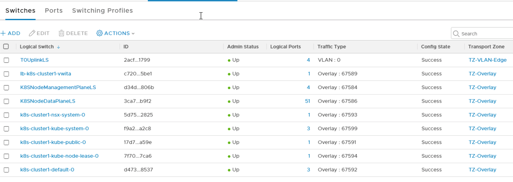

LOGICAL ROUTERS
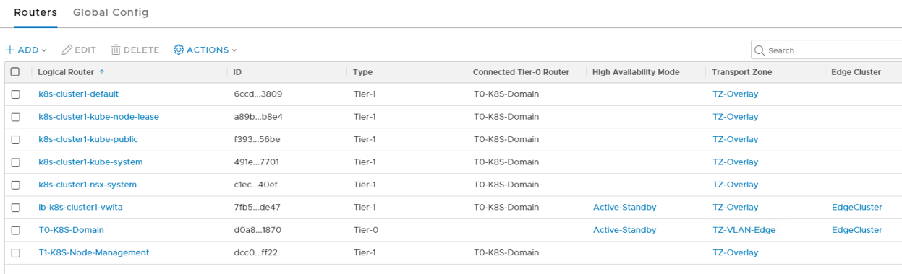

IP POOLS per Namespace
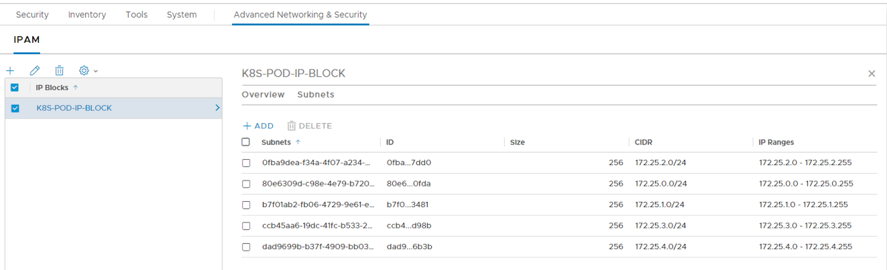

SNAT Pool
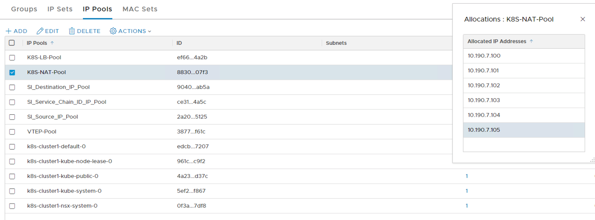

SNAT RULES
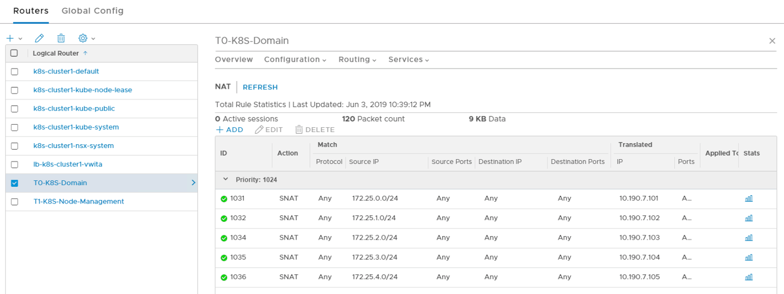

LOAD BALANCER
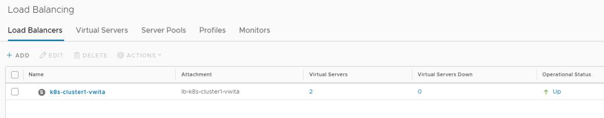

VIRTUAL SERVERS for INGRESS on LOAD BALANCER
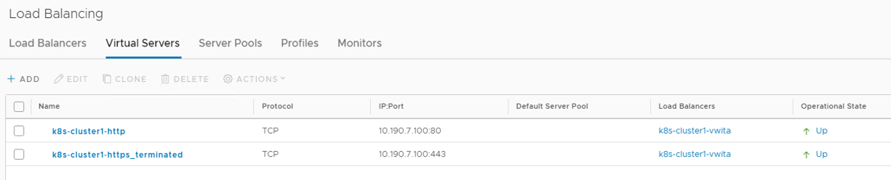

FIREWALL RULEBASE
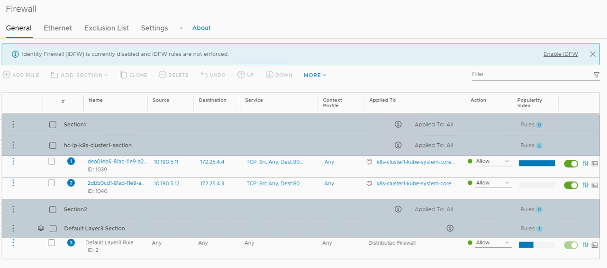

Notice also that CoreDNS pods are still in ContainerCreating phase, the reason for that is NSX Node Agent (which is responsible for connecting the pods to a logical switch) is still not installed on K8S Worker Nodes yet (next step)

# NSX Node Agent Installation
[Back to Table of Contents](#Table-Of-Contents)
 
"nsx-node-agent-ds.yml" will be used to deploy NSX Node Agent. This yml file is also provided in the content of the NSX Container Plugin zip file that was downloaded from My.VMware portal. 

This yml file also contains a configmap for the configuration of the ncp.ini file for the NSX Node Agent. None of the parameters in the configmap will be changed, the only line that needs to be edited is the one where it says "serviceAccountName: nsx-node-agent-svc-account"

The "nsx-node-agent-ds.yml" file can simply be edited with a text editor. **"#" is removed from the line with "serviceAccountname:..." so that role based access control can properly be applied for NSX Node Agent as well.**

The edited yml file, "nsx-node-agent-ds-custom.yml" in this case, can now be deployed from anywhere. In this environment this yml file is copied to /home/vmware folder in K8S Master Node and deployed in the "nsx-system" namespace with the following command.

<pre><code>
root@k8s-master:/home/vmware# <b>kubectl create -f nsx-node-agent-ds-custom.yml --namespace=nsx-system</b>
</code></pre>

As NSX Node Agent is deployed as a deamonset it will be running on each worker node in the K8S cluster.

<pre><code>
root@k8s-master:/home/vmware# kubectl get pods --all-namespaces -o wide
NAMESPACE     NAME                                 READY   STATUS              RESTARTS   AGE     IP            NODE         NOMINATED NODE   READINESS GATES
kube-system   coredns-fb8b8dccf-b592z              0/1     ContainerCreating   0          6h      <none>        k8s-master   <none>           <none>
kube-system   coredns-fb8b8dccf-j66fg              0/1     ContainerCreating   0          6h      <none>        k8s-master   <none>           <none>
kube-system   etcd-k8s-master                      1/1     Running             0          5h59m   10.190.5.10   k8s-master   <none>           <none>
kube-system   kube-apiserver-k8s-master            1/1     Running             0          5h59m   10.190.5.10   k8s-master   <none>           <none>
kube-system   kube-controller-manager-k8s-master   1/1     Running             0          5h59m   10.190.5.10   k8s-master   <none>           <none>
kube-system   kube-proxy-bk7rs                     1/1     Running             0          112m    10.190.5.12   k8s-node2    <none>           <none>
kube-system   kube-proxy-j4p5f                     1/1     Running             0          6h      10.190.5.10   k8s-master   <none>           <none>
kube-system   kube-proxy-mkm4w                     1/1     Running             0          137m    10.190.5.11   k8s-node1    <none>           <none>
kube-system   kube-scheduler-k8s-master            1/1     Running             0          5h59m   10.190.5.10   k8s-master   <none>           <none>
nsx-system    nsx-ncp-7f65bbf6f6-mr29b             1/1     Running             0          14m     10.190.5.12   k8s-node2    <none>           <none>
nsx-system    <b>nsx-node-agent-2tjb7</b>                 2/2     Running             0          24s     10.190.5.12   <b>k8s-node2</b>    <none>           <none>
nsx-system    <b>nsx-node-agent-nqwgx</b>                 2/2     Running             0          24s     10.190.5.11   <b>k8s-node1</b>    <none>           <none>
root@k8s-master:/home/vmware#
</code></pre>

**Note :** "-o wide" provides which Pod <=> Node mapping in the output

Notice yet again the coredns pods are still in ContainerCreating state. At this stage simply delete those two coredns pods and K8S scheduler will recreate those two pods and both of them will be successfully get attached to the respective overlay network on NSX-T side.

<pre><code>
root@k8s-master:/home/vmware# <b>kubectl delete pod/coredns-fb8b8dccf-b592z --namespace=kube-system</b>
pod "coredns-fb8b8dccf-b592z" deleted
root@k8s-master:/home/vmware# <b>kubectl delete pod/coredns-fb8b8dccf-j66fg --namespace=kube-system</b>
pod "coredns-fb8b8dccf-j66fg" deleted
root@k8s-master:/home/vmware# kubectl get pods --all-namespaces <b>-o wide</b>
NAMESPACE     NAME                                 READY   STATUS    RESTARTS   AGE     IP            NODE         NOMINATED NODE   READINESS GATES
kube-system   <b>coredns-fb8b8dccf-fhn6q</b>              1/1     Running   0          3m40s   <b>172.25.4.4</b>    k8s-node1    <none>           <none>
kube-system   <b>coredns-fb8b8dccf-wqndw</b>              1/1     Running   0          88s     <b>172.25.4.3</b>    k8s-node2    <none>           <none>
kube-system   etcd-k8s-master                      1/1     Running   0          6h4m    10.190.5.10   k8s-master   <none>           <none>
kube-system   kube-apiserver-k8s-master            1/1     Running   0          6h4m    10.190.5.10   k8s-master   <none>           <none>
kube-system   kube-controller-manager-k8s-master   1/1     Running   0          6h4m    10.190.5.10   k8s-master   <none>           <none>
kube-system   kube-proxy-bk7rs                     1/1     Running   0          117m    10.190.5.12   k8s-node2    <none>           <none>
kube-system   kube-proxy-j4p5f                     1/1     Running   0          6h5m    10.190.5.10   k8s-master   <none>           <none>
kube-system   kube-proxy-mkm4w                     1/1     Running   0          142m    10.190.5.11   k8s-node1    <none>           <none>
kube-system   kube-scheduler-k8s-master            1/1     Running   0          6h4m    10.190.5.10   k8s-master   <none>           <none>
nsx-system    nsx-ncp-7f65bbf6f6-mr29b             1/1     Running   0          20m     10.190.5.12   k8s-node2    <none>           <none>
nsx-system    nsx-node-agent-2tjb7                 2/2     Running   0          5m35s   10.190.5.12   k8s-node2    <none>           <none>
nsx-system    nsx-node-agent-nqwgx                 2/2     Running   0          5m35s   10.190.5.11   k8s-node1    <none>           <none>
root@k8s-master:/home/vmware#
</code></pre>

At this stage the topology looks like this 

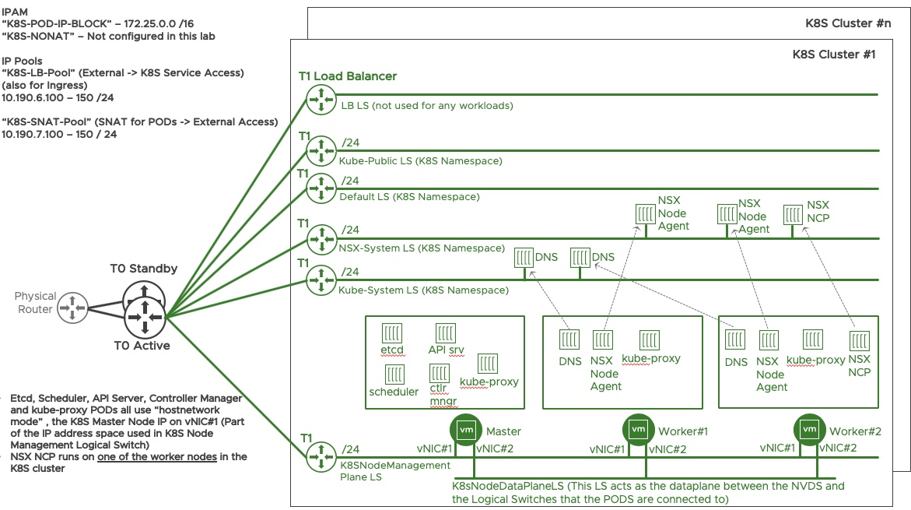

## Test Application Deployment

Let' s create a new namespace 

<pre><code>
root@k8s-master:/home/vmware# <b>kubectl create namespace demons</b>
namespace/demons created
root@k8s-master:/home/vmware#
</code></pre>

A new logical switch is created for "demons" namespace , shown below
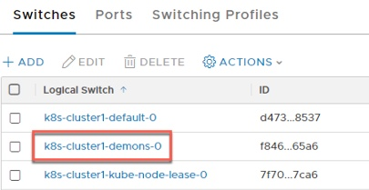

A new logical router is also created for "demons" namespace, shown below
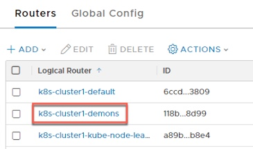

Deploy a sample app in it (in imperative way)

<pre><code>

root@k8s-master:/home/vmware# <b>kubectl run nsxtestapp --image=dumlutimuralp/nsx-demo --replicas=2 --namespace=demons</b>
kubectl run --generator=deployment/apps.v1 is DEPRECATED and will be removed in a future version. Use kubectl run --generator=run-pod/v1 or kubectl create instead.
<b>deployment.apps/testapp created</b>
root@k8s-master:/home/vmware# 
</code></pre>

Note : Notice the message in the output. K8S is recommending declerative way of implementing pods. 

Below is a "Traceroute" output from one of the pods that has just been created. 

In the traceroute output : 
First Router : Tier 1 Default Namespace Downlink IP
Second Router : Tier 0 Router Link , facing Tier 1
Third Router : Physical Router that Tier 0 is peering with
and onwards...

