# NSX-T & K8S - PART 5
[Home Page](https://github.com/dumlutimuralp/nsx-t-k8s)

# Table Of Contents

[Current State](#Current-State)   
[K8S Service](#K8S-Service)   
[K8S Service Type ClusterIP](#K8S-Service-Type-ClusterIP)  
[K8S Service Type LoadBalancer](#K8S-Service-Type-LoadBalancer) . 
[Summary](#Summary)

# Current State
[Back to Table of Contents](#Table-Of-Contents)

This article starts off where we left off at the end of Part 4. A namespace "demons" has been configured and there are two pods in that namespace.

<b>Note</b> : Do not forget to escalete to shell using "sudo -H bash" before running "kubectl ..." commands.

<pre><code>
root@k8s-master:/home/vmware/testymls# <b>kubectl get namespace</b>
NAME              STATUS   AGE
default           Active   135d
demons            Active   5m11s
kube-node-lease   Active   135d
kube-public       Active   135d
kube-system       Active   135d
nsx-system        Active   10h
</code></pre>

<pre><code>
root@k8s-master:/home/vmware/testymls# <b>kubectl get pods -n demons -o wide</b>
NAME                         READY   STATUS    RESTARTS   AGE   IP           NODE        NOMINATED NODE   READINESS GATES
<b>nsxtestapp-5bfcc97b5-gdv6n</b>   1/1     Running   0          78s   <b>172.25.5.2</b>   k8s-node1   <none>           <none>
<b>nsxtestapp-5bfcc97b5-pmkw6</b>   1/1     Running   0          79s   <b>172.25.5.3</b>   k8s-node2   <none>           <none>
</code></pre>

# K8S Service
[Back to Table of Contents](#Table-Of-Contents)

"<b>Service</b>" object is a representation of a group of endpoints, Endpoints are usually Pods. A K8S Service is actually a virtual IP (VIP) address which points to multiple Pods at the backend. Sounds familiar right ? Yes, <b>it is load balancing</b>. The reason for such an abstraction is obvious. K8S Pods come and go; they are ephemeral; hence the K8S Service construct abstracts the dynamic nature of workload changes at the backend and ensures that there is always a Pod responding to the requests destined to that service.

There are different service types in K8S.  "ClusterIP", "NodePort", "LoadBalancer" and "ExternalName" . A good summary is published [here](https://kubernetes.io/docs/concepts/services-networking/service/#publishing-services-service-types) at K8S website. 

<b>"Service Type: ClusterIP"</b> and <b>"Service Type: LoadBalancer"</b> will be explained in this article from a networking data plane point of view.

# K8S Service Type ClusterIP
[Back to Table of Contents](#Table-Of-Contents)

When a K8S service is provisioned as "ClusterIP" (<b>which is the default</b>) that means an available IP will be picked from the "service cluster ip range" pool as the VIP/ClusterIP for that service. The pool itself is a configuration parameter in K8S API Server, it is explained [here](https://kubernetes.io/docs/reference/command-line-tools-reference/kube-apiserver/) . The default for the ClusterIP range is 10.0.0.0/24. 

The actual IP address being used for "ClusterIP" is an interesting one from <b>IP reachability</b> point of view. It will be investigated and explained later on.

First let' s examine some of the properties of the Pods that were created in Part 4 earlier on. Those Pods were spun up using the following command "kubectl run nsxtestapp --image=dumlutimuralp/nsx-demo --replicas=2 --namespace=demons" . When "kubectl run..." command is used, a K8S <b>"deployment"</b> object named as "nsxtestapp" is provisioned in K8S cluster and the Pods become part of that deployment. 

<pre><code>
root@k8s-master:/home/vmware/testymls# <b>kubectl get deployment -n demons</b>
NAME         READY   UP-TO-DATE   AVAILABLE   AGE
nsxtestapp   2/2     2            2           100m
</code></pre>

<pre><code>
root@k8s-master:/home/vmware/testymls# <b>kubectl get pods --show-labels -n demons</b>
NAME                         READY   STATUS    RESTARTS   AGE    LABELS
<b>nsxtestapp-5bfcc97b5-gdv6n</b>   1/1     Running   0          109m   pod-template-hash=5bfcc97b5,<b>run=nsxtestapp</b>
<b>nsxtestapp-5bfcc97b5-pmkw6</b>   1/1     Running   0          109m   pod-template-hash=5bfcc97b5,<b>run=nsxtestapp</b>
root@k8s-master:/home/vmware/testymls#
</code></pre>

So each Pod has a key value pair of <b>"run" = "nsxtestapp"</b>. These are called "<b>Labels</b>" in K8S terminology. Labels are key value pairs that are assigned to any K8S object to identify the attributes of that object. Labels will be used in the context of K8S service management in the following example.

These labels can also be identified on NSX-T UI as well. As shown below.

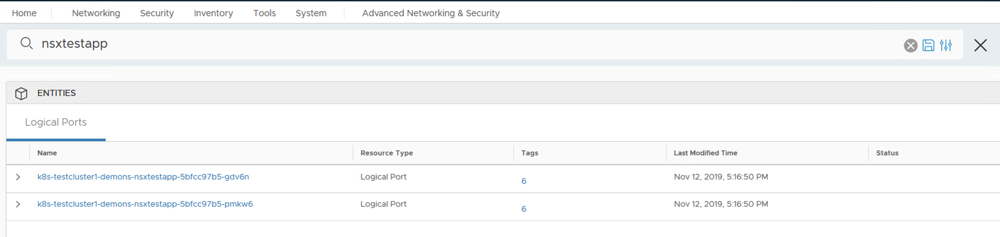

To investigate more the nuumber in the "Tags" column can be clicked (6 in this case) and same labels can be seen there.

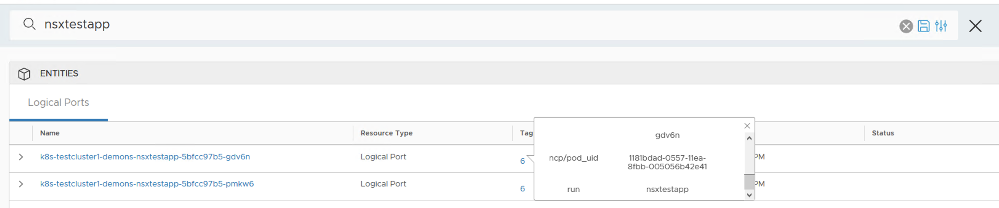

Let' s create a service called "<b>nsxtestservice</b>" in namespace "<b>demons</b>".

<pre><code>
root@k8s-master:/home/vmware/testymls# <b>kubectl create service clusterip nsxtestservice --tcp=80:80 -n demons</b>
service/nsxtestservice created
root@k8s-master:/home/vmware/testymls#
</code></pre>

This service is instantiated on TCP Port 80 (http basically) on the VIP and it is targeting the traffic to TCP Port 80 on the Pods. The way the service is created is still an imperative way of creating object in K8S API (rather than being declarative); as the Pods that were provisioned in the previous part with "kubectl run..." command. This will be explained later with another example.

Let' s examine the details of this service.

<pre><code>
root@k8s-master:/home/vmware/testymls# <b>kubectl describe service nsxtestservice -n demons</b>
Name:              nsxtestservice
Namespace:         demons
Labels:            <b>app=nsxtestservice</b>
Annotations:       <none>
<b>Selector:</b>          <b>app=nsxtestservice</b>
Type:              ClusterIP
IP:                <b>10.101.129.209</b>
Port:              80-80  80/TCP
TargetPort:        80/TCP
<b>Endpoints:         <none></b>
Session Affinity:  None
Events:            <none>
root@k8s-master:/home/vmware/testymls#
</code></pre>

<b>Note</b> : Instead of using "-n demons" each time to execute a command against that namespace, <b>"kubens"</b> can be used. It is a simple and useful tool to take that away and it is published [here](https://github.com/ahmetb/kubectx) 

As shown above, there are no endpoints. This means that the service will not be load balanced as there are no backend Pods assigned to it. "<b>Labels</b>" field in this output is representing this specific service object' s ("nsxtestservice") own metadata. <b>"Selector"</b>, on the other hand though, defines the criteria which the Pods are selected to be part of this service.  In order to have some Pods to back this service, this selector field will be edited. 

As shown earlier on the Pods, there is a default label attached to those Pods as "run=nsxtestapp". 

Let' s edit the K8S service object called "nsxtestservice" and configure the selector as "run=nsxtestapp" so that it picks the two Pods that were created earlier on.

<b>"kubectl edit"</b> will be used to achieve this which essentially opens up a text editor to update the values. (The usual keyboard shortcuts apply in the editor, such as "escape" then type ":wq!" to save the file; which is actually an object spec)

<pre><code>
root@k8s-master:/home/vmware/testymls# <b>kubectl edit service nsxtestservice -n demons</b>
# Please edit the object below. Lines beginning with a '#' will be ignored,
# and an empty file will abort the edit. If an error occurs while saving this file will be
# reopened with the relevant failures.
#
apiVersion: v1
<b>kind: Service</b>
metadata:
  creationTimestamp: "2019-10-11T12:45:01Z"
  labels:
    app: nsxtestservice
  <b>name: nsxtestservice</b>
  namespace: demons
  resourceVersion: "13864177"
  selfLink: /api/v1/namespaces/demons/services/nsxtestservice
  uid: f0edfc3a-ec24-11e9-b9d2-005056b42e41
spec:
  clusterIP: 10.101.129.209
  ports:
  - name: 80-80
    port: 80
    protocol: TCP
    targetPort: 80
  <b>selector:</b>
    app: nsxtestservice  <b><= ### Update this line as "run: nsxtestapp". Be careful with spaces.</b>
  sessionAffinity: None
  type: ClusterIP
status:
</code></pre>

When the object is updated and upon exiting the text editor, <b>"service/nsxtestservice edited"</b> message should appear in the shell.

Let' s examine the service again.

<pre><code>
root@k8s-master:/home/vmware/testymls# <b>kubectl describe service nsxtestservice -n demons</b>
Name:              nsxtestservice
Namespace:         demons
Labels:            app=nsxtestservice
Annotations:       <none>
<b>Selector:          run=nsxtestapp</b>
Type:              ClusterIP
<b>IP:                10.101.129.209</b>
Port:              80-80  80/TCP
TargetPort:        80/TCP
<b>Endpoints:         172.25.5.2:80,172.25.5.3:80</b>
Session Affinity:  None
Events:            <none>
</code></pre>

As shown above now two Pods have been automatically selected by this service object, thanks to "<b>selector</b>". 

Let' s create a new Pod to initiate a request towards the K8S service that we created recently. 

<pre><code>
root@k8s-master:/home/vmware/testymls#<b>kubectl run nwtest --image=dumlutimuralp/networktest --replicas=1 --namespace=demons</b>
kubectl run --generator=deployment/apps.v1 is DEPRECATED and will be removed in a future version. Use kubectl run --generator=run-pod/v1 or kubectl create instead.
</code></pre>

Let' s check if the newly created "nwtest" Pod is in running state.

<pre><code>
root@k8s-master:/home/vmware/testymls# <b>kubectl get pods -n demons</b>
NAME                        READY   STATUS    RESTARTS   AGE
nsxtestapp-5bfcc97b5-gdv6n   1/1     Running   0          6h37m
nsxtestapp-5bfcc97b5-pmkw6   1/1     Running   0          6h37m
<b>nwtest-5bf9856644-7wwsl</b>     1/1     <b>Running</b>   0          12m
root@k8s-master:/home/vmware/testymls#
</code></pre>

K8S cluster comes with its own DNS implementation, which is <b>CoreDNS</b>. CoreDNS watches K8S API for service object changes and creates an automatic DNS entry for this service with the associated IP address is 10.101.129.209 (which is picked from the "service cluster ip range" pool mentiooed earlier) Let' s double check the DNS settings of a Pod in this namespace called "demons". Let's do that on the newly created "nwtest" Pod by attaching to it.

<pre><code>
root@k8s-master:/home/vmware/testymls# <b>kubectl exec -it nwtest-5bf9856644-7wwsl bash -n demons</b>
bash-4.4#
bash-4.4# <b>cat /etc/resolv.conf</b>
<b>nameserver 10.96.0.10</b>
<b>search demons.svc.cluster.local svc.cluster.local cluster.local</b>
options ndots:5
bash-4.4#
</code></pre>

<b>10.96.0.10</b> IP will be explained towards the end of this article, for now notice that a DNS server IP and search domains are already configured by default on the Pod.  

While in the "nwtest" Pod, let' s initiate few requests to the "nsxtestservice" by using curl.

<pre><code>
bash-4.4#<b>ping nsxtestservice</b>
PING <b>nsxtestservice.demons.svc.cluster.local (10.101.129.209</b>): 56 data bytes
^C--- nsxtestservice.demons.svc.cluster.local ping statistics ---
9 packets transmitted, <B>0 packets received</b>, 100% packet loss
bash-4.4#<b>curl nsxtestservice</b>
OUTPUT OMITTED 
Hello, this web-page is served by: <b>nsxtestapp-5bfcc97b5-pmkw6</b>
The containers private IP is: <b>172.25.5.3</b>
OUTPUT OMITTED
bash-4.4# <b>curl nsxtestservice</b>
OUTPUT OMITTED 
Hello, this web-page is served by: <b>nsxtestapp-5bfcc97b5-gdv6n</b>
The containers private IP is: <b>172.25.5.2</b>
OUTPUT OMITTED
bash-4.4#<b>exit</b>
<b>root@k8s-master:/home/vmware/testymls#</b>
</code></pre>

On a test Pod ("nwtest-5bf9856644-7wwsl"), ICMP echo request traffic is generated towards the service by its name "nsxtestservice". As seen above the name is resolved to the VIP address. Although there has been <b>no response to the ICMP echo requests, the service can be accessed</b> by its name through TCP 80 / HTTP . When a few requests are sent continuously, close to "round robin" load balancing should be observed. 

<b>To summarize what is configured so far</b>, two Pods were created with the name "nsxtestapp-xxxxx" and then a K8S service has been created with type ClusterIP and the name "nsxtestservice". The selector for this service has been configured to a value which matches the label of the "nsxtestapp-xxxxx" Pods so that those two Pods become the endpoints which are backing that service. Then the access to this service has been tested from a third pod "nwtest-xxxx" in the same namespace.

It should also be clear by now that <b>when a K8S Service is created it is registered with a DNS name within that K8S cluster</b> automatically and the service also gets an IP assigned, which is 10.101.129.209 in this case. Any Pod in the same namespace can access this service by its name. 

<b>Here is the interesting piece</b>, 10.101.129.209, the IP address assigned for the VIP for this Service of ClusterIP type is not configured anywhere at all</b>. _**How exactly this IP is used as a service ? How do other Pods or external resources access this IP ?**_ 

Let' s uncover the implementation details of the "ClusterIP" concept and NSX-T' s implementation of it.

## Behind the Scenes 

### Generic K8S

Let' s focus on how things work without NSX-T in a generic K8S cluster first. 

In a K8S cluster, Kube Proxy is implemented as a Pod on every K8S node. Kube Proxy (on each K8S node) watches K8S API for service objects. As soon as it detects a new service it then provisions IPtables rules (or IPVS; depends on the implementation) on the K8S node. This takes place on each K8S node.  There is a good detail of information [here](https://kubernetes.io/docs/concepts/services-networking/service/#virtual-ips-and-service-proxies) on K8S service implementations. 

What the IPtables rules actually do is, applying stateful destination NAT (DNAT) for any IP traffic destined to the K8S service IP and swap the destination IP with one of the Pods which are backing the service. For the return traffic the source the source IP of the Pod will be swapped with the service IP. 

Note : More info on "watch" can be found [here](https://kubernetes.io/docs/reference/using-api/api-concepts/#efficient-detection-of-changes) . This was also mentioned in Part 2 of this series.

### NSX-T 

In NSX-T,  <b>NSX Kube Proxy container</b> replaces the Kube Proxy' s function in a generic K8S cluster. Just like Kube Proxy, NSX Kube Proxy container (which runs in NSX Node Agent Pod) watches K8S API for those K8S service objects of type ClusterIP, <b>however</b> it then translates those to <b>openflow rules on Open vSwitch (OVS) on the K8S Node.</b> Open vSwitch' s "conntrack" feature is leveraged for this functionality. More info about OVS Conntrack is [here](http://docs.openvswitch.org/en/latest/tutorials/ovs-conntrack/).

Below diagram, which has been used in previous parts of this series may remind the overall architecture again.

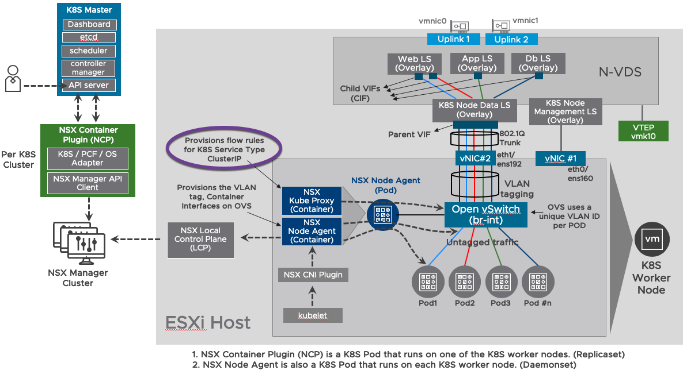

Let' s go back to the lab environment and examine the Openflow rules provisioned on the OVS in the K8S Node when the K8S service "nsxtestservice" was provisined.

On <b>K8S-Node1</b> or <b>K8S-Node2</b>, examine the OVS ports. 

<pre><code>
root@k8s-node1:/home/vmware# <b>ovs-vsctl show</b>
523e062f-1763-4fa1-b624-e4c7efb5f612
    <b>Bridge br-int</b>
        Port nsx_agent_outer
            tag: 4094
            Interface nsx_agent_outer
        Port "ens192"
            Interface "ens192"
        Port "coredns-fb8b8dccf-fklnx_824327d05abfd72"
            tag: 5
            Interface "824327d05abfd72"
        Port "nsxtestapp-5bfcc97b5-pmkw6_cd333ad6021daef"
            tag: 1
            Interface "cd333ad6021daef"
        Port br-int
            Interface br-int
                type: internal
    ovs_version: "2.10.2.13185890"
root@k8s-node1:/home/vmware#
</code></pre>

As shown above the OVS bridge name is "br-int" on the K8S Node.

Let' s list the actual flow entries on OVS named as "br-int". 

<pre><code>
root@k8s-node1:/home/vmware# <b>ovs-ofctl dump-flows br-int</b>
 cookie=0x7, duration=60448.822s, table=0, n_packets=300078, n_bytes=53313183, priority=100,ip actions=ct(table=1)
 cookie=0x7, duration=60448.850s, table=0, n_packets=22587, n_bytes=1267282, priority=0 actions=NORMAL
 cookie=0x7, duration=60448.733s, table=1, n_packets=0, n_bytes=0, priority=100,ct_state=-trk,ip actions=ct(table=1)
 cookie=0x7, duration=60448.438s, table=1, n_packets=0, n_bytes=0, priority=100,ct_state=-new+trk,ip,nw_dst=10.96.0.10 actions=ct(table=2,zone=65312,nat)
 cookie=0x7, duration=60448.347s, table=1, n_packets=9, n_bytes=522, priority=100,ct_state=-new+trk,ip,nw_dst=10.96.0.1 actions=ct(table=2,zone=65312,nat)
 <b>cookie=0x7, duration=13084.353s, table=1, n_packets=0, n_bytes=0, priority=100,ct_state=-new+trk,ip,nw_dst=10.101.129.209 actions=ct(table=2,zone=65312,nat)</b>
 cookie=0x7, duration=60448.379s, table=1, n_packets=67223, n_bytes=4744843, priority=100,ct_state=+new+trk,tcp,nw_dst=10.96.0.1,tp_dst=443 actions=group:2
 cookie=0x7, duration=60419.368s, table=1, n_packets=0, n_bytes=0, priority=100,ct_state=+new+trk,udp,nw_dst=10.96.0.10,tp_dst=53 actions=group:5
 cookie=0x7, duration=60419.341s, table=1, n_packets=0, n_bytes=0, priority=100,ct_state=+new+trk,tcp,nw_dst=10.96.0.10,tp_dst=53 actions=group:3
 cookie=0x7, duration=60419.313s, table=1, n_packets=0, n_bytes=0, priority=100,ct_state=+new+trk,tcp,nw_dst=10.96.0.10,tp_dst=9153 actions=group:4
 <b>cookie=0x7, duration=12630.117s, table=1, n_packets=0, n_bytes=0, priority=100,ct_state=+new+trk,tcp,nw_dst=10.101.129.209,tp_dst=80 actions=group:6</b>
 cookie=0x7, duration=60448.698s, table=1, n_packets=152067, n_bytes=41166579, priority=90,ip,in_port=ens192 actions=ct(table=2,zone=65312,nat)
 cookie=0x7, duration=60448.668s, table=1, n_packets=80780, n_bytes=7265669, priority=80,ip actions=NORMAL
 cookie=0x7, duration=60448.791s, table=2, n_packets=219299, n_bytes=45911944, actions=NORMAL
 root@k8s-node1:/home/vmware#
</code></pre>

The two rules in bold above may have gotten attention already. Let' s explain the first one. 

cookie=0x7, duration=13084.353s, table=1, n_packets=0, n_bytes=0, priority=100,ct_state=-new+trk,ip,<b>nw_dst=10.101.129.209 actions=ct(table=2,zone=65312,nat)</b>

This rule is for traffic destined to 10.101.129.209, the VIP of the K8S service that has been created earlier on (named "nsxtestservice"). The traffic will be destination NATed (DNAT) (as it specifies "nw_dst" and also "nat)") . Additionally "actions=ct" means that this traffic will be processed in a stateful fashion. For more info on OVS actions please have a look at [this](http://www.openvswitch.org/support/dist-docs/ovs-actions.7.txt) on Open vSwitch website.

Let' s explain the second rule.

cookie=0x7, duration=12630.117s, table=1, n_packets=0, n_bytes=0, priority=100,ct_state=+new+trk,<b>tcp,nw_dst=10.101.129.209,tp_dst=80 actions=group:6</b>

This rule is for relaying the traffic destined to 10.101.129.209 on port TCP 80 to "group:6" . <b>What is "group:6" ?</b>

For that let' s examine the Openflow groups with the following command.

<pre><code>
root@k8s-node1:/home/vmware# <b>sudo ovs-ofctl dump-groups br-int</b>
NXST_GROUP_DESC reply (xid=0x2):
 group_id=3,type=select,bucket=bucket_id:0,weight:100,actions=ct(commit,table=2,zone=65312,nat(dst=172.25.4.3:53)),bucket=bucket_id:1,weight:100,actions=ct(commit,table=2,zone=65312,nat(dst=172.25.4.2:53))
 <b>group_id=6</b>,type=select,bucket=bucket_id:0,weight:100,actions=ct(commit,table=2,zone=65312,nat(<b>dst=172.25.5.2:80</b>)),bucket=bucket_id:1,weight:100,actions=ct(commit,table=2,zone=65312,nat(<b>dst=172.25.5.3:80</b>))
 group_id=2,type=select,bucket=bucket_id:0,weight:100,actions=ct(commit,table=2,zone=65312,nat(dst=10.190.5.10:6443))
 group_id=4,type=select,bucket=bucket_id:0,weight:100,actions=ct(commit,table=2,zone=65312,nat(dst=172.25.4.3:9153)),bucket=bucket_id:1,weight:100,actions=ct(commit,table=2,zone=65312,nat(dst=172.25.4.2:9153))
 group_id=5,type=select,bucket=bucket_id:0,weight:100,actions=ct(commit,table=2,zone=65312,nat(dst=172.25.4.3:53)),bucket=bucket_id:1,weight:100,actions=ct(commit,table=2,zone=65312,nat(dst=172.25.4.2:53))
root@k8s-node1:/home/vmware#
</code></pre>

As shown above, group 6 is the group on which the actual Pods are grouped for the service that we provisioned. 

<b>IMPORTANT NOTE:</b> The VIP for the service type of ClusterIP and Openflow rules are programmed on the other K8S Node too. That means the <b>SAME VIP (10.101.129.209) exits on all K8S Nodes.</b>

### Enter Distributed Load Balancing

Although the SAME VIP (10.101.129.209) exists on each K8S node, <b>if it is not routed to anywhere else</b>, how does it actually work then ? 

The VIP basically is kind of an anycast implementation within the K8S cluster. Which means the VIP (Service:ClusterIP) can service the traffic/requests <b>which are generated within the K8S cluster itself. </b> Hence the <b>primary</b> use case for "ClusterIP" type of K8S service is for <b>Pod to service (east west traffic) in the K8S cluster itself</b>. In that case the VIP, which is being used for the "ClusterIP" type of K8S service, <b>does definitely NOT need to be routed</b> to anywhere else.

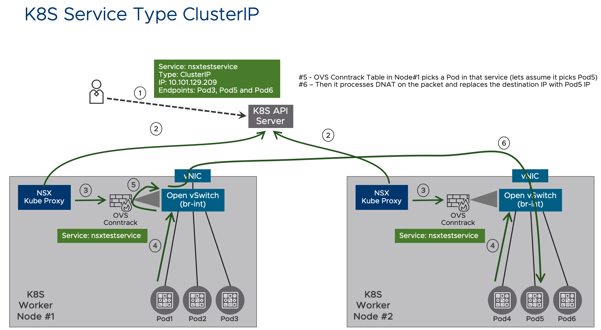

The traffic pattern that is shown in diagram above is, as mentioned earlier, Pod to service traffic or in other words east west traffic in the same K8S cluster. For K8S service type of "ClusterIP", <b>NSX-T Load Balancer (that is attached to NSX-T Tier1 Logical Router) is NOT used.</b> . It is NSX Kube Proxy and OVS Conntrack feature that handles the load balancing of Pod to service traffic.

Now the IP address that is identified as the DNS server IP (which is 10.96.0.10) earlier on can now be investigated. For that lets check all the services configured in this K8S cluster.

<pre><code>
root@k8s-master:/home/vmware/testymls# <b>kubectl get service --all-namespaces</b>
NAMESPACE     NAME             TYPE           CLUSTER-IP      EXTERNAL-IP                  PORT(S)                  AGE
<b>default</b>       <b>kubernetes</b>       ClusterIP      10.96.0.1       none                         443/TCP                  156d
demons        nsxtestservicetest   ClusterIP      10.101.129.209  none                         80/TCP                   150d
<b>kube-system</b>   <b>kube-dns</b>         ClusterIP      <b>10.96.0.10</b>      none                         <b>53/UDP,53/TCP,9153/TCP</b>   156d
root@k8s-master:/home/vmware/testymls#
</code></pre>

As shown above, there are two other K8S services which are automatically configured when this K8S cluster is provisioned in Part 3. There is not only 10.96.0.10 but also another IP 10.96.0.1 as well. In fact 10.96.0.10 is the Core DNS service IP and 10.96.0.1 is the K8S API server service IP. <b>Hence the DNS and K8S API is also using K8S service for abstraction and load balancing.</b>

Let' s check the Pods relevant to DNS service.

<pre><code>
root@k8s-master:/home/vmware/testymls# <b>kubectl get pods -n kube-system -o wide</b>
NAME                                 READY   STATUS    RESTARTS   AGE    IP            NODE         NOMINATED NODE   READINESS GATES
<b>coredns-fb8b8dccf-bns22</b>              1/1     Running   7          21d    <b>172.25.4.2</b>    k8s-node2    <none>           <none>
<b>coredns-fb8b8dccf-fklnx</b>              1/1     Running   7          21d    <b>172.25.4.3</b>    k8s-node1    <none>           <none>
etcd-k8s-master                      1/1     Running   15         156d   10.190.5.10   k8s-master   <none>           <none>
kube-apiserver-k8s-master            1/1     Running   15         156d   10.190.5.10   k8s-master   <none>           <none>
kube-controller-manager-k8s-master   1/1     Running   36         156d   10.190.5.10   k8s-master   <none>           <none>
kube-proxy-bk7rs                     1/1     Running   15         155d   10.190.5.12   k8s-node2    <none>           <none>
kube-proxy-j4p5f                     1/1     Running   15         156d   10.190.5.10   k8s-master   <none>           <none>
kube-proxy-mkm4w                     1/1     Running   15         156d   10.190.5.11   k8s-node1    <none>           <none>
kube-scheduler-k8s-master            1/1     Running   30         156d   10.190.5.10   k8s-master   <none>           <none>
root@k8s-master:/home/vmware/testymls#
</code></pre>

Note : DNS pods are named as "coredns-xxxxx". Notice that there are "kube-proxy-xxxxx" Pods as well . These are <b>NOT</b> representing the NSX kube proxy. Basically these "kube-proxy-xxxxx" Pods are just part of default K8S cluster initiation workflow. They are not used in this enviroonment at all. Remember, NSX infrastructure Pods (i.e. NCP and NSX Node Agent) are running in their own namespace which is "nsx-system". (which can be double checked by "kubectl get pods -n nsx-system")

Let' s check the K8S service related to DNS. 

<pre><code>
root@k8s-master:/home/vmware/testymls# <b>kubectl describe service kube-dns -n kube-system</b>
Name:              <b>kube-dns</b>
Namespace:         <b>kube-system</b>
Labels:            <b>k8s-app=kube-dns</b>
                   kubernetes.io/cluster-service=true
                   kubernetes.io/name=KubeDNS
Annotations:       prometheus.io/port: 9153
                   prometheus.io/scrape: true
Selector:          k8s-app=kube-dns
Type:              ClusterIP
IP:                <b>10.96.0.10</b>
Port:              dns  53/UDP
TargetPort:        53/UDP
Endpoints:         <b>172.25.4.2:53,172.25.4.3:53</b>
Port:              dns-tcp  53/TCP
TargetPort:        53/TCP
Endpoints:         172.25.4.2:53,172.25.4.3:53
Port:              metrics  9153/TCP
TargetPort:        9153/TCP
Endpoints:         172.25.4.2:9153,172.25.4.3:9153
Session Affinity:  None
Events:            <none>
root@k8s-master:/home/vmware/testymls#
</code></pre>

Notice the endpoints of the DNS service are the "core-dns-xxxxx" Pod IPs. 

It should be clear by now that K8S is using service objects to provide resiliency and scale out; even for its own infrastructure functions such as DNS and K8S API.

However, at this point the Pods and the service that they are part of <b>is still NOT exposed to the external world.</b> These services can only be accessed by workloads that are within the K8S cluster itself.<

So far NSX-T Load Balancer (on a Tier1) is NOT used at all. 

Let' s focus on how to make the service accessible from the external world in the next section.

# K8S Service Type LoadBalancer
[Back to Table of Contents](#Table-Of-Contents)

In the previous section on "ClusterIP", the actual networking topology was not that relevant since the connectivity between a Pod and the K8S service (of type Cluster IP) has been tested. With K8S service type of "LoadBalancer", the focus will be on traffic from external resources to the K8S cluster. For that reason, now is a good time to remind the topology that is implemented in this lab with NSX-T and K8S.

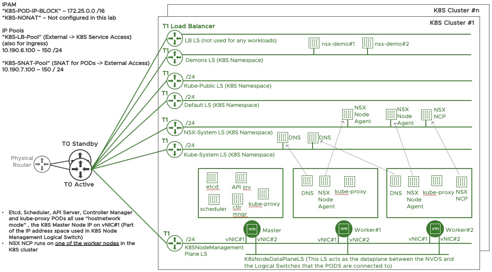

In the above topology, there are two things worth mentioning, 
- There is an additional "nwtest-xxxxx" Pod connected to "demons" logical switch (which was created in the previous section "ClusterIP") 
- There is a single K8S cluster in this lab. 

Before moving on, so far every pod or service has been created in an imperative way. To show the declarative way of doing things in K8S the existing Pods and service will be deleted manually in the K8S cluster.

<pre><code>
root@k8s-master:/home/vmware/testymls# <b>kubectl get deployment -n demons</b>
NAME         READY   UP-TO-DATE   AVAILABLE   AGE
<b>nsxtestapp</b>   2/2     2            2           9h27m
<b>nwtest</b>       1/1     1            1           6h10m
root@k8s-master:/home/vmware/testymls# <B>kubectl delete deployment nwtest -n demons</b>
<b>deployment.extensions "nsxtestapp" deleted</b>
root@k8s-master:/home/vmware/testymls# <B>kubectl delete deployment nsxtestapp -n demons</b>
<b>deployment.extensions "nsxtestapp" deleted</b>
root@k8s-master:/home/vmware/testymls# <b>kubectl delete service nsxtestservicetest -n demons</b>
<b>service "nsxtestservicetest" deleted</b>
</code></pre>

Let' s create a deployment which will have <b>four "nsxdemoapp"</b> pods in it. Below is the yaml file for it. This can be created in a folder on Ubuntu Linux VM with any editor (i.e. VI, Nano) Instead of an imperative way of using "kubectl run..." commands, this time the high level instructions are defined in the yaml file.

<pre><code>
root@k8s-master:/home/vmware/testymls# cat <b>nsxdemoapp.yml</b>
apiVersion: apps/v1
kind: <b>Deployment</b>
metadata:
  name: <b>nsxdemoapp</b>
spec:
  selector:
    matchLabels:
      <b>app: nsxdemo</b>
  replicas: 4
  template:
    metadata:
      labels:
        <b>app: nsxdemo</b>
    spec:
      containers:
      - name: nsx-demo
        image: dumlutimuralp/nsx-demo
        ports:
        - containerPort: 80
</code></pre>

In order to provision this deployment following step is performed.

<pre><code>
root@k8s-master:/home/vmware/testymls# <b>kubectl create -f nsxdemoapp.yml -n demons</b>
<b>deployment.apps/nsxdemoapp created</b>
</code></pre>

Verifying the four Pods get created successfully.

<pre><code>
root@k8s-master:/home/vmware/testymls# <b>kubectl get pods -o wide -n demons --show-labels</b>
NAME                          READY   STATUS    RESTARTS   AGE   IP           NODE        NOMINATED NODE   READINESS GATES   LABELS
nsxdemoapp-85d76c598f-6v98l   1/1     Running   0          75s   <b>172.25.5.4</b>   k8s-node2   <none>           <none>            <b>app=nsxdemo</b>,pod-template-hash=85d76c598f
nsxdemoapp-85d76c598f-ks24n   1/1     Running   0          75s   <b>172.25.5.5</b>   k8s-node2   <none>           <none>            <b>app=nsxdemo</b>,pod-template-hash=85d76c598f
nsxdemoapp-85d76c598f-pmf2g   1/1     Running   0          75s   <b>172.25.5.3</b>   k8s-node1   <none>           <none>            <b>app=nsxdemo</b>,pod-template-hash=85d76c598f
nsxdemoapp-85d76c598f-pr49l   1/1     Running   0          75s   <b>172.25.5.2</b>   k8s-node1   <none>           <none>            <b>app=nsxdemo</b>,pod-template-hash=85d76c598f
root@k8s-master:/home/vmware/testymls#
</code></pre>

Now let' s create a K8S service of type "LoadBalancer". Another yaml file is used for that. Shown below. This time a key value pair of "app:nsxdemo" is used for to select the respective Pods for this service.

<pre><code>
root@k8s-master:/home/vmware/testymls# cat <b>lb.yaml</b>
apiVersion: v1
kind: <b>Service</b>
metadata:
  name: <b>nsxdemoservice</b>
  labels:
    app: nsxdemoservice
spec:
  type: <b>LoadBalancer</b>
  selector:
    app: <b>nsxdemo</b>
  ports:
  - name: http
    protocol: TCP
    port: 80
    targetPort: 80
root@k8s-master:/home/vmware/testymls#
root@k8s-master:/home/vmware/testymls#
root@k8s-master:/home/vmware/testymls# <b>kubectl create -f lb.yaml -n demons</b>
<b>service/nsxdemoservice created</b>
root@k8s-master:/home/vmware/testymls# <b>kubectl get service -n demons</b>
NAME             TYPE           CLUSTER-IP      EXTERNAL-IP                 PORT(S)        AGE
<b>nsxdemoservice</b>   <b>LoadBalancer</b>   <b>10.103.216.59</b>   <b>10.190.6.102</b>,100.64.208.9   80:<b>30657</b>/TCP   45s
root@k8s-master:/home/vmware/testymls#
</code></pre>

Couple of things about the output shown above. There is a VIP assigned for ClusterIP which is 10.102.137.25 and also there are two other IPs assigned as ExternalIP, which are 10.190.6.101 and 100.64.208.9. There is a reason that the former one is highlighted in the output. It will be explained later on.

Let' s examine the service. 

<pre><code>
root@k8s-master:/home/vmware/testymls# <b>kubectl describe service nsxdemoservice -n demons</b>
Name:                     <b>nsxdemoservice</b>
Namespace:                demons
Labels:                   app=nsxdemoservice
Annotations:              ncp/internal_ip_for_policy: 100.64.208.9
Selector:                 <b>app=nsxdemo</b>
Type:                     LoadBalancer
IP:                       <b>10.103.216.59</b>
LoadBalancer Ingress:     <b>10.190.6.102</b>, 100.64.208.9
Port:                     <b>http  80/TCP</b>
TargetPort:               80/TCP
NodePort:                 http  <b>30657/TCP</b>
Endpoints:                <b>172.25.5.2:80,172.25.5.3:80,172.25.5.4:80 + 1 more...</b>
Session Affinity:         None
External Traffic Policy:  Cluster
Events:                   <none>
root@k8s-master:/home/vmware/testymls#
</code></pre>

As expected, in the above output, it can be seen that the endpoints are correctly selected by the service.

## Behind The Scenes

### Generic K8S 

In a generic K8S cluster <b>without NSX-T</b>,  when a K8S service is provisioned of type "LoadBalancer", there are multiple things configured behind the scenes. <b>Let' s explain each and every one of those step by step. </b>

1. An external load balancer solution watches the K8S API for K8S service objects. This external load balancer could be the public cloud provider load balancer or an enterprise physical/virtual load balancer on premise. When a K8S service object gets created of type "LoadBalancer", <b>the external load balancer automatically provisions a VIP on itself for the respective K8S service.</b> The pool configured on the external load balancer for that VIP will have the <B>K8S Nodes IPs</b> as pool members and the target TCP/UDP port (which the client requests will be redirected to) for those pool members is the "NodePort".  <b>What is "NodePort" ?</b> 

2. Kube Proxy also always watches K8S API for K8S service objects and when a K8S service object gets created of type "LoadBalancer" then Kube Proxy provisions and exposes a TCP/UDP port on K8S Nodes. <b>The exposed TCP/UDP port on the K8S Nodes is called "NodePort".</b> Kube Proxy configures <b>Iptables</b> rules on K8S Nodes, <b>to map</b> the "NodePort" to the actual K8S Service Port. Hence when request comes to a K8S Node on the "NodePort", then the request is redirected, on that K8S Node, to the respective K8S Service. K8S Node applies source NAT (SNAT) on the request. Since the K8S service is an abstraction from the Pods backing that service itself, <b> the next step below still takes place.</b> 

3. Kube Proxy provisions a VIP as the <b>"ClusterIP"</b> for that K8S service. This is <b>exactly the same</b> as explained <b>in the previous "ClusterIP" section. </b>

Basically K8S service type "LoadBalancer" relies on an external load balancer VIP to attract external traffic to that service, but it also provisions a "NodePort" to deliver the traffic to the K8S Nodes, and also provisions a "ClusterIP" to deliver the traffic to the Pods which are part of that respective service.

#### Summary

The difference with K8S service type "LoadBalancer" is, 

- The K8S service is exposed to the external resources through a <b>VIP on the external load balancer.</b> 
- The K8S service is <b>also</b> exposed to <b>any external resource</b> through K8S Nodes themselves <b>in the form of "NodePort" as well.</b> That external resource in the case of K8S Service Type "LoadBalancer" is an external load balancer device which load balances the client requests to the "NodePort" on the K8S Nodes.

Because of the points mentioned just above, <b>"Nodeport" is actually also another type of K8S service.</b> It enables an external client (external to K8S cluster) to send traffic to the K8S Node IP on a specific TCP/UDP port and access the K8S service even without an automated integration with the external load balancer solution. When a K8 service type is configured of type "NodePort" the steps 2 and 3, mentioned above, will take place. In this aspect the use case could be a load balancer being configured manually without any integration with the K8S API.

A picture is worth a thousand words hence the below diagram shows a logical respresentation of the steps.

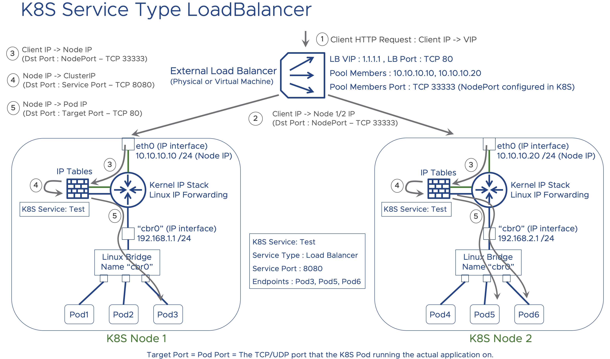

Note : Especially step 3-4-5 and IP tables component is overly simplified here for easier consumption. In reality IPtables processes, the traffic in various multiple chains. 

Note 2 : NodePort is picked from a port range which is specified in "--service-node-port-range" parameter in K8S cluster config, by default the range is 30000-32767.

### NSX-T 

When a K8S service of type "LoadBalancer" gets created , all the objects that are provisioned in a generic K8S environment still stays the same in an NSX-T integrated K8S cluster. Meaning that, a VIP as "ClusterIP" is assigned for the service, appropriate Openflow rules will be put in place on OVS as shown in ClusterIP section previously. In addition, <b>a "NodePort" will still be configured</b> for this service as part of K8S workflow, (Iptables rules for this service are implemented on K8S nodes) but the NodePort will <b>not be used</b>. The reason is explained later on.

On the NSX-T side, a VIP, which is part of a routable IP address space, will be configured on the NSX-T Load Balancer (which is associated with a Tier 1 router) and be associated with this K8S service. In this lab that pool is configured as 10.190.6.0 /24, back in Part 3 [here](https://github.com/dumlutimuralp/k8s-with-nsx-t-2.4.x/blob/master/Part%203/README.md#configuring-ip-pool-k8s-lb-pool-advanced-networking--security---inventory---groups---ip-pools). 

<b>The difference</b> to what has been mentioned above in previous "Generic K8S" section is <b>with NSX-T, the IP addresses of the Pods</b> that are backing the service will be automatically configured as pool members of the VIP on the NSX-T LB. This essentially makes the "NodePort" configuration irrelevant in NSX-T scenario, since for all north - south traffic which takes place between external resources and K8S cluster workloads, the NSX-T load balancer will redirect the requests directly to the Pod IPs. However for <b>Pod to Service traffic</b> obviously "ClusterIP" still has to be used. 

Let' s validate all of the above in the lab. The service "nsxdemoservice" was already configured. 

<pre><code>
root@k8s-master:/home/vmware/testymls#<b>kubectl get service -n demons</b>
NAME             TYPE           CLUSTER-IP      EXTERNAL-IP                 PORT(S)        AGE
<b>nsxdemoservice</b>   <b>LoadBalancer</b>   <b>10.103.216.59</b>   <b>10.190.6.102</b>,100.64.208.9   80:<b>30657</b>/TCP   45s
root@k8s-master:/home/vmware/testymls#
</code></pre>

As seen above this service has a VIP of 10.103.216.59 for Cluster IP, VIPs 10.190.6.102 and 100.64.208.9 for External IP (the VIP on the LoadBalancer) and a NodePort of 30657.

The traffic flow though, as mentioned earlier, will be from external resource to NSX-T Load Balancer VIP and then to one of the Pods which are actually part of that service. As shown below. (The IPs of the NSX-T T1 Load Balancer will be investigated on NSX-T CLI later on)

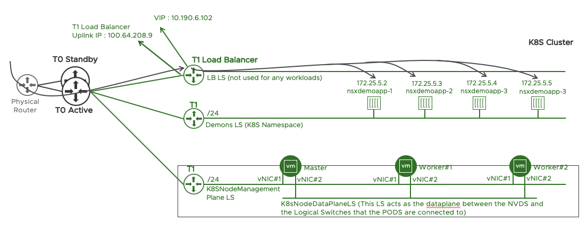

Let' s check the connectivity from a client to the VIP : 10.190.6.102.

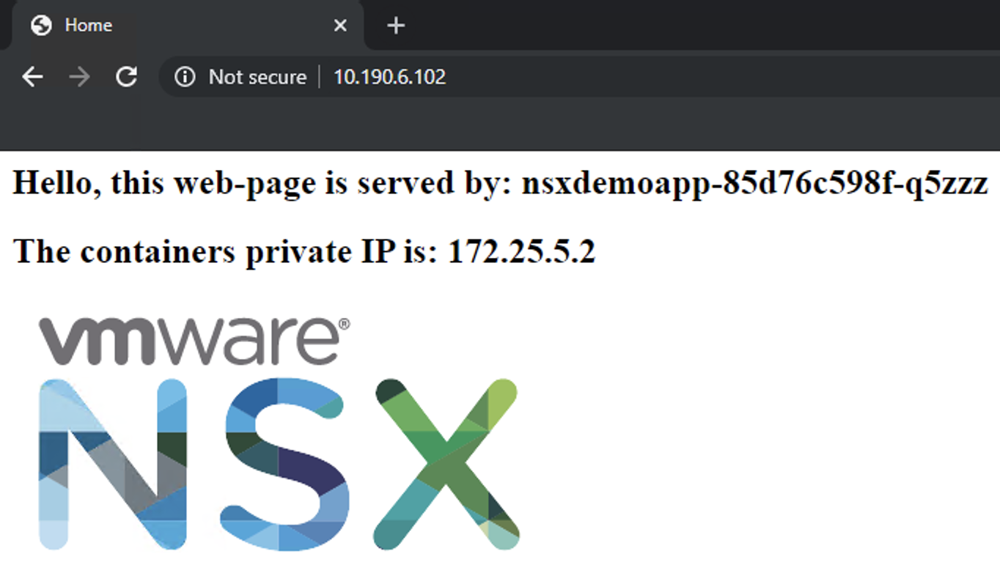

As shown above the traffic from the client has been able to reach the service. Which is basically a simple static HTML page. 

Let' s check what is configured on NSX-T when this K8S service is provisioned.

The easiest way to start is to search for the VIP for External IP which is 10.190.6.102 on main NSX-T search page. Shown below. 

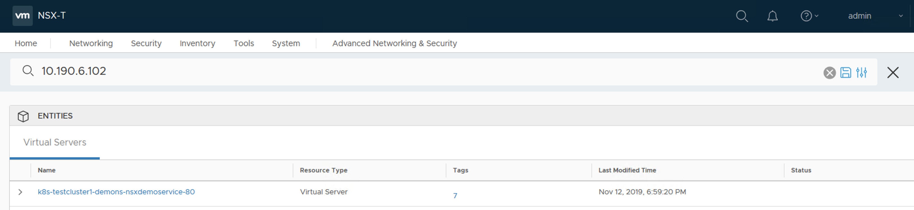

This brings up the virtual server configured for this K8S service. After clicking on it, below screen will be brought up.

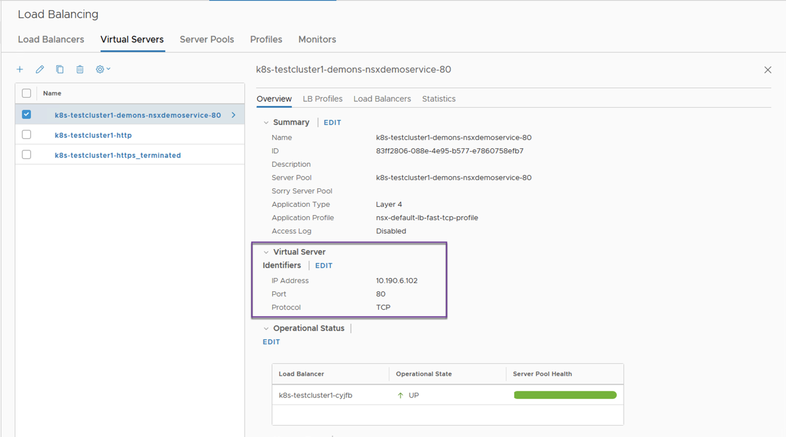

When scrolled down to the bottom of the page, the K8S tags of this service can be seen in NSX-T database.

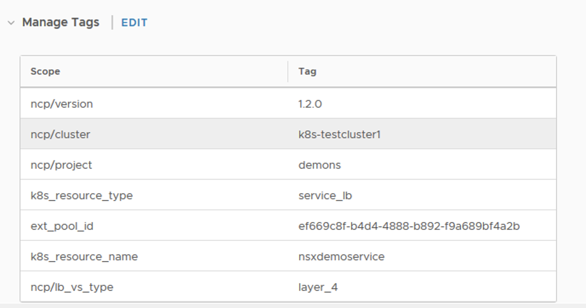

Server pool can be investigated by clicking on server pools tab and then clicking on members (4 in this case) will show the actual Pods as pool members. More detail on the second screenshot below.

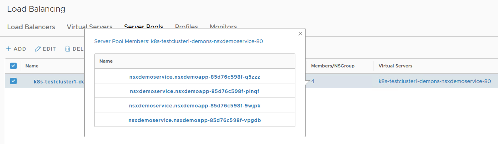

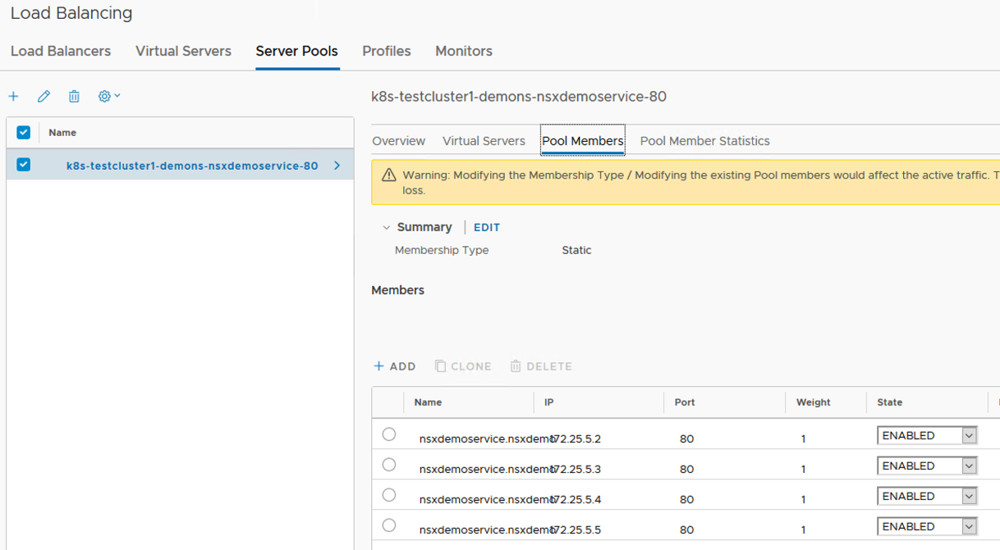

The interesting piece is when the  server pool for the service is edited by clicking on that edit icon (shown in the second screenshot)

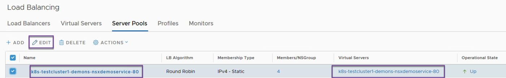

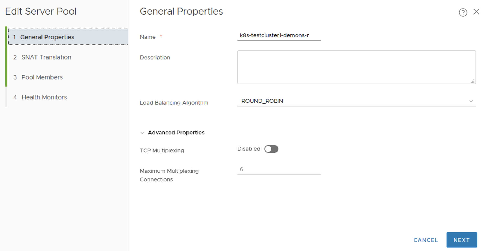

Click on next (right bottom) until the "Health Monitors" section is brought up, shown below.

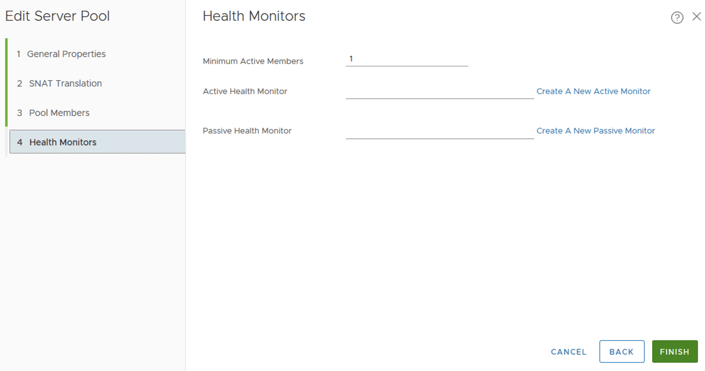

There are <b>no health checks</b> configured in this NSX-T LB pool. How come ? 

The reason is K8S implements its own probes to check the state of an application in a Pod or the Pod itself. More info here => [Configure Liveness, Readiness and Startup Probes](https://kubernetes.io/docs/tasks/configure-pod-container/configure-liveness-readiness-startup-probes/#define-readiness-probes) In K8S, it is the K8S node' s job to check the health of an application running in a Pod by usiing "liveness probe". Each K8S node is responsible to run this task for the Pods it hosts. More specifically, it is the "kubelet" process' job on that K8S node to run this task at all times. In this lab, there are no liveness probes configured. 

<b> Note:</b> To achieve healthchecks by using liveness probes in K8S, the <b>K8S Node subnet</b> (the logical switch that vNIC1 of each K8S node is connected to) <b>needs reachability to the subnet of the demons logical switch.</b>

Click on cancel in the previous UI.

Rolling back to the other VIP (100.64.208.9) which was shown in the External IP field in K8S service output, it is actually the uplink IP of the NSX-T T1 Load Balancer. This can be validated by connecting to the NSX-T active Edge Node and by performing several "get" commands. Before getting into the CLI view though, let' s check on which specific NSX-T Tier 1 logical router the NSX-T Load Balancer is instantiated. To do that navigate back to virtual servers view. As shown below this K8S service (aka NSX-T virtual server) is provisioned on NSX-T Load Balancer named "k8s-cluster1-cyjfb". 

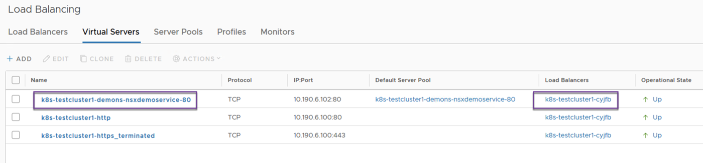

Click on "k8s-cluster1-cyjfb" on that screen and it will bring up the following view which shows the Tier 1 Logical Router information. As highlighted below.

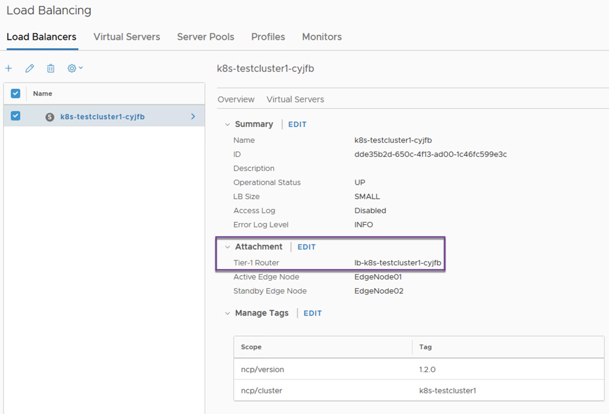

Let' s SSH to the management IP address of the active Edge Node (which is EdgeNode01 in this case) and then validate the interface IPs of the NSX-T Tier 1 Logical Router which is also used for load balancing.

<pre><code>
<b>edge1> get logical-router</b>
Logical Router
UUID                                   VRF    LR-ID  Name                              Type                        Ports
736a80e3-23f6-5a2d-81d6-bbefb2786666   0      0                                        TUNNEL                      3
04f5d70a-b322-44f3-920b-9b49babefce9   1      3073   DR-lb-k8s-testcluster1-cyjfb      DISTRIBUTED_ROUTER_TIER1    4
8ceaf822-db17-49d8-8441-0c62734cd4d7   2      3075   DR-k8s-testcluster1-default       DISTRIBUTED_ROUTER_TIER1    5
f2b5c490-6ed5-4eaa-a9dd-55c4a8726dd1   3      3077   DR-k8s-testcluster1-nsx-system    DISTRIBUTED_ROUTER_TIER1    5
e4410e5c-45dd-4e98-beea-f3f28efdb175   4      3082   DR-k8s-testcluster1-demons        DISTRIBUTED_ROUTER_TIER1    5
92094207-dfc0-4795-ba85-3b74faaed46c   5      2      SR-T0-K8S-Domain                  SERVICE_ROUTER_TIER0        5
d0a866ef-eb20-4f5b-affd-0cd45c561870   6      1      DR-T0-K8S-Domain                  DISTRIBUTED_ROUTER_TIER0    20
c1d4f2bc-540c-4142-846b-11ad899971c0   7      2051   SR-T1-Tenant1                     SERVICE_ROUTER_TIER1        5
9df46a97-e850-4258-87c0-deff92b9e4e4   8      3078   DR-k8s-testcluster1-kube-node-l   DISTRIBUTED_ROUTER_TIER1    5
080a43a4-7553-48ca-b6b0-8f338d2cc3a5   9      3076   DR-k8s-testcluster1-kube-public   DISTRIBUTED_ROUTER_TIER1    5
014e2a7b-844c-4664-a56a-a07068c8776d   10     2052   SR-T1-Tenant2                     SERVICE_ROUTER_TIER1        5
b3d954bf-9529-48f5-87ca-79054e940d4e  <b> 11     3074   SR-lb-k8s-testcluster1-cyjfb</b>      SERVICE_ROUTER_TIER1        5
dcc054fa-1e49-4541-8669-1849cbbfff22   12     5      DR-T1-K8S-Node-Management         DISTRIBUTED_ROUTER_TIER1    5
612e0782-a510-4d0c-aea3-841f6c0dad77   13     3079   DR-k8s-testcluster1-kube-system   DISTRIBUTED_ROUTER_TIER1    5

edge1> <b>vrf 11</b>
edge1(tier1_sr)> <b>get interfaces</b>
Logical Router
UUID                                   VRF    LR-ID  Name                              Type
04f5d70a-b322-44f3-920b-9b49babefce9   1      3073   DR-lb-k8s-testcluster1-cyjfb      DISTRIBUTED_ROUTER_TIER1
Interfaces
    Interface     : bc772ab3-7b3c-4fc3-a996-17fb60d7aeff
    Ifuid         : 299
    Name          : lrp-k8s-testcluster1-lb-k8s-tes
    Mode          : lif
    IP/Mask       : 169.254.169.1/24
    MAC           : 02:50:56:56:44:52
    VNI           : 67607
    LS port       : cb3bfe4f-1b83-4b83-bac7-6562894d8f12
    Urpf-mode     : NONE
    Admin         : up
    Op_state      : up
    MTU           : 1442

    Interface     : d105aea5-7db5-5ba2-8c00-3f973eae1433
    Ifuid         : 265
    Mode          : blackhole

    Interface     : adf54135-0fd5-5a28-84a0-a93be6da5ffe
    Ifuid         : 264
    Mode          : cpu

    Interface     : 02da6771-034d-4d08-9d1d-ed854da0bc6a
    Ifuid         : 325
    Name          : bp-dr-port
    Mode          : lif
    IP/Mask       : 169.254.0.1/28;fe80::50:56ff:fe56:4452/64
    MAC           : 02:50:56:56:44:52
    VNI           : 67608
    LS port       : 4a4afecd-b33f-4f09-84df-723754b8b728
    Urpf-mode     : PORT_CHECK
    Admin         : up
    Op_state      : up
    MTU           : 1442

Logical Router
UUID                                   VRF    LR-ID  Name                              Type
b3d954bf-9529-48f5-87ca-79054e940d4e   11     3074   <b>SR-lb-k8s-testcluster1-cyjfb</b>      SERVICE_ROUTER_TIER1
Interfaces
    Interface     : eb5341a1-b5a3-4913-a421-d983f2ba8fc2
    Ifuid         : 326
    Name          : TIER1-RouterLinkPort
    Mode          : lif
    IP/Mask       : <b>100.64.208.9/31</b>;fe80::50:56ff:fe56:4455/64;fcd2:b361:7f01:6004::2/64
    MAC           : 02:50:56:56:44:55
    VNI           : 67606
    LS port       : 61249293-1503-4a84-96d7-d04e29d6fcdb
    Urpf-mode     : NONE
    Admin         : up
    Op_state      : up
    MTU           : 1442

    Interface     : da0210e1-e442-4b47-b824-219d5f9061bc
    Ifuid         : 331
    Mode          : <b>loopback</b>
    IP/Mask       : 10.190.6.100/32;127.0.0.1/8;<b>10.190.6.102/32</b>;::1/128

    Interface     : 334a6638-b6ab-5409-b17f-2ebdb666c45d
    Ifuid         : 285
    Mode          : blackhole

    Interface     : 9c60d078-63de-58e7-b355-7898b92980b2
    Ifuid         : 284
    Mode          : cpu

    Interface     : 2fc33f5c-d8ab-40fd-900f-da2a329d269a
    Ifuid         : 327
    Name          : bp-sr0-port
    Mode          : lif
    IP/Mask       : 169.254.0.2/28;fe80::50:56ff:fe56:5300/64
    MAC           : 02:50:56:56:53:00
    VNI           : 67608
    LS port       : 08b1bae9-12e3-4d6b-8b01-128469354e1b
    Urpf-mode     : NONE
    Admin         : up
    Op_state      : up
    MTU           : 1442

edge1(tier1_sr)>
</code></pre>

What is shown above is (ignoring the DR component detail of NSX-T Tier 1) , the uplink IP of the Tier 1 is 100.64.208.9 which is connected to Tier 0, and the actual VIP being used for load balancing is 10.190.6.102 which is realized as a loopback IP on the same Tier 1.  <b>The NSX-T 2.4.x integration with K8S always injects both IP addresses</b> to the ExternalIP field in K8S service object. However 10.190.6.102 will be the IP which is distributed through BGP to the rest of the infrastructure based on the config put in place back in Part 1. (shown below with "T1 LB VIP")

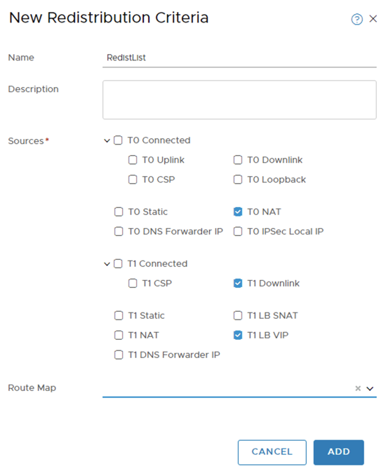

However one additional config is needed but that is automatically configured by NSX-T and K8S integration through NCP plugin. It is the "Route Advertisement" config of the NSX-T Tier 1 which is used for load balancing. Cause that specific Tier 1 needs to advertise the LB VIP IPs (which are basically loopback IPs on Tier 1) to the Tier 0. That can be checked on the Tier 1 config. Shown below.

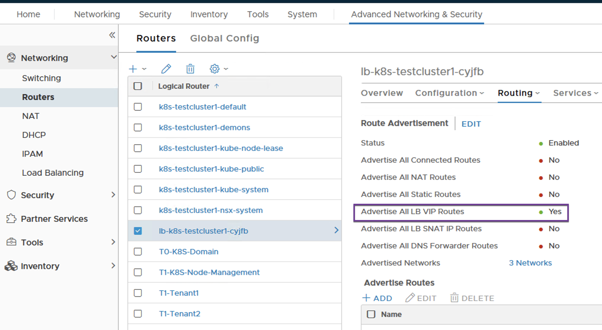

# Summary

Both K8S service types "ClusterIP" and "LoadBalancer" is explained in this article. 

Service type "ClusterIP" is basically a distributed layer 4 (OSI) load balancer. NSX-T leverages "NSX kube proxy" component on each K8S node to provision flow rules on Open vSwitch (OVS) to map the virtual IP of that service to the individual Pod IPs which are part of that service. The "ClusterIP" service type is for load balancing of the traffic which is generated in the K8S cluster itself. (east west load balancing) The virtual IP for the service is not routed anywhere at all and cannot be seen in the actual physical networking or NSX-T logical networking data plane. 

Service type "LoadBalancer" is basically a centralized layer 4 load balancer. NSX-T leverages the "NSX Load Balancer" which is basically a function implemented on an NSX Tier 1 Logical Router. The virtual IP for the service is realized as a loopback interface on the NSX Tier 1 logical router. The "LoadBalancer" service type is for load balancing of the traffic which is generated by an external resource destined to the respective K8S service. 
